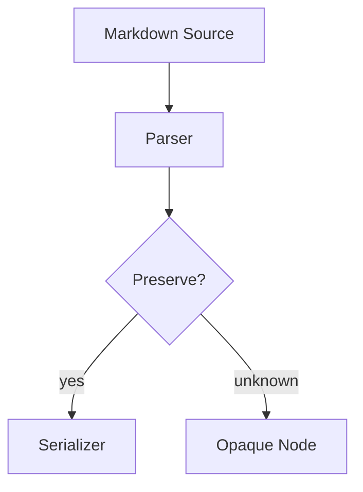

# Mermaid Fixture

```mermaid
flowchart TD
  A[Markdown Source] --> B[Parser]
  B --> C{Preserve?}
  C -->|yes| D[Serializer]
  C -->|unknown| E[Opaque Node]
```

The diagram source is the durable content.
