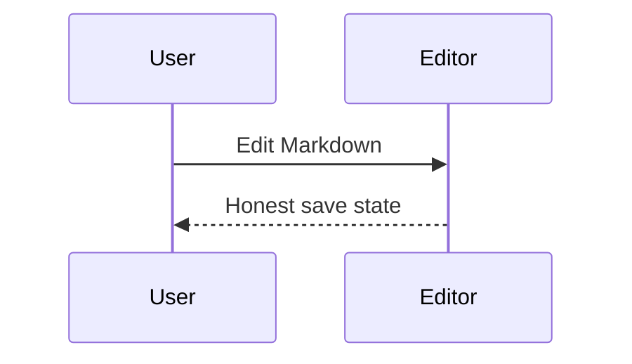

# Release Planning Note

---
owner: docs-team
status: review
---

## Summary

We need source mode, parser preservation, and a truthful Save Engine before rich mode.

> [!WARNING] Gate reminder
> Do not ship a pretty editor that corrupts Markdown.

| Area | Risk | Mitigation |
| -- | -- | -- |
| Parser | unknown syntax | opaque nodes |
| Save | false status | target labels |

Related: [[Save Engine]], [Quality Gates](../docs/internal/QUALITY_GATES.md)

HTML artifact placeholder

Final note with $a^2 + b^2 = c^2$.
