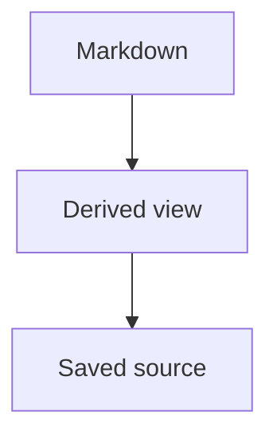

# Large Performance Fixture

This generated document is intentionally large and structurally varied.
It proves performance budgets against real Markdown shapes instead of a repeated single-line mock.

## Performance section 0001

Paragraph 0001 links to [relative link](./section-0001.md), uses [[Performance 0001]], and cites [^perf-0001].
It keeps **bold text**, _underscore emphasis_, inline `code-0001`, and a safe email placeholder user-0001@example.test.

- [ ] Todo item 0001
- [x] Completed item 0001
  - Nested bullet 0001
  - Nested link [child 0001](./child-0001.md)

1. First ordered step
2. Second ordered step

> Quote variant 0001
> - quoted task 0001
> - quoted link [variant 0001](./variant-0001.md)

| Metric | Value | Notes |
| -- | --: | -- |
| Parse | 1 | section 0001 |
| Render | 2 | preserves pipes \| and links |

> [!NOTE] Section 0001
> Callout body for performance section 0001.

```ts
export const section0001 = {
  id: "0001",
  markdownSource: "durable",
};
```



<section data-mme-performance="0001">
  <p>Safe HTML block 0001 remains an artifact or preserved source.</p>
</section>

::mme-opaque{#perf-0001}
custom payload 0001 must stay source-only unless a host extension understands it.
::

[^perf-0001]: Generated footnote 0001 with a [back reference](#performance-section-0001).

## Performance section 0002

Paragraph 0002 links to [relative link](./section-0002.md), uses [[Performance 0002]], and cites [^perf-0002].
It keeps **bold text**, _underscore emphasis_, inline `code-0002`, and a safe email placeholder user-0002@example.test.

- [ ] Todo item 0002
- [x] Completed item 0002
  - Nested bullet 0002
  - Nested link [child 0002](./child-0002.md)

1. First ordered step
2. Second ordered step

<aside data-mme-variant="0002">Inline HTML variant 0002 with <strong>safe emphasis</strong>.</aside>

| Metric | Value | Notes |
| -- | --: | -- |
| Parse | 2 | section 0002 |
| Render | 4 | preserves pipes \| and links |

> [!NOTE] Section 0002
> Callout body for performance section 0002.

```ts
export const section0002 = {
  id: "0002",
  markdownSource: "durable",
};
```


<section data-mme-performance="0002">
  <p>Safe HTML block 0002 remains an artifact or preserved source.</p>
</section>

::mme-opaque{#perf-0002}
custom payload 0002 must stay source-only unless a host extension understands it.
::

[^perf-0002]: Generated footnote 0002 with a [back reference](#performance-section-0002).

## Performance section 0003

Paragraph 0003 links to [relative link](./section-0003.md), uses [[Performance 0003]], and cites [^perf-0003].
It keeps **bold text**, _underscore emphasis_, inline `code-0003`, and a safe email placeholder user-0003@example.test.

- [ ] Todo item 0003
- [x] Completed item 0003
  - Nested bullet 0003
  - Nested link [child 0003](./child-0003.md)

1. First ordered step
2. Second ordered step


| Metric | Value | Notes |
| -- | --: | -- |
| Parse | 3 | section 0003 |
| Render | 6 | preserves pipes \| and links |

> [!NOTE] Section 0003
> Callout body for performance section 0003.

```ts
export const section0003 = {
  id: "0003",
  markdownSource: "durable",
};
```


<section data-mme-performance="0003">
  <p>Safe HTML block 0003 remains an artifact or preserved source.</p>
</section>

::mme-opaque{#perf-0003}
custom payload 0003 must stay source-only unless a host extension understands it.
::

[^perf-0003]: Generated footnote 0003 with a [back reference](#performance-section-0003).

## Performance section 0004

Paragraph 0004 links to [relative link](./section-0004.md), uses [[Performance 0004]], and cites [^perf-0004].
It keeps **bold text**, _underscore emphasis_, inline `code-0004`, and a safe email placeholder user-0004@example.test.

- [ ] Todo item 0004
- [x] Completed item 0004
  - Nested bullet 0004
  - Nested link [child 0004](./child-0004.md)

1. First ordered step
2. Second ordered step

### Nested checkpoint 0004

This subsection adds nested outline pressure for section 0004.

| Metric | Value | Notes |
| -- | --: | -- |
| Parse | 4 | section 0004 |
| Render | 8 | preserves pipes \| and links |

> [!NOTE] Section 0004
> Callout body for performance section 0004.

```ts
export const section0004 = {
  id: "0004",
  markdownSource: "durable",
};
```


<section data-mme-performance="0004">
  <p>Safe HTML block 0004 remains an artifact or preserved source.</p>
</section>

::mme-opaque{#perf-0004}
custom payload 0004 must stay source-only unless a host extension understands it.
::

[^perf-0004]: Generated footnote 0004 with a [back reference](#performance-section-0004).

## Performance section 0005

Paragraph 0005 links to [relative link](./section-0005.md), uses [[Performance 0005]], and cites [^perf-0005].
It keeps **bold text**, _underscore emphasis_, inline `code-0005`, and a safe email placeholder user-0005@example.test.

- [ ] Todo item 0005
- [x] Completed item 0005
  - Nested bullet 0005
  - Nested link [child 0005](./child-0005.md)

1. First ordered step
2. Second ordered step

> Quote variant 0005
> - quoted task 0005
> - quoted link [variant 0005](./variant-0005.md)

| Metric | Value | Notes |
| -- | --: | -- |
| Parse | 5 | section 0005 |
| Render | 10 | preserves pipes \| and links |

> [!NOTE] Section 0005
> Callout body for performance section 0005.

```ts
export const section0005 = {
  id: "0005",
  markdownSource: "durable",
};
```


<section data-mme-performance="0005">
  <p>Safe HTML block 0005 remains an artifact or preserved source.</p>
</section>

::mme-opaque{#perf-0005}
custom payload 0005 must stay source-only unless a host extension understands it.
::

[^perf-0005]: Generated footnote 0005 with a [back reference](#performance-section-0005).

## Performance section 0006

Paragraph 0006 links to [relative link](./section-0006.md), uses [[Performance 0006]], and cites [^perf-0006].
It keeps **bold text**, _underscore emphasis_, inline `code-0006`, and a safe email placeholder user-0006@example.test.

- [ ] Todo item 0006
- [x] Completed item 0006
  - Nested bullet 0006
  - Nested link [child 0006](./child-0006.md)

1. First ordered step
2. Second ordered step

<aside data-mme-variant="0006">Inline HTML variant 0006 with <strong>safe emphasis</strong>.</aside>

| Metric | Value | Notes |
| -- | --: | -- |
| Parse | 6 | section 0006 |
| Render | 12 | preserves pipes \| and links |

> [!NOTE] Section 0006
> Callout body for performance section 0006.

```ts
export const section0006 = {
  id: "0006",
  markdownSource: "durable",
};
```


<section data-mme-performance="0006">
  <p>Safe HTML block 0006 remains an artifact or preserved source.</p>
</section>

::mme-opaque{#perf-0006}
custom payload 0006 must stay source-only unless a host extension understands it.
::

[^perf-0006]: Generated footnote 0006 with a [back reference](#performance-section-0006).

## Performance section 0007

Paragraph 0007 links to [relative link](./section-0007.md), uses [[Performance 0007]], and cites [^perf-0007].
It keeps **bold text**, _underscore emphasis_, inline `code-0007`, and a safe email placeholder user-0007@example.test.

- [ ] Todo item 0007
- [x] Completed item 0007
  - Nested bullet 0007
  - Nested link [child 0007](./child-0007.md)

1. First ordered step
2. Second ordered step


| Metric | Value | Notes |
| -- | --: | -- |
| Parse | 7 | section 0007 |
| Render | 14 | preserves pipes \| and links |

> [!NOTE] Section 0007
> Callout body for performance section 0007.

```ts
export const section0007 = {
  id: "0007",
  markdownSource: "durable",
};
```


<section data-mme-performance="0007">
  <p>Safe HTML block 0007 remains an artifact or preserved source.</p>
</section>

::mme-opaque{#perf-0007}
custom payload 0007 must stay source-only unless a host extension understands it.
::

[^perf-0007]: Generated footnote 0007 with a [back reference](#performance-section-0007).

## Performance section 0008

Paragraph 0008 links to [relative link](./section-0008.md), uses [[Performance 0008]], and cites [^perf-0008].
It keeps **bold text**, _underscore emphasis_, inline `code-0008`, and a safe email placeholder user-0008@example.test.

- [ ] Todo item 0008
- [x] Completed item 0008
  - Nested bullet 0008
  - Nested link [child 0008](./child-0008.md)

1. First ordered step
2. Second ordered step

### Nested checkpoint 0008

This subsection adds nested outline pressure for section 0008.

| Metric | Value | Notes |
| -- | --: | -- |
| Parse | 8 | section 0008 |
| Render | 16 | preserves pipes \| and links |

> [!NOTE] Section 0008
> Callout body for performance section 0008.

```ts
export const section0008 = {
  id: "0008",
  markdownSource: "durable",
};
```


<section data-mme-performance="0008">
  <p>Safe HTML block 0008 remains an artifact or preserved source.</p>
</section>

::mme-opaque{#perf-0008}
custom payload 0008 must stay source-only unless a host extension understands it.
::

[^perf-0008]: Generated footnote 0008 with a [back reference](#performance-section-0008).

## Performance section 0009

Paragraph 0009 links to [relative link](./section-0009.md), uses [[Performance 0009]], and cites [^perf-0009].
It keeps **bold text**, _underscore emphasis_, inline `code-0009`, and a safe email placeholder user-0009@example.test.

- [ ] Todo item 0009
- [x] Completed item 0009
  - Nested bullet 0009
  - Nested link [child 0009](./child-0009.md)

1. First ordered step
2. Second ordered step

> Quote variant 0009
> - quoted task 0009
> - quoted link [variant 0009](./variant-0009.md)

| Metric | Value | Notes |
| -- | --: | -- |
| Parse | 9 | section 0009 |
| Render | 18 | preserves pipes \| and links |

> [!NOTE] Section 0009
> Callout body for performance section 0009.

```ts
export const section0009 = {
  id: "0009",
  markdownSource: "durable",
};
```


<section data-mme-performance="0009">
  <p>Safe HTML block 0009 remains an artifact or preserved source.</p>
</section>

::mme-opaque{#perf-0009}
custom payload 0009 must stay source-only unless a host extension understands it.
::

[^perf-0009]: Generated footnote 0009 with a [back reference](#performance-section-0009).

## Performance section 0010

Paragraph 0010 links to [relative link](./section-0010.md), uses [[Performance 0010]], and cites [^perf-0010].
It keeps **bold text**, _underscore emphasis_, inline `code-0010`, and a safe email placeholder user-0010@example.test.

- [ ] Todo item 0010
- [x] Completed item 0010
  - Nested bullet 0010
  - Nested link [child 0010](./child-0010.md)

1. First ordered step
2. Second ordered step

<aside data-mme-variant="0010">Inline HTML variant 0010 with <strong>safe emphasis</strong>.</aside>

| Metric | Value | Notes |
| -- | --: | -- |
| Parse | 10 | section 0010 |
| Render | 20 | preserves pipes \| and links |

> [!NOTE] Section 0010
> Callout body for performance section 0010.

```ts
export const section0010 = {
  id: "0010",
  markdownSource: "durable",
};
```


<section data-mme-performance="0010">
  <p>Safe HTML block 0010 remains an artifact or preserved source.</p>
</section>

::mme-opaque{#perf-0010}
custom payload 0010 must stay source-only unless a host extension understands it.
::

[^perf-0010]: Generated footnote 0010 with a [back reference](#performance-section-0010).

## Performance section 0011

Paragraph 0011 links to [relative link](./section-0011.md), uses [[Performance 0011]], and cites [^perf-0011].
It keeps **bold text**, _underscore emphasis_, inline `code-0011`, and a safe email placeholder user-0011@example.test.

- [ ] Todo item 0011
- [x] Completed item 0011
  - Nested bullet 0011
  - Nested link [child 0011](./child-0011.md)

1. First ordered step
2. Second ordered step


| Metric | Value | Notes |
| -- | --: | -- |
| Parse | 11 | section 0011 |
| Render | 22 | preserves pipes \| and links |

> [!NOTE] Section 0011
> Callout body for performance section 0011.

```ts
export const section0011 = {
  id: "0011",
  markdownSource: "durable",
};
```


<section data-mme-performance="0011">
  <p>Safe HTML block 0011 remains an artifact or preserved source.</p>
</section>

::mme-opaque{#perf-0011}
custom payload 0011 must stay source-only unless a host extension understands it.
::

[^perf-0011]: Generated footnote 0011 with a [back reference](#performance-section-0011).

## Performance section 0012

Paragraph 0012 links to [relative link](./section-0012.md), uses [[Performance 0012]], and cites [^perf-0012].
It keeps **bold text**, _underscore emphasis_, inline `code-0012`, and a safe email placeholder user-0012@example.test.

- [ ] Todo item 0012
- [x] Completed item 0012
  - Nested bullet 0012
  - Nested link [child 0012](./child-0012.md)

1. First ordered step
2. Second ordered step

### Nested checkpoint 0012

This subsection adds nested outline pressure for section 0012.

| Metric | Value | Notes |
| -- | --: | -- |
| Parse | 12 | section 0012 |
| Render | 24 | preserves pipes \| and links |

> [!NOTE] Section 0012
> Callout body for performance section 0012.

```ts
export const section0012 = {
  id: "0012",
  markdownSource: "durable",
};
```


<section data-mme-performance="0012">
  <p>Safe HTML block 0012 remains an artifact or preserved source.</p>
</section>

::mme-opaque{#perf-0012}
custom payload 0012 must stay source-only unless a host extension understands it.
::

[^perf-0012]: Generated footnote 0012 with a [back reference](#performance-section-0012).

## Performance section 0013

Paragraph 0013 links to [relative link](./section-0013.md), uses [[Performance 0013]], and cites [^perf-0013].
It keeps **bold text**, _underscore emphasis_, inline `code-0013`, and a safe email placeholder user-0013@example.test.

- [ ] Todo item 0013
- [x] Completed item 0013
  - Nested bullet 0013
  - Nested link [child 0013](./child-0013.md)

1. First ordered step
2. Second ordered step

> Quote variant 0013
> - quoted task 0013
> - quoted link [variant 0013](./variant-0013.md)

| Metric | Value | Notes |
| -- | --: | -- |
| Parse | 13 | section 0013 |
| Render | 26 | preserves pipes \| and links |

> [!NOTE] Section 0013
> Callout body for performance section 0013.

```ts
export const section0013 = {
  id: "0013",
  markdownSource: "durable",
};
```


<section data-mme-performance="0013">
  <p>Safe HTML block 0013 remains an artifact or preserved source.</p>
</section>

::mme-opaque{#perf-0013}
custom payload 0013 must stay source-only unless a host extension understands it.
::

[^perf-0013]: Generated footnote 0013 with a [back reference](#performance-section-0013).

## Performance section 0014

Paragraph 0014 links to [relative link](./section-0014.md), uses [[Performance 0014]], and cites [^perf-0014].
It keeps **bold text**, _underscore emphasis_, inline `code-0014`, and a safe email placeholder user-0014@example.test.

- [ ] Todo item 0014
- [x] Completed item 0014
  - Nested bullet 0014
  - Nested link [child 0014](./child-0014.md)

1. First ordered step
2. Second ordered step

<aside data-mme-variant="0014">Inline HTML variant 0014 with <strong>safe emphasis</strong>.</aside>

| Metric | Value | Notes |
| -- | --: | -- |
| Parse | 14 | section 0014 |
| Render | 28 | preserves pipes \| and links |

> [!NOTE] Section 0014
> Callout body for performance section 0014.

```ts
export const section0014 = {
  id: "0014",
  markdownSource: "durable",
};
```


<section data-mme-performance="0014">
  <p>Safe HTML block 0014 remains an artifact or preserved source.</p>
</section>

::mme-opaque{#perf-0014}
custom payload 0014 must stay source-only unless a host extension understands it.
::

[^perf-0014]: Generated footnote 0014 with a [back reference](#performance-section-0014).

## Performance section 0015

Paragraph 0015 links to [relative link](./section-0015.md), uses [[Performance 0015]], and cites [^perf-0015].
It keeps **bold text**, _underscore emphasis_, inline `code-0015`, and a safe email placeholder user-0015@example.test.

- [ ] Todo item 0015
- [x] Completed item 0015
  - Nested bullet 0015
  - Nested link [child 0015](./child-0015.md)

1. First ordered step
2. Second ordered step


| Metric | Value | Notes |
| -- | --: | -- |
| Parse | 15 | section 0015 |
| Render | 30 | preserves pipes \| and links |

> [!NOTE] Section 0015
> Callout body for performance section 0015.

```ts
export const section0015 = {
  id: "0015",
  markdownSource: "durable",
};
```


<section data-mme-performance="0015">
  <p>Safe HTML block 0015 remains an artifact or preserved source.</p>
</section>

::mme-opaque{#perf-0015}
custom payload 0015 must stay source-only unless a host extension understands it.
::

[^perf-0015]: Generated footnote 0015 with a [back reference](#performance-section-0015).

## Performance section 0016

Paragraph 0016 links to [relative link](./section-0016.md), uses [[Performance 0016]], and cites [^perf-0016].
It keeps **bold text**, _underscore emphasis_, inline `code-0016`, and a safe email placeholder user-0016@example.test.

- [ ] Todo item 0016
- [x] Completed item 0016
  - Nested bullet 0016
  - Nested link [child 0016](./child-0016.md)

1. First ordered step
2. Second ordered step

### Nested checkpoint 0016

This subsection adds nested outline pressure for section 0016.

| Metric | Value | Notes |
| -- | --: | -- |
| Parse | 16 | section 0016 |
| Render | 32 | preserves pipes \| and links |

> [!NOTE] Section 0016
> Callout body for performance section 0016.

```ts
export const section0016 = {
  id: "0016",
  markdownSource: "durable",
};
```


<section data-mme-performance="0016">
  <p>Safe HTML block 0016 remains an artifact or preserved source.</p>
</section>

::mme-opaque{#perf-0016}
custom payload 0016 must stay source-only unless a host extension understands it.
::

[^perf-0016]: Generated footnote 0016 with a [back reference](#performance-section-0016).

## Performance section 0017

Paragraph 0017 links to [relative link](./section-0017.md), uses [[Performance 0017]], and cites [^perf-0017].
It keeps **bold text**, _underscore emphasis_, inline `code-0017`, and a safe email placeholder user-0017@example.test.

- [ ] Todo item 0017
- [x] Completed item 0017
  - Nested bullet 0017
  - Nested link [child 0017](./child-0017.md)

1. First ordered step
2. Second ordered step

> Quote variant 0017
> - quoted task 0017
> - quoted link [variant 0017](./variant-0017.md)

| Metric | Value | Notes |
| -- | --: | -- |
| Parse | 17 | section 0017 |
| Render | 34 | preserves pipes \| and links |

> [!NOTE] Section 0017
> Callout body for performance section 0017.

```ts
export const section0017 = {
  id: "0017",
  markdownSource: "durable",
};
```


<section data-mme-performance="0017">
  <p>Safe HTML block 0017 remains an artifact or preserved source.</p>
</section>

::mme-opaque{#perf-0017}
custom payload 0017 must stay source-only unless a host extension understands it.
::

[^perf-0017]: Generated footnote 0017 with a [back reference](#performance-section-0017).

## Performance section 0018

Paragraph 0018 links to [relative link](./section-0018.md), uses [[Performance 0018]], and cites [^perf-0018].
It keeps **bold text**, _underscore emphasis_, inline `code-0018`, and a safe email placeholder user-0018@example.test.

- [ ] Todo item 0018
- [x] Completed item 0018
  - Nested bullet 0018
  - Nested link [child 0018](./child-0018.md)

1. First ordered step
2. Second ordered step

<aside data-mme-variant="0018">Inline HTML variant 0018 with <strong>safe emphasis</strong>.</aside>

| Metric | Value | Notes |
| -- | --: | -- |
| Parse | 18 | section 0018 |
| Render | 36 | preserves pipes \| and links |

> [!NOTE] Section 0018
> Callout body for performance section 0018.

```ts
export const section0018 = {
  id: "0018",
  markdownSource: "durable",
};
```


<section data-mme-performance="0018">
  <p>Safe HTML block 0018 remains an artifact or preserved source.</p>
</section>

::mme-opaque{#perf-0018}
custom payload 0018 must stay source-only unless a host extension understands it.
::

[^perf-0018]: Generated footnote 0018 with a [back reference](#performance-section-0018).

## Performance section 0019

Paragraph 0019 links to [relative link](./section-0019.md), uses [[Performance 0019]], and cites [^perf-0019].
It keeps **bold text**, _underscore emphasis_, inline `code-0019`, and a safe email placeholder user-0019@example.test.

- [ ] Todo item 0019
- [x] Completed item 0019
  - Nested bullet 0019
  - Nested link [child 0019](./child-0019.md)

1. First ordered step
2. Second ordered step


| Metric | Value | Notes |
| -- | --: | -- |
| Parse | 19 | section 0019 |
| Render | 38 | preserves pipes \| and links |

> [!NOTE] Section 0019
> Callout body for performance section 0019.

```ts
export const section0019 = {
  id: "0019",
  markdownSource: "durable",
};
```


<section data-mme-performance="0019">
  <p>Safe HTML block 0019 remains an artifact or preserved source.</p>
</section>

::mme-opaque{#perf-0019}
custom payload 0019 must stay source-only unless a host extension understands it.
::

[^perf-0019]: Generated footnote 0019 with a [back reference](#performance-section-0019).

## Performance section 0020

Paragraph 0020 links to [relative link](./section-0020.md), uses [[Performance 0020]], and cites [^perf-0020].
It keeps **bold text**, _underscore emphasis_, inline `code-0020`, and a safe email placeholder user-0020@example.test.

- [ ] Todo item 0020
- [x] Completed item 0020
  - Nested bullet 0020
  - Nested link [child 0020](./child-0020.md)

1. First ordered step
2. Second ordered step

### Nested checkpoint 0020

This subsection adds nested outline pressure for section 0020.

| Metric | Value | Notes |
| -- | --: | -- |
| Parse | 20 | section 0020 |
| Render | 40 | preserves pipes \| and links |

> [!NOTE] Section 0020
> Callout body for performance section 0020.

```ts
export const section0020 = {
  id: "0020",
  markdownSource: "durable",
};
```


<section data-mme-performance="0020">
  <p>Safe HTML block 0020 remains an artifact or preserved source.</p>
</section>

::mme-opaque{#perf-0020}
custom payload 0020 must stay source-only unless a host extension understands it.
::

[^perf-0020]: Generated footnote 0020 with a [back reference](#performance-section-0020).

## Performance section 0021

Paragraph 0021 links to [relative link](./section-0021.md), uses [[Performance 0021]], and cites [^perf-0021].
It keeps **bold text**, _underscore emphasis_, inline `code-0021`, and a safe email placeholder user-0021@example.test.

- [ ] Todo item 0021
- [x] Completed item 0021
  - Nested bullet 0021
  - Nested link [child 0021](./child-0021.md)

1. First ordered step
2. Second ordered step

> Quote variant 0021
> - quoted task 0021
> - quoted link [variant 0021](./variant-0021.md)

| Metric | Value | Notes |
| -- | --: | -- |
| Parse | 21 | section 0021 |
| Render | 42 | preserves pipes \| and links |

> [!NOTE] Section 0021
> Callout body for performance section 0021.

```ts
export const section0021 = {
  id: "0021",
  markdownSource: "durable",
};
```

```mermaid
graph TD
  A0021[Markdown] --> B0021[Derived view]
  B0021 --> C0021[Saved source]
```

<section data-mme-performance="0021">
  <p>Safe HTML block 0021 remains an artifact or preserved source.</p>
</section>

::mme-opaque{#perf-0021}
custom payload 0021 must stay source-only unless a host extension understands it.
::

[^perf-0021]: Generated footnote 0021 with a [back reference](#performance-section-0021).

## Performance section 0022

Paragraph 0022 links to [relative link](./section-0022.md), uses [[Performance 0022]], and cites [^perf-0022].
It keeps **bold text**, _underscore emphasis_, inline `code-0022`, and a safe email placeholder user-0022@example.test.

- [ ] Todo item 0022
- [x] Completed item 0022
  - Nested bullet 0022
  - Nested link [child 0022](./child-0022.md)

1. First ordered step
2. Second ordered step

<aside data-mme-variant="0022">Inline HTML variant 0022 with <strong>safe emphasis</strong>.</aside>

| Metric | Value | Notes |
| -- | --: | -- |
| Parse | 22 | section 0022 |
| Render | 44 | preserves pipes \| and links |

> [!NOTE] Section 0022
> Callout body for performance section 0022.

```ts
export const section0022 = {
  id: "0022",
  markdownSource: "durable",
};
```

```mermaid
graph TD
  A0022[Markdown] --> B0022[Derived view]
  B0022 --> C0022[Saved source]
```

<section data-mme-performance="0022">
  <p>Safe HTML block 0022 remains an artifact or preserved source.</p>
</section>

::mme-opaque{#perf-0022}
custom payload 0022 must stay source-only unless a host extension understands it.
::

[^perf-0022]: Generated footnote 0022 with a [back reference](#performance-section-0022).

## Performance section 0023

Paragraph 0023 links to [relative link](./section-0023.md), uses [[Performance 0023]], and cites [^perf-0023].
It keeps **bold text**, _underscore emphasis_, inline `code-0023`, and a safe email placeholder user-0023@example.test.

- [ ] Todo item 0023
- [x] Completed item 0023
  - Nested bullet 0023
  - Nested link [child 0023](./child-0023.md)

1. First ordered step
2. Second ordered step


| Metric | Value | Notes |
| -- | --: | -- |
| Parse | 23 | section 0023 |
| Render | 46 | preserves pipes \| and links |

> [!NOTE] Section 0023
> Callout body for performance section 0023.

```ts
export const section0023 = {
  id: "0023",
  markdownSource: "durable",
};
```

```mermaid
graph TD
  A0023[Markdown] --> B0023[Derived view]
  B0023 --> C0023[Saved source]
```

<section data-mme-performance="0023">
  <p>Safe HTML block 0023 remains an artifact or preserved source.</p>
</section>

::mme-opaque{#perf-0023}
custom payload 0023 must stay source-only unless a host extension understands it.
::

[^perf-0023]: Generated footnote 0023 with a [back reference](#performance-section-0023).

## Performance section 0024

Paragraph 0024 links to [relative link](./section-0024.md), uses [[Performance 0024]], and cites [^perf-0024].
It keeps **bold text**, _underscore emphasis_, inline `code-0024`, and a safe email placeholder user-0024@example.test.

- [ ] Todo item 0024
- [x] Completed item 0024
  - Nested bullet 0024
  - Nested link [child 0024](./child-0024.md)

1. First ordered step
2. Second ordered step

### Nested checkpoint 0024

This subsection adds nested outline pressure for section 0024.

| Metric | Value | Notes |
| -- | --: | -- |
| Parse | 24 | section 0024 |
| Render | 48 | preserves pipes \| and links |

> [!NOTE] Section 0024
> Callout body for performance section 0024.

```ts
export const section0024 = {
  id: "0024",
  markdownSource: "durable",
};
```

```mermaid
graph TD
  A0024[Markdown] --> B0024[Derived view]
  B0024 --> C0024[Saved source]
```

<section data-mme-performance="0024">
  <p>Safe HTML block 0024 remains an artifact or preserved source.</p>
</section>

::mme-opaque{#perf-0024}
custom payload 0024 must stay source-only unless a host extension understands it.
::

[^perf-0024]: Generated footnote 0024 with a [back reference](#performance-section-0024).

## Performance section 0025

Paragraph 0025 links to [relative link](./section-0025.md), uses [[Performance 0025]], and cites [^perf-0025].
It keeps **bold text**, _underscore emphasis_, inline `code-0025`, and a safe email placeholder user-0025@example.test.

- [ ] Todo item 0025
- [x] Completed item 0025
  - Nested bullet 0025
  - Nested link [child 0025](./child-0025.md)

1. First ordered step
2. Second ordered step

> Quote variant 0025
> - quoted task 0025
> - quoted link [variant 0025](./variant-0025.md)

| Metric | Value | Notes |
| -- | --: | -- |
| Parse | 25 | section 0025 |
| Render | 50 | preserves pipes \| and links |

> [!NOTE] Section 0025
> Callout body for performance section 0025.

```ts
export const section0025 = {
  id: "0025",
  markdownSource: "durable",
};
```

```mermaid
graph TD
  A0025[Markdown] --> B0025[Derived view]
  B0025 --> C0025[Saved source]
```

<section data-mme-performance="0025">
  <p>Safe HTML block 0025 remains an artifact or preserved source.</p>
</section>

::mme-opaque{#perf-0025}
custom payload 0025 must stay source-only unless a host extension understands it.
::

[^perf-0025]: Generated footnote 0025 with a [back reference](#performance-section-0025).

## Performance section 0026

Paragraph 0026 links to [relative link](./section-0026.md), uses [[Performance 0026]], and cites [^perf-0026].
It keeps **bold text**, _underscore emphasis_, inline `code-0026`, and a safe email placeholder user-0026@example.test.

- [ ] Todo item 0026
- [x] Completed item 0026
  - Nested bullet 0026
  - Nested link [child 0026](./child-0026.md)

1. First ordered step
2. Second ordered step

<aside data-mme-variant="0026">Inline HTML variant 0026 with <strong>safe emphasis</strong>.</aside>

| Metric | Value | Notes |
| -- | --: | -- |
| Parse | 26 | section 0026 |
| Render | 52 | preserves pipes \| and links |

> [!NOTE] Section 0026
> Callout body for performance section 0026.

```ts
export const section0026 = {
  id: "0026",
  markdownSource: "durable",
};
```

```mermaid
graph TD
  A0026[Markdown] --> B0026[Derived view]
  B0026 --> C0026[Saved source]
```

<section data-mme-performance="0026">
  <p>Safe HTML block 0026 remains an artifact or preserved source.</p>
</section>

::mme-opaque{#perf-0026}
custom payload 0026 must stay source-only unless a host extension understands it.
::

[^perf-0026]: Generated footnote 0026 with a [back reference](#performance-section-0026).

## Performance section 0027

Paragraph 0027 links to [relative link](./section-0027.md), uses [[Performance 0027]], and cites [^perf-0027].
It keeps **bold text**, _underscore emphasis_, inline `code-0027`, and a safe email placeholder user-0027@example.test.

- [ ] Todo item 0027
- [x] Completed item 0027
  - Nested bullet 0027
  - Nested link [child 0027](./child-0027.md)

1. First ordered step
2. Second ordered step


| Metric | Value | Notes |
| -- | --: | -- |
| Parse | 27 | section 0027 |
| Render | 54 | preserves pipes \| and links |

> [!NOTE] Section 0027
> Callout body for performance section 0027.

```ts
export const section0027 = {
  id: "0027",
  markdownSource: "durable",
};
```

```mermaid
graph TD
  A0027[Markdown] --> B0027[Derived view]
  B0027 --> C0027[Saved source]
```

<section data-mme-performance="0027">
  <p>Safe HTML block 0027 remains an artifact or preserved source.</p>
</section>

::mme-opaque{#perf-0027}
custom payload 0027 must stay source-only unless a host extension understands it.
::

[^perf-0027]: Generated footnote 0027 with a [back reference](#performance-section-0027).

## Performance section 0028

Paragraph 0028 links to [relative link](./section-0028.md), uses [[Performance 0028]], and cites [^perf-0028].
It keeps **bold text**, _underscore emphasis_, inline `code-0028`, and a safe email placeholder user-0028@example.test.

- [ ] Todo item 0028
- [x] Completed item 0028
  - Nested bullet 0028
  - Nested link [child 0028](./child-0028.md)

1. First ordered step
2. Second ordered step

### Nested checkpoint 0028

This subsection adds nested outline pressure for section 0028.

| Metric | Value | Notes |
| -- | --: | -- |
| Parse | 28 | section 0028 |
| Render | 56 | preserves pipes \| and links |

> [!NOTE] Section 0028
> Callout body for performance section 0028.

```ts
export const section0028 = {
  id: "0028",
  markdownSource: "durable",
};
```

```mermaid
graph TD
  A0028[Markdown] --> B0028[Derived view]
  B0028 --> C0028[Saved source]
```

<section data-mme-performance="0028">
  <p>Safe HTML block 0028 remains an artifact or preserved source.</p>
</section>

::mme-opaque{#perf-0028}
custom payload 0028 must stay source-only unless a host extension understands it.
::

[^perf-0028]: Generated footnote 0028 with a [back reference](#performance-section-0028).

## Performance section 0029

Paragraph 0029 links to [relative link](./section-0029.md), uses [[Performance 0029]], and cites [^perf-0029].
It keeps **bold text**, _underscore emphasis_, inline `code-0029`, and a safe email placeholder user-0029@example.test.

- [ ] Todo item 0029
- [x] Completed item 0029
  - Nested bullet 0029
  - Nested link [child 0029](./child-0029.md)

1. First ordered step
2. Second ordered step

> Quote variant 0029
> - quoted task 0029
> - quoted link [variant 0029](./variant-0029.md)

| Metric | Value | Notes |
| -- | --: | -- |
| Parse | 29 | section 0029 |
| Render | 58 | preserves pipes \| and links |

> [!NOTE] Section 0029
> Callout body for performance section 0029.

```ts
export const section0029 = {
  id: "0029",
  markdownSource: "durable",
};
```

```mermaid
graph TD
  A0029[Markdown] --> B0029[Derived view]
  B0029 --> C0029[Saved source]
```

<section data-mme-performance="0029">
  <p>Safe HTML block 0029 remains an artifact or preserved source.</p>
</section>

::mme-opaque{#perf-0029}
custom payload 0029 must stay source-only unless a host extension understands it.
::

[^perf-0029]: Generated footnote 0029 with a [back reference](#performance-section-0029).

## Performance section 0030

Paragraph 0030 links to [relative link](./section-0030.md), uses [[Performance 0030]], and cites [^perf-0030].
It keeps **bold text**, _underscore emphasis_, inline `code-0030`, and a safe email placeholder user-0030@example.test.

- [ ] Todo item 0030
- [x] Completed item 0030
  - Nested bullet 0030
  - Nested link [child 0030](./child-0030.md)

1. First ordered step
2. Second ordered step

<aside data-mme-variant="0030">Inline HTML variant 0030 with <strong>safe emphasis</strong>.</aside>

| Metric | Value | Notes |
| -- | --: | -- |
| Parse | 30 | section 0030 |
| Render | 60 | preserves pipes \| and links |

> [!NOTE] Section 0030
> Callout body for performance section 0030.

```ts
export const section0030 = {
  id: "0030",
  markdownSource: "durable",
};
```

```mermaid
graph TD
  A0030[Markdown] --> B0030[Derived view]
  B0030 --> C0030[Saved source]
```

<section data-mme-performance="0030">
  <p>Safe HTML block 0030 remains an artifact or preserved source.</p>
</section>

::mme-opaque{#perf-0030}
custom payload 0030 must stay source-only unless a host extension understands it.
::

[^perf-0030]: Generated footnote 0030 with a [back reference](#performance-section-0030).

## Performance section 0031

Paragraph 0031 links to [relative link](./section-0031.md), uses [[Performance 0031]], and cites [^perf-0031].
It keeps **bold text**, _underscore emphasis_, inline `code-0031`, and a safe email placeholder user-0031@example.test.

- [ ] Todo item 0031
- [x] Completed item 0031
  - Nested bullet 0031
  - Nested link [child 0031](./child-0031.md)

1. First ordered step
2. Second ordered step


| Metric | Value | Notes |
| -- | --: | -- |
| Parse | 31 | section 0031 |
| Render | 62 | preserves pipes \| and links |

> [!NOTE] Section 0031
> Callout body for performance section 0031.

```ts
export const section0031 = {
  id: "0031",
  markdownSource: "durable",
};
```

```mermaid
graph TD
  A0031[Markdown] --> B0031[Derived view]
  B0031 --> C0031[Saved source]
```

<section data-mme-performance="0031">
  <p>Safe HTML block 0031 remains an artifact or preserved source.</p>
</section>

::mme-opaque{#perf-0031}
custom payload 0031 must stay source-only unless a host extension understands it.
::

[^perf-0031]: Generated footnote 0031 with a [back reference](#performance-section-0031).

## Performance section 0032

Paragraph 0032 links to [relative link](./section-0032.md), uses [[Performance 0032]], and cites [^perf-0032].
It keeps **bold text**, _underscore emphasis_, inline `code-0032`, and a safe email placeholder user-0032@example.test.

- [ ] Todo item 0032
- [x] Completed item 0032
  - Nested bullet 0032
  - Nested link [child 0032](./child-0032.md)

1. First ordered step
2. Second ordered step

### Nested checkpoint 0032

This subsection adds nested outline pressure for section 0032.

| Metric | Value | Notes |
| -- | --: | -- |
| Parse | 32 | section 0032 |
| Render | 64 | preserves pipes \| and links |

> [!NOTE] Section 0032
> Callout body for performance section 0032.

```ts
export const section0032 = {
  id: "0032",
  markdownSource: "durable",
};
```

```mermaid
graph TD
  A0032[Markdown] --> B0032[Derived view]
  B0032 --> C0032[Saved source]
```

<section data-mme-performance="0032">
  <p>Safe HTML block 0032 remains an artifact or preserved source.</p>
</section>

::mme-opaque{#perf-0032}
custom payload 0032 must stay source-only unless a host extension understands it.
::

[^perf-0032]: Generated footnote 0032 with a [back reference](#performance-section-0032).

## Performance section 0033

Paragraph 0033 links to [relative link](./section-0033.md), uses [[Performance 0033]], and cites [^perf-0033].
It keeps **bold text**, _underscore emphasis_, inline `code-0033`, and a safe email placeholder user-0033@example.test.

- [ ] Todo item 0033
- [x] Completed item 0033
  - Nested bullet 0033
  - Nested link [child 0033](./child-0033.md)

1. First ordered step
2. Second ordered step

> Quote variant 0033
> - quoted task 0033
> - quoted link [variant 0033](./variant-0033.md)

| Metric | Value | Notes |
| -- | --: | -- |
| Parse | 33 | section 0033 |
| Render | 66 | preserves pipes \| and links |

> [!NOTE] Section 0033
> Callout body for performance section 0033.

```ts
export const section0033 = {
  id: "0033",
  markdownSource: "durable",
};
```

```mermaid
graph TD
  A0033[Markdown] --> B0033[Derived view]
  B0033 --> C0033[Saved source]
```

<section data-mme-performance="0033">
  <p>Safe HTML block 0033 remains an artifact or preserved source.</p>
</section>

::mme-opaque{#perf-0033}
custom payload 0033 must stay source-only unless a host extension understands it.
::

[^perf-0033]: Generated footnote 0033 with a [back reference](#performance-section-0033).

## Performance section 0034

Paragraph 0034 links to [relative link](./section-0034.md), uses [[Performance 0034]], and cites [^perf-0034].
It keeps **bold text**, _underscore emphasis_, inline `code-0034`, and a safe email placeholder user-0034@example.test.

- [ ] Todo item 0034
- [x] Completed item 0034
  - Nested bullet 0034
  - Nested link [child 0034](./child-0034.md)

1. First ordered step
2. Second ordered step

<aside data-mme-variant="0034">Inline HTML variant 0034 with <strong>safe emphasis</strong>.</aside>

| Metric | Value | Notes |
| -- | --: | -- |
| Parse | 34 | section 0034 |
| Render | 68 | preserves pipes \| and links |

> [!NOTE] Section 0034
> Callout body for performance section 0034.

```ts
export const section0034 = {
  id: "0034",
  markdownSource: "durable",
};
```

```mermaid
graph TD
  A0034[Markdown] --> B0034[Derived view]
  B0034 --> C0034[Saved source]
```

<section data-mme-performance="0034">
  <p>Safe HTML block 0034 remains an artifact or preserved source.</p>
</section>

::mme-opaque{#perf-0034}
custom payload 0034 must stay source-only unless a host extension understands it.
::

[^perf-0034]: Generated footnote 0034 with a [back reference](#performance-section-0034).

## Performance section 0035

Paragraph 0035 links to [relative link](./section-0035.md), uses [[Performance 0035]], and cites [^perf-0035].
It keeps **bold text**, _underscore emphasis_, inline `code-0035`, and a safe email placeholder user-0035@example.test.

- [ ] Todo item 0035
- [x] Completed item 0035
  - Nested bullet 0035
  - Nested link [child 0035](./child-0035.md)

1. First ordered step
2. Second ordered step


| Metric | Value | Notes |
| -- | --: | -- |
| Parse | 35 | section 0035 |
| Render | 70 | preserves pipes \| and links |

> [!NOTE] Section 0035
> Callout body for performance section 0035.

```ts
export const section0035 = {
  id: "0035",
  markdownSource: "durable",
};
```

```mermaid
graph TD
  A0035[Markdown] --> B0035[Derived view]
  B0035 --> C0035[Saved source]
```

<section data-mme-performance="0035">
  <p>Safe HTML block 0035 remains an artifact or preserved source.</p>
</section>

::mme-opaque{#perf-0035}
custom payload 0035 must stay source-only unless a host extension understands it.
::

[^perf-0035]: Generated footnote 0035 with a [back reference](#performance-section-0035).

## Performance section 0036

Paragraph 0036 links to [relative link](./section-0036.md), uses [[Performance 0036]], and cites [^perf-0036].
It keeps **bold text**, _underscore emphasis_, inline `code-0036`, and a safe email placeholder user-0036@example.test.

- [ ] Todo item 0036
- [x] Completed item 0036
  - Nested bullet 0036
  - Nested link [child 0036](./child-0036.md)

1. First ordered step
2. Second ordered step

### Nested checkpoint 0036

This subsection adds nested outline pressure for section 0036.

| Metric | Value | Notes |
| -- | --: | -- |
| Parse | 36 | section 0036 |
| Render | 72 | preserves pipes \| and links |

> [!NOTE] Section 0036
> Callout body for performance section 0036.

```ts
export const section0036 = {
  id: "0036",
  markdownSource: "durable",
};
```

```mermaid
graph TD
  A0036[Markdown] --> B0036[Derived view]
  B0036 --> C0036[Saved source]
```

<section data-mme-performance="0036">
  <p>Safe HTML block 0036 remains an artifact or preserved source.</p>
</section>

::mme-opaque{#perf-0036}
custom payload 0036 must stay source-only unless a host extension understands it.
::

[^perf-0036]: Generated footnote 0036 with a [back reference](#performance-section-0036).

## Performance section 0037

Paragraph 0037 links to [relative link](./section-0037.md), uses [[Performance 0037]], and cites [^perf-0037].
It keeps **bold text**, _underscore emphasis_, inline `code-0037`, and a safe email placeholder user-0037@example.test.

- [ ] Todo item 0037
- [x] Completed item 0037
  - Nested bullet 0037
  - Nested link [child 0037](./child-0037.md)

1. First ordered step
2. Second ordered step

> Quote variant 0037
> - quoted task 0037
> - quoted link [variant 0037](./variant-0037.md)

| Metric | Value | Notes |
| -- | --: | -- |
| Parse | 37 | section 0037 |
| Render | 74 | preserves pipes \| and links |

> [!NOTE] Section 0037
> Callout body for performance section 0037.

```ts
export const section0037 = {
  id: "0037",
  markdownSource: "durable",
};
```

```mermaid
graph TD
  A0037[Markdown] --> B0037[Derived view]
  B0037 --> C0037[Saved source]
```

<section data-mme-performance="0037">
  <p>Safe HTML block 0037 remains an artifact or preserved source.</p>
</section>

::mme-opaque{#perf-0037}
custom payload 0037 must stay source-only unless a host extension understands it.
::

[^perf-0037]: Generated footnote 0037 with a [back reference](#performance-section-0037).

## Performance section 0038

Paragraph 0038 links to [relative link](./section-0038.md), uses [[Performance 0038]], and cites [^perf-0038].
It keeps **bold text**, _underscore emphasis_, inline `code-0038`, and a safe email placeholder user-0038@example.test.

- [ ] Todo item 0038
- [x] Completed item 0038
  - Nested bullet 0038
  - Nested link [child 0038](./child-0038.md)

1. First ordered step
2. Second ordered step

<aside data-mme-variant="0038">Inline HTML variant 0038 with <strong>safe emphasis</strong>.</aside>

| Metric | Value | Notes |
| -- | --: | -- |
| Parse | 38 | section 0038 |
| Render | 76 | preserves pipes \| and links |

> [!NOTE] Section 0038
> Callout body for performance section 0038.

```ts
export const section0038 = {
  id: "0038",
  markdownSource: "durable",
};
```

```mermaid
graph TD
  A0038[Markdown] --> B0038[Derived view]
  B0038 --> C0038[Saved source]
```

<section data-mme-performance="0038">
  <p>Safe HTML block 0038 remains an artifact or preserved source.</p>
</section>

::mme-opaque{#perf-0038}
custom payload 0038 must stay source-only unless a host extension understands it.
::

[^perf-0038]: Generated footnote 0038 with a [back reference](#performance-section-0038).

## Performance section 0039

Paragraph 0039 links to [relative link](./section-0039.md), uses [[Performance 0039]], and cites [^perf-0039].
It keeps **bold text**, _underscore emphasis_, inline `code-0039`, and a safe email placeholder user-0039@example.test.

- [ ] Todo item 0039
- [x] Completed item 0039
  - Nested bullet 0039
  - Nested link [child 0039](./child-0039.md)

1. First ordered step
2. Second ordered step


| Metric | Value | Notes |
| -- | --: | -- |
| Parse | 39 | section 0039 |
| Render | 78 | preserves pipes \| and links |

> [!NOTE] Section 0039
> Callout body for performance section 0039.

```ts
export const section0039 = {
  id: "0039",
  markdownSource: "durable",
};
```

```mermaid
graph TD
  A0039[Markdown] --> B0039[Derived view]
  B0039 --> C0039[Saved source]
```

<section data-mme-performance="0039">
  <p>Safe HTML block 0039 remains an artifact or preserved source.</p>
</section>

::mme-opaque{#perf-0039}
custom payload 0039 must stay source-only unless a host extension understands it.
::

[^perf-0039]: Generated footnote 0039 with a [back reference](#performance-section-0039).

## Performance section 0040

Paragraph 0040 links to [relative link](./section-0040.md), uses [[Performance 0040]], and cites [^perf-0040].
It keeps **bold text**, _underscore emphasis_, inline `code-0040`, and a safe email placeholder user-0040@example.test.

- [ ] Todo item 0040
- [x] Completed item 0040
  - Nested bullet 0040
  - Nested link [child 0040](./child-0040.md)

1. First ordered step
2. Second ordered step

### Nested checkpoint 0040

This subsection adds nested outline pressure for section 0040.

| Metric | Value | Notes |
| -- | --: | -- |
| Parse | 40 | section 0040 |
| Render | 80 | preserves pipes \| and links |

> [!NOTE] Section 0040
> Callout body for performance section 0040.

```ts
export const section0040 = {
  id: "0040",
  markdownSource: "durable",
};
```

```mermaid
graph TD
  A0040[Markdown] --> B0040[Derived view]
  B0040 --> C0040[Saved source]
```

<section data-mme-performance="0040">
  <p>Safe HTML block 0040 remains an artifact or preserved source.</p>
</section>

::mme-opaque{#perf-0040}
custom payload 0040 must stay source-only unless a host extension understands it.
::

[^perf-0040]: Generated footnote 0040 with a [back reference](#performance-section-0040).

## Performance section 0041

Paragraph 0041 links to [relative link](./section-0041.md), uses [[Performance 0041]], and cites [^perf-0041].
It keeps **bold text**, _underscore emphasis_, inline `code-0041`, and a safe email placeholder user-0041@example.test.

- [ ] Todo item 0041
- [x] Completed item 0041
  - Nested bullet 0041
  - Nested link [child 0041](./child-0041.md)

1. First ordered step
2. Second ordered step

> Quote variant 0041
> - quoted task 0041
> - quoted link [variant 0041](./variant-0041.md)

| Metric | Value | Notes |
| -- | --: | -- |
| Parse | 41 | section 0041 |
| Render | 82 | preserves pipes \| and links |

> [!NOTE] Section 0041
> Callout body for performance section 0041.

```ts
export const section0041 = {
  id: "0041",
  markdownSource: "durable",
};
```

```mermaid
graph TD
  A0041[Markdown] --> B0041[Derived view]
  B0041 --> C0041[Saved source]
```

<section data-mme-performance="0041">
  <p>Safe HTML block 0041 remains an artifact or preserved source.</p>
</section>

::mme-opaque{#perf-0041}
custom payload 0041 must stay source-only unless a host extension understands it.
::

[^perf-0041]: Generated footnote 0041 with a [back reference](#performance-section-0041).

## Performance section 0042

Paragraph 0042 links to [relative link](./section-0042.md), uses [[Performance 0042]], and cites [^perf-0042].
It keeps **bold text**, _underscore emphasis_, inline `code-0042`, and a safe email placeholder user-0042@example.test.

- [ ] Todo item 0042
- [x] Completed item 0042
  - Nested bullet 0042
  - Nested link [child 0042](./child-0042.md)

1. First ordered step
2. Second ordered step

<aside data-mme-variant="0042">Inline HTML variant 0042 with <strong>safe emphasis</strong>.</aside>

| Metric | Value | Notes |
| -- | --: | -- |
| Parse | 42 | section 0042 |
| Render | 84 | preserves pipes \| and links |

> [!NOTE] Section 0042
> Callout body for performance section 0042.

```ts
export const section0042 = {
  id: "0042",
  markdownSource: "durable",
};
```

```mermaid
graph TD
  A0042[Markdown] --> B0042[Derived view]
  B0042 --> C0042[Saved source]
```

<section data-mme-performance="0042">
  <p>Safe HTML block 0042 remains an artifact or preserved source.</p>
</section>

::mme-opaque{#perf-0042}
custom payload 0042 must stay source-only unless a host extension understands it.
::

[^perf-0042]: Generated footnote 0042 with a [back reference](#performance-section-0042).

## Performance section 0043

Paragraph 0043 links to [relative link](./section-0043.md), uses [[Performance 0043]], and cites [^perf-0043].
It keeps **bold text**, _underscore emphasis_, inline `code-0043`, and a safe email placeholder user-0043@example.test.

- [ ] Todo item 0043
- [x] Completed item 0043
  - Nested bullet 0043
  - Nested link [child 0043](./child-0043.md)

1. First ordered step
2. Second ordered step


| Metric | Value | Notes |
| -- | --: | -- |
| Parse | 43 | section 0043 |
| Render | 86 | preserves pipes \| and links |

> [!NOTE] Section 0043
> Callout body for performance section 0043.

```ts
export const section0043 = {
  id: "0043",
  markdownSource: "durable",
};
```

```mermaid
graph TD
  A0043[Markdown] --> B0043[Derived view]
  B0043 --> C0043[Saved source]
```

<section data-mme-performance="0043">
  <p>Safe HTML block 0043 remains an artifact or preserved source.</p>
</section>

::mme-opaque{#perf-0043}
custom payload 0043 must stay source-only unless a host extension understands it.
::

[^perf-0043]: Generated footnote 0043 with a [back reference](#performance-section-0043).

## Performance section 0044

Paragraph 0044 links to [relative link](./section-0044.md), uses [[Performance 0044]], and cites [^perf-0044].
It keeps **bold text**, _underscore emphasis_, inline `code-0044`, and a safe email placeholder user-0044@example.test.

- [ ] Todo item 0044
- [x] Completed item 0044
  - Nested bullet 0044
  - Nested link [child 0044](./child-0044.md)

1. First ordered step
2. Second ordered step

### Nested checkpoint 0044

This subsection adds nested outline pressure for section 0044.

| Metric | Value | Notes |
| -- | --: | -- |
| Parse | 44 | section 0044 |
| Render | 88 | preserves pipes \| and links |

> [!NOTE] Section 0044
> Callout body for performance section 0044.

```ts
export const section0044 = {
  id: "0044",
  markdownSource: "durable",
};
```

```mermaid
graph TD
  A0044[Markdown] --> B0044[Derived view]
  B0044 --> C0044[Saved source]
```

<section data-mme-performance="0044">
  <p>Safe HTML block 0044 remains an artifact or preserved source.</p>
</section>

::mme-opaque{#perf-0044}
custom payload 0044 must stay source-only unless a host extension understands it.
::

[^perf-0044]: Generated footnote 0044 with a [back reference](#performance-section-0044).

## Performance section 0045

Paragraph 0045 links to [relative link](./section-0045.md), uses [[Performance 0045]], and cites [^perf-0045].
It keeps **bold text**, _underscore emphasis_, inline `code-0045`, and a safe email placeholder user-0045@example.test.

- [ ] Todo item 0045
- [x] Completed item 0045
  - Nested bullet 0045
  - Nested link [child 0045](./child-0045.md)

1. First ordered step
2. Second ordered step

> Quote variant 0045
> - quoted task 0045
> - quoted link [variant 0045](./variant-0045.md)

| Metric | Value | Notes |
| -- | --: | -- |
| Parse | 45 | section 0045 |
| Render | 90 | preserves pipes \| and links |

> [!NOTE] Section 0045
> Callout body for performance section 0045.

```ts
export const section0045 = {
  id: "0045",
  markdownSource: "durable",
};
```

```mermaid
graph TD
  A0045[Markdown] --> B0045[Derived view]
  B0045 --> C0045[Saved source]
```

<section data-mme-performance="0045">
  <p>Safe HTML block 0045 remains an artifact or preserved source.</p>
</section>

::mme-opaque{#perf-0045}
custom payload 0045 must stay source-only unless a host extension understands it.
::

[^perf-0045]: Generated footnote 0045 with a [back reference](#performance-section-0045).

## Performance section 0046

Paragraph 0046 links to [relative link](./section-0046.md), uses [[Performance 0046]], and cites [^perf-0046].
It keeps **bold text**, _underscore emphasis_, inline `code-0046`, and a safe email placeholder user-0046@example.test.

- [ ] Todo item 0046
- [x] Completed item 0046
  - Nested bullet 0046
  - Nested link [child 0046](./child-0046.md)

1. First ordered step
2. Second ordered step

<aside data-mme-variant="0046">Inline HTML variant 0046 with <strong>safe emphasis</strong>.</aside>

| Metric | Value | Notes |
| -- | --: | -- |
| Parse | 46 | section 0046 |
| Render | 92 | preserves pipes \| and links |

> [!NOTE] Section 0046
> Callout body for performance section 0046.

```ts
export const section0046 = {
  id: "0046",
  markdownSource: "durable",
};
```

```mermaid
graph TD
  A0046[Markdown] --> B0046[Derived view]
  B0046 --> C0046[Saved source]
```

<section data-mme-performance="0046">
  <p>Safe HTML block 0046 remains an artifact or preserved source.</p>
</section>

::mme-opaque{#perf-0046}
custom payload 0046 must stay source-only unless a host extension understands it.
::

[^perf-0046]: Generated footnote 0046 with a [back reference](#performance-section-0046).

## Performance section 0047

Paragraph 0047 links to [relative link](./section-0047.md), uses [[Performance 0047]], and cites [^perf-0047].
It keeps **bold text**, _underscore emphasis_, inline `code-0047`, and a safe email placeholder user-0047@example.test.

- [ ] Todo item 0047
- [x] Completed item 0047
  - Nested bullet 0047
  - Nested link [child 0047](./child-0047.md)

1. First ordered step
2. Second ordered step


| Metric | Value | Notes |
| -- | --: | -- |
| Parse | 47 | section 0047 |
| Render | 94 | preserves pipes \| and links |

> [!NOTE] Section 0047
> Callout body for performance section 0047.

```ts
export const section0047 = {
  id: "0047",
  markdownSource: "durable",
};
```

```mermaid
graph TD
  A0047[Markdown] --> B0047[Derived view]
  B0047 --> C0047[Saved source]
```

<section data-mme-performance="0047">
  <p>Safe HTML block 0047 remains an artifact or preserved source.</p>
</section>

::mme-opaque{#perf-0047}
custom payload 0047 must stay source-only unless a host extension understands it.
::

[^perf-0047]: Generated footnote 0047 with a [back reference](#performance-section-0047).

## Performance section 0048

Paragraph 0048 links to [relative link](./section-0048.md), uses [[Performance 0048]], and cites [^perf-0048].
It keeps **bold text**, _underscore emphasis_, inline `code-0048`, and a safe email placeholder user-0048@example.test.

- [ ] Todo item 0048
- [x] Completed item 0048
  - Nested bullet 0048
  - Nested link [child 0048](./child-0048.md)

1. First ordered step
2. Second ordered step

### Nested checkpoint 0048

This subsection adds nested outline pressure for section 0048.

| Metric | Value | Notes |
| -- | --: | -- |
| Parse | 48 | section 0048 |
| Render | 96 | preserves pipes \| and links |

> [!NOTE] Section 0048
> Callout body for performance section 0048.

```ts
export const section0048 = {
  id: "0048",
  markdownSource: "durable",
};
```

```mermaid
graph TD
  A0048[Markdown] --> B0048[Derived view]
  B0048 --> C0048[Saved source]
```

<section data-mme-performance="0048">
  <p>Safe HTML block 0048 remains an artifact or preserved source.</p>
</section>

::mme-opaque{#perf-0048}
custom payload 0048 must stay source-only unless a host extension understands it.
::

[^perf-0048]: Generated footnote 0048 with a [back reference](#performance-section-0048).

## Performance section 0049

Paragraph 0049 links to [relative link](./section-0049.md), uses [[Performance 0049]], and cites [^perf-0049].
It keeps **bold text**, _underscore emphasis_, inline `code-0049`, and a safe email placeholder user-0049@example.test.

- [ ] Todo item 0049
- [x] Completed item 0049
  - Nested bullet 0049
  - Nested link [child 0049](./child-0049.md)

1. First ordered step
2. Second ordered step

> Quote variant 0049
> - quoted task 0049
> - quoted link [variant 0049](./variant-0049.md)

| Metric | Value | Notes |
| -- | --: | -- |
| Parse | 49 | section 0049 |
| Render | 98 | preserves pipes \| and links |

> [!NOTE] Section 0049
> Callout body for performance section 0049.

```ts
export const section0049 = {
  id: "0049",
  markdownSource: "durable",
};
```

```mermaid
graph TD
  A0049[Markdown] --> B0049[Derived view]
  B0049 --> C0049[Saved source]
```

<section data-mme-performance="0049">
  <p>Safe HTML block 0049 remains an artifact or preserved source.</p>
</section>

::mme-opaque{#perf-0049}
custom payload 0049 must stay source-only unless a host extension understands it.
::

[^perf-0049]: Generated footnote 0049 with a [back reference](#performance-section-0049).

## Performance section 0050

Paragraph 0050 links to [relative link](./section-0050.md), uses [[Performance 0050]], and cites [^perf-0050].
It keeps **bold text**, _underscore emphasis_, inline `code-0050`, and a safe email placeholder user-0050@example.test.

- [ ] Todo item 0050
- [x] Completed item 0050
  - Nested bullet 0050
  - Nested link [child 0050](./child-0050.md)

1. First ordered step
2. Second ordered step

<aside data-mme-variant="0050">Inline HTML variant 0050 with <strong>safe emphasis</strong>.</aside>

| Metric | Value | Notes |
| -- | --: | -- |
| Parse | 50 | section 0050 |
| Render | 100 | preserves pipes \| and links |

> [!NOTE] Section 0050
> Callout body for performance section 0050.

```ts
export const section0050 = {
  id: "0050",
  markdownSource: "durable",
};
```

```mermaid
graph TD
  A0050[Markdown] --> B0050[Derived view]
  B0050 --> C0050[Saved source]
```

<section data-mme-performance="0050">
  <p>Safe HTML block 0050 remains an artifact or preserved source.</p>
</section>

::mme-opaque{#perf-0050}
custom payload 0050 must stay source-only unless a host extension understands it.
::

[^perf-0050]: Generated footnote 0050 with a [back reference](#performance-section-0050).

## Performance section 0051

Paragraph 0051 links to [relative link](./section-0051.md), uses [[Performance 0051]], and cites [^perf-0051].
It keeps **bold text**, _underscore emphasis_, inline `code-0051`, and a safe email placeholder user-0051@example.test.

- [ ] Todo item 0051
- [x] Completed item 0051
  - Nested bullet 0051
  - Nested link [child 0051](./child-0051.md)

1. First ordered step
2. Second ordered step


| Metric | Value | Notes |
| -- | --: | -- |
| Parse | 51 | section 0051 |
| Render | 102 | preserves pipes \| and links |

> [!NOTE] Section 0051
> Callout body for performance section 0051.

```ts
export const section0051 = {
  id: "0051",
  markdownSource: "durable",
};
```

```mermaid
graph TD
  A0051[Markdown] --> B0051[Derived view]
  B0051 --> C0051[Saved source]
```

<section data-mme-performance="0051">
  <p>Safe HTML block 0051 remains an artifact or preserved source.</p>
</section>

::mme-opaque{#perf-0051}
custom payload 0051 must stay source-only unless a host extension understands it.
::

[^perf-0051]: Generated footnote 0051 with a [back reference](#performance-section-0051).

## Performance section 0052

Paragraph 0052 links to [relative link](./section-0052.md), uses [[Performance 0052]], and cites [^perf-0052].
It keeps **bold text**, _underscore emphasis_, inline `code-0052`, and a safe email placeholder user-0052@example.test.

- [ ] Todo item 0052
- [x] Completed item 0052
  - Nested bullet 0052
  - Nested link [child 0052](./child-0052.md)

1. First ordered step
2. Second ordered step

### Nested checkpoint 0052

This subsection adds nested outline pressure for section 0052.

| Metric | Value | Notes |
| -- | --: | -- |
| Parse | 52 | section 0052 |
| Render | 104 | preserves pipes \| and links |

> [!NOTE] Section 0052
> Callout body for performance section 0052.

```ts
export const section0052 = {
  id: "0052",
  markdownSource: "durable",
};
```

```mermaid
graph TD
  A0052[Markdown] --> B0052[Derived view]
  B0052 --> C0052[Saved source]
```

<section data-mme-performance="0052">
  <p>Safe HTML block 0052 remains an artifact or preserved source.</p>
</section>

::mme-opaque{#perf-0052}
custom payload 0052 must stay source-only unless a host extension understands it.
::

[^perf-0052]: Generated footnote 0052 with a [back reference](#performance-section-0052).

## Performance section 0053

Paragraph 0053 links to [relative link](./section-0053.md), uses [[Performance 0053]], and cites [^perf-0053].
It keeps **bold text**, _underscore emphasis_, inline `code-0053`, and a safe email placeholder user-0053@example.test.

- [ ] Todo item 0053
- [x] Completed item 0053
  - Nested bullet 0053
  - Nested link [child 0053](./child-0053.md)

1. First ordered step
2. Second ordered step

> Quote variant 0053
> - quoted task 0053
> - quoted link [variant 0053](./variant-0053.md)

| Metric | Value | Notes |
| -- | --: | -- |
| Parse | 53 | section 0053 |
| Render | 106 | preserves pipes \| and links |

> [!NOTE] Section 0053
> Callout body for performance section 0053.

```ts
export const section0053 = {
  id: "0053",
  markdownSource: "durable",
};
```

```mermaid
graph TD
  A0053[Markdown] --> B0053[Derived view]
  B0053 --> C0053[Saved source]
```

<section data-mme-performance="0053">
  <p>Safe HTML block 0053 remains an artifact or preserved source.</p>
</section>

::mme-opaque{#perf-0053}
custom payload 0053 must stay source-only unless a host extension understands it.
::

[^perf-0053]: Generated footnote 0053 with a [back reference](#performance-section-0053).

## Performance section 0054

Paragraph 0054 links to [relative link](./section-0054.md), uses [[Performance 0054]], and cites [^perf-0054].
It keeps **bold text**, _underscore emphasis_, inline `code-0054`, and a safe email placeholder user-0054@example.test.

- [ ] Todo item 0054
- [x] Completed item 0054
  - Nested bullet 0054
  - Nested link [child 0054](./child-0054.md)

1. First ordered step
2. Second ordered step

<aside data-mme-variant="0054">Inline HTML variant 0054 with <strong>safe emphasis</strong>.</aside>

| Metric | Value | Notes |
| -- | --: | -- |
| Parse | 54 | section 0054 |
| Render | 108 | preserves pipes \| and links |

> [!NOTE] Section 0054
> Callout body for performance section 0054.

```ts
export const section0054 = {
  id: "0054",
  markdownSource: "durable",
};
```

```mermaid
graph TD
  A0054[Markdown] --> B0054[Derived view]
  B0054 --> C0054[Saved source]
```

<section data-mme-performance="0054">
  <p>Safe HTML block 0054 remains an artifact or preserved source.</p>
</section>

::mme-opaque{#perf-0054}
custom payload 0054 must stay source-only unless a host extension understands it.
::

[^perf-0054]: Generated footnote 0054 with a [back reference](#performance-section-0054).

## Performance section 0055

Paragraph 0055 links to [relative link](./section-0055.md), uses [[Performance 0055]], and cites [^perf-0055].
It keeps **bold text**, _underscore emphasis_, inline `code-0055`, and a safe email placeholder user-0055@example.test.

- [ ] Todo item 0055
- [x] Completed item 0055
  - Nested bullet 0055
  - Nested link [child 0055](./child-0055.md)

1. First ordered step
2. Second ordered step


| Metric | Value | Notes |
| -- | --: | -- |
| Parse | 55 | section 0055 |
| Render | 110 | preserves pipes \| and links |

> [!NOTE] Section 0055
> Callout body for performance section 0055.

```ts
export const section0055 = {
  id: "0055",
  markdownSource: "durable",
};
```

```mermaid
graph TD
  A0055[Markdown] --> B0055[Derived view]
  B0055 --> C0055[Saved source]
```

<section data-mme-performance="0055">
  <p>Safe HTML block 0055 remains an artifact or preserved source.</p>
</section>

::mme-opaque{#perf-0055}
custom payload 0055 must stay source-only unless a host extension understands it.
::

[^perf-0055]: Generated footnote 0055 with a [back reference](#performance-section-0055).

## Performance section 0056

Paragraph 0056 links to [relative link](./section-0056.md), uses [[Performance 0056]], and cites [^perf-0056].
It keeps **bold text**, _underscore emphasis_, inline `code-0056`, and a safe email placeholder user-0056@example.test.

- [ ] Todo item 0056
- [x] Completed item 0056
  - Nested bullet 0056
  - Nested link [child 0056](./child-0056.md)

1. First ordered step
2. Second ordered step

### Nested checkpoint 0056

This subsection adds nested outline pressure for section 0056.

| Metric | Value | Notes |
| -- | --: | -- |
| Parse | 56 | section 0056 |
| Render | 112 | preserves pipes \| and links |

> [!NOTE] Section 0056
> Callout body for performance section 0056.

```ts
export const section0056 = {
  id: "0056",
  markdownSource: "durable",
};
```

```mermaid
graph TD
  A0056[Markdown] --> B0056[Derived view]
  B0056 --> C0056[Saved source]
```

<section data-mme-performance="0056">
  <p>Safe HTML block 0056 remains an artifact or preserved source.</p>
</section>

::mme-opaque{#perf-0056}
custom payload 0056 must stay source-only unless a host extension understands it.
::

[^perf-0056]: Generated footnote 0056 with a [back reference](#performance-section-0056).

## Performance section 0057

Paragraph 0057 links to [relative link](./section-0057.md), uses [[Performance 0057]], and cites [^perf-0057].
It keeps **bold text**, _underscore emphasis_, inline `code-0057`, and a safe email placeholder user-0057@example.test.

- [ ] Todo item 0057
- [x] Completed item 0057
  - Nested bullet 0057
  - Nested link [child 0057](./child-0057.md)

1. First ordered step
2. Second ordered step

> Quote variant 0057
> - quoted task 0057
> - quoted link [variant 0057](./variant-0057.md)

| Metric | Value | Notes |
| -- | --: | -- |
| Parse | 57 | section 0057 |
| Render | 114 | preserves pipes \| and links |

> [!NOTE] Section 0057
> Callout body for performance section 0057.

```ts
export const section0057 = {
  id: "0057",
  markdownSource: "durable",
};
```

```mermaid
graph TD
  A0057[Markdown] --> B0057[Derived view]
  B0057 --> C0057[Saved source]
```

<section data-mme-performance="0057">
  <p>Safe HTML block 0057 remains an artifact or preserved source.</p>
</section>

::mme-opaque{#perf-0057}
custom payload 0057 must stay source-only unless a host extension understands it.
::

[^perf-0057]: Generated footnote 0057 with a [back reference](#performance-section-0057).

## Performance section 0058

Paragraph 0058 links to [relative link](./section-0058.md), uses [[Performance 0058]], and cites [^perf-0058].
It keeps **bold text**, _underscore emphasis_, inline `code-0058`, and a safe email placeholder user-0058@example.test.

- [ ] Todo item 0058
- [x] Completed item 0058
  - Nested bullet 0058
  - Nested link [child 0058](./child-0058.md)

1. First ordered step
2. Second ordered step

<aside data-mme-variant="0058">Inline HTML variant 0058 with <strong>safe emphasis</strong>.</aside>

| Metric | Value | Notes |
| -- | --: | -- |
| Parse | 58 | section 0058 |
| Render | 116 | preserves pipes \| and links |

> [!NOTE] Section 0058
> Callout body for performance section 0058.

```ts
export const section0058 = {
  id: "0058",
  markdownSource: "durable",
};
```

```mermaid
graph TD
  A0058[Markdown] --> B0058[Derived view]
  B0058 --> C0058[Saved source]
```

<section data-mme-performance="0058">
  <p>Safe HTML block 0058 remains an artifact or preserved source.</p>
</section>

::mme-opaque{#perf-0058}
custom payload 0058 must stay source-only unless a host extension understands it.
::

[^perf-0058]: Generated footnote 0058 with a [back reference](#performance-section-0058).

## Performance section 0059

Paragraph 0059 links to [relative link](./section-0059.md), uses [[Performance 0059]], and cites [^perf-0059].
It keeps **bold text**, _underscore emphasis_, inline `code-0059`, and a safe email placeholder user-0059@example.test.

- [ ] Todo item 0059
- [x] Completed item 0059
  - Nested bullet 0059
  - Nested link [child 0059](./child-0059.md)

1. First ordered step
2. Second ordered step


| Metric | Value | Notes |
| -- | --: | -- |
| Parse | 59 | section 0059 |
| Render | 118 | preserves pipes \| and links |

> [!NOTE] Section 0059
> Callout body for performance section 0059.

```ts
export const section0059 = {
  id: "0059",
  markdownSource: "durable",
};
```

```mermaid
graph TD
  A0059[Markdown] --> B0059[Derived view]
  B0059 --> C0059[Saved source]
```

<section data-mme-performance="0059">
  <p>Safe HTML block 0059 remains an artifact or preserved source.</p>
</section>

::mme-opaque{#perf-0059}
custom payload 0059 must stay source-only unless a host extension understands it.
::

[^perf-0059]: Generated footnote 0059 with a [back reference](#performance-section-0059).

## Performance section 0060

Paragraph 0060 links to [relative link](./section-0060.md), uses [[Performance 0060]], and cites [^perf-0060].
It keeps **bold text**, _underscore emphasis_, inline `code-0060`, and a safe email placeholder user-0060@example.test.

- [ ] Todo item 0060
- [x] Completed item 0060
  - Nested bullet 0060
  - Nested link [child 0060](./child-0060.md)

1. First ordered step
2. Second ordered step

### Nested checkpoint 0060

This subsection adds nested outline pressure for section 0060.

| Metric | Value | Notes |
| -- | --: | -- |
| Parse | 60 | section 0060 |
| Render | 120 | preserves pipes \| and links |

> [!NOTE] Section 0060
> Callout body for performance section 0060.

```ts
export const section0060 = {
  id: "0060",
  markdownSource: "durable",
};
```

```mermaid
graph TD
  A0060[Markdown] --> B0060[Derived view]
  B0060 --> C0060[Saved source]
```

<section data-mme-performance="0060">
  <p>Safe HTML block 0060 remains an artifact or preserved source.</p>
</section>

::mme-opaque{#perf-0060}
custom payload 0060 must stay source-only unless a host extension understands it.
::

[^perf-0060]: Generated footnote 0060 with a [back reference](#performance-section-0060).

## Performance section 0061

Paragraph 0061 links to [relative link](./section-0061.md), uses [[Performance 0061]], and cites [^perf-0061].
It keeps **bold text**, _underscore emphasis_, inline `code-0061`, and a safe email placeholder user-0061@example.test.

- [ ] Todo item 0061
- [x] Completed item 0061
  - Nested bullet 0061
  - Nested link [child 0061](./child-0061.md)

1. First ordered step
2. Second ordered step

> Quote variant 0061
> - quoted task 0061
> - quoted link [variant 0061](./variant-0061.md)

| Metric | Value | Notes |
| -- | --: | -- |
| Parse | 61 | section 0061 |
| Render | 122 | preserves pipes \| and links |

> [!NOTE] Section 0061
> Callout body for performance section 0061.

```ts
export const section0061 = {
  id: "0061",
  markdownSource: "durable",
};
```

```mermaid
graph TD
  A0061[Markdown] --> B0061[Derived view]
  B0061 --> C0061[Saved source]
```

<section data-mme-performance="0061">
  <p>Safe HTML block 0061 remains an artifact or preserved source.</p>
</section>

::mme-opaque{#perf-0061}
custom payload 0061 must stay source-only unless a host extension understands it.
::

[^perf-0061]: Generated footnote 0061 with a [back reference](#performance-section-0061).

## Performance section 0062

Paragraph 0062 links to [relative link](./section-0062.md), uses [[Performance 0062]], and cites [^perf-0062].
It keeps **bold text**, _underscore emphasis_, inline `code-0062`, and a safe email placeholder user-0062@example.test.

- [ ] Todo item 0062
- [x] Completed item 0062
  - Nested bullet 0062
  - Nested link [child 0062](./child-0062.md)

1. First ordered step
2. Second ordered step

<aside data-mme-variant="0062">Inline HTML variant 0062 with <strong>safe emphasis</strong>.</aside>

| Metric | Value | Notes |
| -- | --: | -- |
| Parse | 62 | section 0062 |
| Render | 124 | preserves pipes \| and links |

> [!NOTE] Section 0062
> Callout body for performance section 0062.

```ts
export const section0062 = {
  id: "0062",
  markdownSource: "durable",
};
```

```mermaid
graph TD
  A0062[Markdown] --> B0062[Derived view]
  B0062 --> C0062[Saved source]
```

<section data-mme-performance="0062">
  <p>Safe HTML block 0062 remains an artifact or preserved source.</p>
</section>

::mme-opaque{#perf-0062}
custom payload 0062 must stay source-only unless a host extension understands it.
::

[^perf-0062]: Generated footnote 0062 with a [back reference](#performance-section-0062).

## Performance section 0063

Paragraph 0063 links to [relative link](./section-0063.md), uses [[Performance 0063]], and cites [^perf-0063].
It keeps **bold text**, _underscore emphasis_, inline `code-0063`, and a safe email placeholder user-0063@example.test.

- [ ] Todo item 0063
- [x] Completed item 0063
  - Nested bullet 0063
  - Nested link [child 0063](./child-0063.md)

1. First ordered step
2. Second ordered step


| Metric | Value | Notes |
| -- | --: | -- |
| Parse | 63 | section 0063 |
| Render | 126 | preserves pipes \| and links |

> [!NOTE] Section 0063
> Callout body for performance section 0063.

```ts
export const section0063 = {
  id: "0063",
  markdownSource: "durable",
};
```

```mermaid
graph TD
  A0063[Markdown] --> B0063[Derived view]
  B0063 --> C0063[Saved source]
```

<section data-mme-performance="0063">
  <p>Safe HTML block 0063 remains an artifact or preserved source.</p>
</section>

::mme-opaque{#perf-0063}
custom payload 0063 must stay source-only unless a host extension understands it.
::

[^perf-0063]: Generated footnote 0063 with a [back reference](#performance-section-0063).

## Performance section 0064

Paragraph 0064 links to [relative link](./section-0064.md), uses [[Performance 0064]], and cites [^perf-0064].
It keeps **bold text**, _underscore emphasis_, inline `code-0064`, and a safe email placeholder user-0064@example.test.

- [ ] Todo item 0064
- [x] Completed item 0064
  - Nested bullet 0064
  - Nested link [child 0064](./child-0064.md)

1. First ordered step
2. Second ordered step

### Nested checkpoint 0064

This subsection adds nested outline pressure for section 0064.

| Metric | Value | Notes |
| -- | --: | -- |
| Parse | 64 | section 0064 |
| Render | 128 | preserves pipes \| and links |

> [!NOTE] Section 0064
> Callout body for performance section 0064.

```ts
export const section0064 = {
  id: "0064",
  markdownSource: "durable",
};
```

```mermaid
graph TD
  A0064[Markdown] --> B0064[Derived view]
  B0064 --> C0064[Saved source]
```

<section data-mme-performance="0064">
  <p>Safe HTML block 0064 remains an artifact or preserved source.</p>
</section>

::mme-opaque{#perf-0064}
custom payload 0064 must stay source-only unless a host extension understands it.
::

[^perf-0064]: Generated footnote 0064 with a [back reference](#performance-section-0064).

## Performance section 0065

Paragraph 0065 links to [relative link](./section-0065.md), uses [[Performance 0065]], and cites [^perf-0065].
It keeps **bold text**, _underscore emphasis_, inline `code-0065`, and a safe email placeholder user-0065@example.test.

- [ ] Todo item 0065
- [x] Completed item 0065
  - Nested bullet 0065
  - Nested link [child 0065](./child-0065.md)

1. First ordered step
2. Second ordered step

> Quote variant 0065
> - quoted task 0065
> - quoted link [variant 0065](./variant-0065.md)

| Metric | Value | Notes |
| -- | --: | -- |
| Parse | 65 | section 0065 |
| Render | 130 | preserves pipes \| and links |

> [!NOTE] Section 0065
> Callout body for performance section 0065.

```ts
export const section0065 = {
  id: "0065",
  markdownSource: "durable",
};
```

```mermaid
graph TD
  A0065[Markdown] --> B0065[Derived view]
  B0065 --> C0065[Saved source]
```

<section data-mme-performance="0065">
  <p>Safe HTML block 0065 remains an artifact or preserved source.</p>
</section>

::mme-opaque{#perf-0065}
custom payload 0065 must stay source-only unless a host extension understands it.
::

[^perf-0065]: Generated footnote 0065 with a [back reference](#performance-section-0065).

## Performance section 0066

Paragraph 0066 links to [relative link](./section-0066.md), uses [[Performance 0066]], and cites [^perf-0066].
It keeps **bold text**, _underscore emphasis_, inline `code-0066`, and a safe email placeholder user-0066@example.test.

- [ ] Todo item 0066
- [x] Completed item 0066
  - Nested bullet 0066
  - Nested link [child 0066](./child-0066.md)

1. First ordered step
2. Second ordered step

<aside data-mme-variant="0066">Inline HTML variant 0066 with <strong>safe emphasis</strong>.</aside>

| Metric | Value | Notes |
| -- | --: | -- |
| Parse | 66 | section 0066 |
| Render | 132 | preserves pipes \| and links |

> [!NOTE] Section 0066
> Callout body for performance section 0066.

```ts
export const section0066 = {
  id: "0066",
  markdownSource: "durable",
};
```

```mermaid
graph TD
  A0066[Markdown] --> B0066[Derived view]
  B0066 --> C0066[Saved source]
```

<section data-mme-performance="0066">
  <p>Safe HTML block 0066 remains an artifact or preserved source.</p>
</section>

::mme-opaque{#perf-0066}
custom payload 0066 must stay source-only unless a host extension understands it.
::

[^perf-0066]: Generated footnote 0066 with a [back reference](#performance-section-0066).

## Performance section 0067

Paragraph 0067 links to [relative link](./section-0067.md), uses [[Performance 0067]], and cites [^perf-0067].
It keeps **bold text**, _underscore emphasis_, inline `code-0067`, and a safe email placeholder user-0067@example.test.

- [ ] Todo item 0067
- [x] Completed item 0067
  - Nested bullet 0067
  - Nested link [child 0067](./child-0067.md)

1. First ordered step
2. Second ordered step


| Metric | Value | Notes |
| -- | --: | -- |
| Parse | 67 | section 0067 |
| Render | 134 | preserves pipes \| and links |

> [!NOTE] Section 0067
> Callout body for performance section 0067.

```ts
export const section0067 = {
  id: "0067",
  markdownSource: "durable",
};
```

```mermaid
graph TD
  A0067[Markdown] --> B0067[Derived view]
  B0067 --> C0067[Saved source]
```

<section data-mme-performance="0067">
  <p>Safe HTML block 0067 remains an artifact or preserved source.</p>
</section>

::mme-opaque{#perf-0067}
custom payload 0067 must stay source-only unless a host extension understands it.
::

[^perf-0067]: Generated footnote 0067 with a [back reference](#performance-section-0067).

## Performance section 0068

Paragraph 0068 links to [relative link](./section-0068.md), uses [[Performance 0068]], and cites [^perf-0068].
It keeps **bold text**, _underscore emphasis_, inline `code-0068`, and a safe email placeholder user-0068@example.test.

- [ ] Todo item 0068
- [x] Completed item 0068
  - Nested bullet 0068
  - Nested link [child 0068](./child-0068.md)

1. First ordered step
2. Second ordered step

### Nested checkpoint 0068

This subsection adds nested outline pressure for section 0068.

| Metric | Value | Notes |
| -- | --: | -- |
| Parse | 68 | section 0068 |
| Render | 136 | preserves pipes \| and links |

> [!NOTE] Section 0068
> Callout body for performance section 0068.

```ts
export const section0068 = {
  id: "0068",
  markdownSource: "durable",
};
```

```mermaid
graph TD
  A0068[Markdown] --> B0068[Derived view]
  B0068 --> C0068[Saved source]
```

<section data-mme-performance="0068">
  <p>Safe HTML block 0068 remains an artifact or preserved source.</p>
</section>

::mme-opaque{#perf-0068}
custom payload 0068 must stay source-only unless a host extension understands it.
::

[^perf-0068]: Generated footnote 0068 with a [back reference](#performance-section-0068).

## Performance section 0069

Paragraph 0069 links to [relative link](./section-0069.md), uses [[Performance 0069]], and cites [^perf-0069].
It keeps **bold text**, _underscore emphasis_, inline `code-0069`, and a safe email placeholder user-0069@example.test.

- [ ] Todo item 0069
- [x] Completed item 0069
  - Nested bullet 0069
  - Nested link [child 0069](./child-0069.md)

1. First ordered step
2. Second ordered step

> Quote variant 0069
> - quoted task 0069
> - quoted link [variant 0069](./variant-0069.md)

| Metric | Value | Notes |
| -- | --: | -- |
| Parse | 69 | section 0069 |
| Render | 138 | preserves pipes \| and links |

> [!NOTE] Section 0069
> Callout body for performance section 0069.

```ts
export const section0069 = {
  id: "0069",
  markdownSource: "durable",
};
```

```mermaid
graph TD
  A0069[Markdown] --> B0069[Derived view]
  B0069 --> C0069[Saved source]
```

<section data-mme-performance="0069">
  <p>Safe HTML block 0069 remains an artifact or preserved source.</p>
</section>

::mme-opaque{#perf-0069}
custom payload 0069 must stay source-only unless a host extension understands it.
::

[^perf-0069]: Generated footnote 0069 with a [back reference](#performance-section-0069).

## Performance section 0070

Paragraph 0070 links to [relative link](./section-0070.md), uses [[Performance 0070]], and cites [^perf-0070].
It keeps **bold text**, _underscore emphasis_, inline `code-0070`, and a safe email placeholder user-0070@example.test.

- [ ] Todo item 0070
- [x] Completed item 0070
  - Nested bullet 0070
  - Nested link [child 0070](./child-0070.md)

1. First ordered step
2. Second ordered step

<aside data-mme-variant="0070">Inline HTML variant 0070 with <strong>safe emphasis</strong>.</aside>

| Metric | Value | Notes |
| -- | --: | -- |
| Parse | 70 | section 0070 |
| Render | 140 | preserves pipes \| and links |

> [!NOTE] Section 0070
> Callout body for performance section 0070.

```ts
export const section0070 = {
  id: "0070",
  markdownSource: "durable",
};
```

```mermaid
graph TD
  A0070[Markdown] --> B0070[Derived view]
  B0070 --> C0070[Saved source]
```

<section data-mme-performance="0070">
  <p>Safe HTML block 0070 remains an artifact or preserved source.</p>
</section>

::mme-opaque{#perf-0070}
custom payload 0070 must stay source-only unless a host extension understands it.
::

[^perf-0070]: Generated footnote 0070 with a [back reference](#performance-section-0070).

## Performance section 0071

Paragraph 0071 links to [relative link](./section-0071.md), uses [[Performance 0071]], and cites [^perf-0071].
It keeps **bold text**, _underscore emphasis_, inline `code-0071`, and a safe email placeholder user-0071@example.test.

- [ ] Todo item 0071
- [x] Completed item 0071
  - Nested bullet 0071
  - Nested link [child 0071](./child-0071.md)

1. First ordered step
2. Second ordered step


| Metric | Value | Notes |
| -- | --: | -- |
| Parse | 71 | section 0071 |
| Render | 142 | preserves pipes \| and links |

> [!NOTE] Section 0071
> Callout body for performance section 0071.

```ts
export const section0071 = {
  id: "0071",
  markdownSource: "durable",
};
```

```mermaid
graph TD
  A0071[Markdown] --> B0071[Derived view]
  B0071 --> C0071[Saved source]
```

<section data-mme-performance="0071">
  <p>Safe HTML block 0071 remains an artifact or preserved source.</p>
</section>

::mme-opaque{#perf-0071}
custom payload 0071 must stay source-only unless a host extension understands it.
::

[^perf-0071]: Generated footnote 0071 with a [back reference](#performance-section-0071).

## Performance section 0072

Paragraph 0072 links to [relative link](./section-0072.md), uses [[Performance 0072]], and cites [^perf-0072].
It keeps **bold text**, _underscore emphasis_, inline `code-0072`, and a safe email placeholder user-0072@example.test.

- [ ] Todo item 0072
- [x] Completed item 0072
  - Nested bullet 0072
  - Nested link [child 0072](./child-0072.md)

1. First ordered step
2. Second ordered step

### Nested checkpoint 0072

This subsection adds nested outline pressure for section 0072.

| Metric | Value | Notes |
| -- | --: | -- |
| Parse | 72 | section 0072 |
| Render | 144 | preserves pipes \| and links |

> [!NOTE] Section 0072
> Callout body for performance section 0072.

```ts
export const section0072 = {
  id: "0072",
  markdownSource: "durable",
};
```

```mermaid
graph TD
  A0072[Markdown] --> B0072[Derived view]
  B0072 --> C0072[Saved source]
```

<section data-mme-performance="0072">
  <p>Safe HTML block 0072 remains an artifact or preserved source.</p>
</section>

::mme-opaque{#perf-0072}
custom payload 0072 must stay source-only unless a host extension understands it.
::

[^perf-0072]: Generated footnote 0072 with a [back reference](#performance-section-0072).

## Performance section 0073

Paragraph 0073 links to [relative link](./section-0073.md), uses [[Performance 0073]], and cites [^perf-0073].
It keeps **bold text**, _underscore emphasis_, inline `code-0073`, and a safe email placeholder user-0073@example.test.

- [ ] Todo item 0073
- [x] Completed item 0073
  - Nested bullet 0073
  - Nested link [child 0073](./child-0073.md)

1. First ordered step
2. Second ordered step

> Quote variant 0073
> - quoted task 0073
> - quoted link [variant 0073](./variant-0073.md)

| Metric | Value | Notes |
| -- | --: | -- |
| Parse | 73 | section 0073 |
| Render | 146 | preserves pipes \| and links |

> [!NOTE] Section 0073
> Callout body for performance section 0073.

```ts
export const section0073 = {
  id: "0073",
  markdownSource: "durable",
};
```

```mermaid
graph TD
  A0073[Markdown] --> B0073[Derived view]
  B0073 --> C0073[Saved source]
```

<section data-mme-performance="0073">
  <p>Safe HTML block 0073 remains an artifact or preserved source.</p>
</section>

::mme-opaque{#perf-0073}
custom payload 0073 must stay source-only unless a host extension understands it.
::

[^perf-0073]: Generated footnote 0073 with a [back reference](#performance-section-0073).

## Performance section 0074

Paragraph 0074 links to [relative link](./section-0074.md), uses [[Performance 0074]], and cites [^perf-0074].
It keeps **bold text**, _underscore emphasis_, inline `code-0074`, and a safe email placeholder user-0074@example.test.

- [ ] Todo item 0074
- [x] Completed item 0074
  - Nested bullet 0074
  - Nested link [child 0074](./child-0074.md)

1. First ordered step
2. Second ordered step

<aside data-mme-variant="0074">Inline HTML variant 0074 with <strong>safe emphasis</strong>.</aside>

| Metric | Value | Notes |
| -- | --: | -- |
| Parse | 74 | section 0074 |
| Render | 148 | preserves pipes \| and links |

> [!NOTE] Section 0074
> Callout body for performance section 0074.

```ts
export const section0074 = {
  id: "0074",
  markdownSource: "durable",
};
```

```mermaid
graph TD
  A0074[Markdown] --> B0074[Derived view]
  B0074 --> C0074[Saved source]
```

<section data-mme-performance="0074">
  <p>Safe HTML block 0074 remains an artifact or preserved source.</p>
</section>

::mme-opaque{#perf-0074}
custom payload 0074 must stay source-only unless a host extension understands it.
::

[^perf-0074]: Generated footnote 0074 with a [back reference](#performance-section-0074).

## Performance section 0075

Paragraph 0075 links to [relative link](./section-0075.md), uses [[Performance 0075]], and cites [^perf-0075].
It keeps **bold text**, _underscore emphasis_, inline `code-0075`, and a safe email placeholder user-0075@example.test.

- [ ] Todo item 0075
- [x] Completed item 0075
  - Nested bullet 0075
  - Nested link [child 0075](./child-0075.md)

1. First ordered step
2. Second ordered step


| Metric | Value | Notes |
| -- | --: | -- |
| Parse | 75 | section 0075 |
| Render | 150 | preserves pipes \| and links |

> [!NOTE] Section 0075
> Callout body for performance section 0075.

```ts
export const section0075 = {
  id: "0075",
  markdownSource: "durable",
};
```

```mermaid
graph TD
  A0075[Markdown] --> B0075[Derived view]
  B0075 --> C0075[Saved source]
```

<section data-mme-performance="0075">
  <p>Safe HTML block 0075 remains an artifact or preserved source.</p>
</section>

::mme-opaque{#perf-0075}
custom payload 0075 must stay source-only unless a host extension understands it.
::

[^perf-0075]: Generated footnote 0075 with a [back reference](#performance-section-0075).

## Performance section 0076

Paragraph 0076 links to [relative link](./section-0076.md), uses [[Performance 0076]], and cites [^perf-0076].
It keeps **bold text**, _underscore emphasis_, inline `code-0076`, and a safe email placeholder user-0076@example.test.

- [ ] Todo item 0076
- [x] Completed item 0076
  - Nested bullet 0076
  - Nested link [child 0076](./child-0076.md)

1. First ordered step
2. Second ordered step

### Nested checkpoint 0076

This subsection adds nested outline pressure for section 0076.

| Metric | Value | Notes |
| -- | --: | -- |
| Parse | 76 | section 0076 |
| Render | 152 | preserves pipes \| and links |

> [!NOTE] Section 0076
> Callout body for performance section 0076.

```ts
export const section0076 = {
  id: "0076",
  markdownSource: "durable",
};
```

```mermaid
graph TD
  A0076[Markdown] --> B0076[Derived view]
  B0076 --> C0076[Saved source]
```

<section data-mme-performance="0076">
  <p>Safe HTML block 0076 remains an artifact or preserved source.</p>
</section>

::mme-opaque{#perf-0076}
custom payload 0076 must stay source-only unless a host extension understands it.
::

[^perf-0076]: Generated footnote 0076 with a [back reference](#performance-section-0076).

## Performance section 0077

Paragraph 0077 links to [relative link](./section-0077.md), uses [[Performance 0077]], and cites [^perf-0077].
It keeps **bold text**, _underscore emphasis_, inline `code-0077`, and a safe email placeholder user-0077@example.test.

- [ ] Todo item 0077
- [x] Completed item 0077
  - Nested bullet 0077
  - Nested link [child 0077](./child-0077.md)

1. First ordered step
2. Second ordered step

> Quote variant 0077
> - quoted task 0077
> - quoted link [variant 0077](./variant-0077.md)

| Metric | Value | Notes |
| -- | --: | -- |
| Parse | 77 | section 0077 |
| Render | 154 | preserves pipes \| and links |

> [!NOTE] Section 0077
> Callout body for performance section 0077.

```ts
export const section0077 = {
  id: "0077",
  markdownSource: "durable",
};
```

```mermaid
graph TD
  A0077[Markdown] --> B0077[Derived view]
  B0077 --> C0077[Saved source]
```

<section data-mme-performance="0077">
  <p>Safe HTML block 0077 remains an artifact or preserved source.</p>
</section>

::mme-opaque{#perf-0077}
custom payload 0077 must stay source-only unless a host extension understands it.
::

[^perf-0077]: Generated footnote 0077 with a [back reference](#performance-section-0077).

## Performance section 0078

Paragraph 0078 links to [relative link](./section-0078.md), uses [[Performance 0078]], and cites [^perf-0078].
It keeps **bold text**, _underscore emphasis_, inline `code-0078`, and a safe email placeholder user-0078@example.test.

- [ ] Todo item 0078
- [x] Completed item 0078
  - Nested bullet 0078
  - Nested link [child 0078](./child-0078.md)

1. First ordered step
2. Second ordered step

<aside data-mme-variant="0078">Inline HTML variant 0078 with <strong>safe emphasis</strong>.</aside>

| Metric | Value | Notes |
| -- | --: | -- |
| Parse | 78 | section 0078 |
| Render | 156 | preserves pipes \| and links |

> [!NOTE] Section 0078
> Callout body for performance section 0078.

```ts
export const section0078 = {
  id: "0078",
  markdownSource: "durable",
};
```

```mermaid
graph TD
  A0078[Markdown] --> B0078[Derived view]
  B0078 --> C0078[Saved source]
```

<section data-mme-performance="0078">
  <p>Safe HTML block 0078 remains an artifact or preserved source.</p>
</section>

::mme-opaque{#perf-0078}
custom payload 0078 must stay source-only unless a host extension understands it.
::

[^perf-0078]: Generated footnote 0078 with a [back reference](#performance-section-0078).

## Performance section 0079

Paragraph 0079 links to [relative link](./section-0079.md), uses [[Performance 0079]], and cites [^perf-0079].
It keeps **bold text**, _underscore emphasis_, inline `code-0079`, and a safe email placeholder user-0079@example.test.

- [ ] Todo item 0079
- [x] Completed item 0079
  - Nested bullet 0079
  - Nested link [child 0079](./child-0079.md)

1. First ordered step
2. Second ordered step


| Metric | Value | Notes |
| -- | --: | -- |
| Parse | 79 | section 0079 |
| Render | 158 | preserves pipes \| and links |

> [!NOTE] Section 0079
> Callout body for performance section 0079.

```ts
export const section0079 = {
  id: "0079",
  markdownSource: "durable",
};
```

```mermaid
graph TD
  A0079[Markdown] --> B0079[Derived view]
  B0079 --> C0079[Saved source]
```

<section data-mme-performance="0079">
  <p>Safe HTML block 0079 remains an artifact or preserved source.</p>
</section>

::mme-opaque{#perf-0079}
custom payload 0079 must stay source-only unless a host extension understands it.
::

[^perf-0079]: Generated footnote 0079 with a [back reference](#performance-section-0079).

## Performance section 0080

Paragraph 0080 links to [relative link](./section-0080.md), uses [[Performance 0080]], and cites [^perf-0080].
It keeps **bold text**, _underscore emphasis_, inline `code-0080`, and a safe email placeholder user-0080@example.test.

- [ ] Todo item 0080
- [x] Completed item 0080
  - Nested bullet 0080
  - Nested link [child 0080](./child-0080.md)

1. First ordered step
2. Second ordered step

### Nested checkpoint 0080

This subsection adds nested outline pressure for section 0080.

| Metric | Value | Notes |
| -- | --: | -- |
| Parse | 80 | section 0080 |
| Render | 160 | preserves pipes \| and links |

> [!NOTE] Section 0080
> Callout body for performance section 0080.

```ts
export const section0080 = {
  id: "0080",
  markdownSource: "durable",
};
```

```mermaid
graph TD
  A0080[Markdown] --> B0080[Derived view]
  B0080 --> C0080[Saved source]
```

<section data-mme-performance="0080">
  <p>Safe HTML block 0080 remains an artifact or preserved source.</p>
</section>

::mme-opaque{#perf-0080}
custom payload 0080 must stay source-only unless a host extension understands it.
::

[^perf-0080]: Generated footnote 0080 with a [back reference](#performance-section-0080).

## Performance section 0081

Paragraph 0081 links to [relative link](./section-0081.md), uses [[Performance 0081]], and cites [^perf-0081].
It keeps **bold text**, _underscore emphasis_, inline `code-0081`, and a safe email placeholder user-0081@example.test.

- [ ] Todo item 0081
- [x] Completed item 0081
  - Nested bullet 0081
  - Nested link [child 0081](./child-0081.md)

1. First ordered step
2. Second ordered step

> Quote variant 0081
> - quoted task 0081
> - quoted link [variant 0081](./variant-0081.md)

| Metric | Value | Notes |
| -- | --: | -- |
| Parse | 81 | section 0081 |
| Render | 162 | preserves pipes \| and links |

> [!NOTE] Section 0081
> Callout body for performance section 0081.

```ts
export const section0081 = {
  id: "0081",
  markdownSource: "durable",
};
```

```mermaid
graph TD
  A0081[Markdown] --> B0081[Derived view]
  B0081 --> C0081[Saved source]
```

<section data-mme-performance="0081">
  <p>Safe HTML block 0081 remains an artifact or preserved source.</p>
</section>

::mme-opaque{#perf-0081}
custom payload 0081 must stay source-only unless a host extension understands it.
::

[^perf-0081]: Generated footnote 0081 with a [back reference](#performance-section-0081).

## Performance section 0082

Paragraph 0082 links to [relative link](./section-0082.md), uses [[Performance 0082]], and cites [^perf-0082].
It keeps **bold text**, _underscore emphasis_, inline `code-0082`, and a safe email placeholder user-0082@example.test.

- [ ] Todo item 0082
- [x] Completed item 0082
  - Nested bullet 0082
  - Nested link [child 0082](./child-0082.md)

1. First ordered step
2. Second ordered step

<aside data-mme-variant="0082">Inline HTML variant 0082 with <strong>safe emphasis</strong>.</aside>

| Metric | Value | Notes |
| -- | --: | -- |
| Parse | 82 | section 0082 |
| Render | 164 | preserves pipes \| and links |

> [!NOTE] Section 0082
> Callout body for performance section 0082.

```ts
export const section0082 = {
  id: "0082",
  markdownSource: "durable",
};
```

```mermaid
graph TD
  A0082[Markdown] --> B0082[Derived view]
  B0082 --> C0082[Saved source]
```

<section data-mme-performance="0082">
  <p>Safe HTML block 0082 remains an artifact or preserved source.</p>
</section>

::mme-opaque{#perf-0082}
custom payload 0082 must stay source-only unless a host extension understands it.
::

[^perf-0082]: Generated footnote 0082 with a [back reference](#performance-section-0082).

## Performance section 0083

Paragraph 0083 links to [relative link](./section-0083.md), uses [[Performance 0083]], and cites [^perf-0083].
It keeps **bold text**, _underscore emphasis_, inline `code-0083`, and a safe email placeholder user-0083@example.test.

- [ ] Todo item 0083
- [x] Completed item 0083
  - Nested bullet 0083
  - Nested link [child 0083](./child-0083.md)

1. First ordered step
2. Second ordered step


| Metric | Value | Notes |
| -- | --: | -- |
| Parse | 83 | section 0083 |
| Render | 166 | preserves pipes \| and links |

> [!NOTE] Section 0083
> Callout body for performance section 0083.

```ts
export const section0083 = {
  id: "0083",
  markdownSource: "durable",
};
```

```mermaid
graph TD
  A0083[Markdown] --> B0083[Derived view]
  B0083 --> C0083[Saved source]
```

<section data-mme-performance="0083">
  <p>Safe HTML block 0083 remains an artifact or preserved source.</p>
</section>

::mme-opaque{#perf-0083}
custom payload 0083 must stay source-only unless a host extension understands it.
::

[^perf-0083]: Generated footnote 0083 with a [back reference](#performance-section-0083).

## Performance section 0084

Paragraph 0084 links to [relative link](./section-0084.md), uses [[Performance 0084]], and cites [^perf-0084].
It keeps **bold text**, _underscore emphasis_, inline `code-0084`, and a safe email placeholder user-0084@example.test.

- [ ] Todo item 0084
- [x] Completed item 0084
  - Nested bullet 0084
  - Nested link [child 0084](./child-0084.md)

1. First ordered step
2. Second ordered step

### Nested checkpoint 0084

This subsection adds nested outline pressure for section 0084.

| Metric | Value | Notes |
| -- | --: | -- |
| Parse | 84 | section 0084 |
| Render | 168 | preserves pipes \| and links |

> [!NOTE] Section 0084
> Callout body for performance section 0084.

```ts
export const section0084 = {
  id: "0084",
  markdownSource: "durable",
};
```

```mermaid
graph TD
  A0084[Markdown] --> B0084[Derived view]
  B0084 --> C0084[Saved source]
```

<section data-mme-performance="0084">
  <p>Safe HTML block 0084 remains an artifact or preserved source.</p>
</section>

::mme-opaque{#perf-0084}
custom payload 0084 must stay source-only unless a host extension understands it.
::

[^perf-0084]: Generated footnote 0084 with a [back reference](#performance-section-0084).

## Performance section 0085

Paragraph 0085 links to [relative link](./section-0085.md), uses [[Performance 0085]], and cites [^perf-0085].
It keeps **bold text**, _underscore emphasis_, inline `code-0085`, and a safe email placeholder user-0085@example.test.

- [ ] Todo item 0085
- [x] Completed item 0085
  - Nested bullet 0085
  - Nested link [child 0085](./child-0085.md)

1. First ordered step
2. Second ordered step

> Quote variant 0085
> - quoted task 0085
> - quoted link [variant 0085](./variant-0085.md)

| Metric | Value | Notes |
| -- | --: | -- |
| Parse | 85 | section 0085 |
| Render | 170 | preserves pipes \| and links |

> [!NOTE] Section 0085
> Callout body for performance section 0085.

```ts
export const section0085 = {
  id: "0085",
  markdownSource: "durable",
};
```

```mermaid
graph TD
  A0085[Markdown] --> B0085[Derived view]
  B0085 --> C0085[Saved source]
```

<section data-mme-performance="0085">
  <p>Safe HTML block 0085 remains an artifact or preserved source.</p>
</section>

::mme-opaque{#perf-0085}
custom payload 0085 must stay source-only unless a host extension understands it.
::

[^perf-0085]: Generated footnote 0085 with a [back reference](#performance-section-0085).

## Performance section 0086

Paragraph 0086 links to [relative link](./section-0086.md), uses [[Performance 0086]], and cites [^perf-0086].
It keeps **bold text**, _underscore emphasis_, inline `code-0086`, and a safe email placeholder user-0086@example.test.

- [ ] Todo item 0086
- [x] Completed item 0086
  - Nested bullet 0086
  - Nested link [child 0086](./child-0086.md)

1. First ordered step
2. Second ordered step

<aside data-mme-variant="0086">Inline HTML variant 0086 with <strong>safe emphasis</strong>.</aside>

| Metric | Value | Notes |
| -- | --: | -- |
| Parse | 86 | section 0086 |
| Render | 172 | preserves pipes \| and links |

> [!NOTE] Section 0086
> Callout body for performance section 0086.

```ts
export const section0086 = {
  id: "0086",
  markdownSource: "durable",
};
```

```mermaid
graph TD
  A0086[Markdown] --> B0086[Derived view]
  B0086 --> C0086[Saved source]
```

<section data-mme-performance="0086">
  <p>Safe HTML block 0086 remains an artifact or preserved source.</p>
</section>

::mme-opaque{#perf-0086}
custom payload 0086 must stay source-only unless a host extension understands it.
::

[^perf-0086]: Generated footnote 0086 with a [back reference](#performance-section-0086).

## Performance section 0087

Paragraph 0087 links to [relative link](./section-0087.md), uses [[Performance 0087]], and cites [^perf-0087].
It keeps **bold text**, _underscore emphasis_, inline `code-0087`, and a safe email placeholder user-0087@example.test.

- [ ] Todo item 0087
- [x] Completed item 0087
  - Nested bullet 0087
  - Nested link [child 0087](./child-0087.md)

1. First ordered step
2. Second ordered step


| Metric | Value | Notes |
| -- | --: | -- |
| Parse | 87 | section 0087 |
| Render | 174 | preserves pipes \| and links |

> [!NOTE] Section 0087
> Callout body for performance section 0087.

```ts
export const section0087 = {
  id: "0087",
  markdownSource: "durable",
};
```

```mermaid
graph TD
  A0087[Markdown] --> B0087[Derived view]
  B0087 --> C0087[Saved source]
```

<section data-mme-performance="0087">
  <p>Safe HTML block 0087 remains an artifact or preserved source.</p>
</section>

::mme-opaque{#perf-0087}
custom payload 0087 must stay source-only unless a host extension understands it.
::

[^perf-0087]: Generated footnote 0087 with a [back reference](#performance-section-0087).

## Performance section 0088

Paragraph 0088 links to [relative link](./section-0088.md), uses [[Performance 0088]], and cites [^perf-0088].
It keeps **bold text**, _underscore emphasis_, inline `code-0088`, and a safe email placeholder user-0088@example.test.

- [ ] Todo item 0088
- [x] Completed item 0088
  - Nested bullet 0088
  - Nested link [child 0088](./child-0088.md)

1. First ordered step
2. Second ordered step

### Nested checkpoint 0088

This subsection adds nested outline pressure for section 0088.

| Metric | Value | Notes |
| -- | --: | -- |
| Parse | 88 | section 0088 |
| Render | 176 | preserves pipes \| and links |

> [!NOTE] Section 0088
> Callout body for performance section 0088.

```ts
export const section0088 = {
  id: "0088",
  markdownSource: "durable",
};
```

```mermaid
graph TD
  A0088[Markdown] --> B0088[Derived view]
  B0088 --> C0088[Saved source]
```

<section data-mme-performance="0088">
  <p>Safe HTML block 0088 remains an artifact or preserved source.</p>
</section>

::mme-opaque{#perf-0088}
custom payload 0088 must stay source-only unless a host extension understands it.
::

[^perf-0088]: Generated footnote 0088 with a [back reference](#performance-section-0088).

## Performance section 0089

Paragraph 0089 links to [relative link](./section-0089.md), uses [[Performance 0089]], and cites [^perf-0089].
It keeps **bold text**, _underscore emphasis_, inline `code-0089`, and a safe email placeholder user-0089@example.test.

- [ ] Todo item 0089
- [x] Completed item 0089
  - Nested bullet 0089
  - Nested link [child 0089](./child-0089.md)

1. First ordered step
2. Second ordered step

> Quote variant 0089
> - quoted task 0089
> - quoted link [variant 0089](./variant-0089.md)

| Metric | Value | Notes |
| -- | --: | -- |
| Parse | 89 | section 0089 |
| Render | 178 | preserves pipes \| and links |

> [!NOTE] Section 0089
> Callout body for performance section 0089.

```ts
export const section0089 = {
  id: "0089",
  markdownSource: "durable",
};
```

```mermaid
graph TD
  A0089[Markdown] --> B0089[Derived view]
  B0089 --> C0089[Saved source]
```

<section data-mme-performance="0089">
  <p>Safe HTML block 0089 remains an artifact or preserved source.</p>
</section>

::mme-opaque{#perf-0089}
custom payload 0089 must stay source-only unless a host extension understands it.
::

[^perf-0089]: Generated footnote 0089 with a [back reference](#performance-section-0089).

## Performance section 0090

Paragraph 0090 links to [relative link](./section-0090.md), uses [[Performance 0090]], and cites [^perf-0090].
It keeps **bold text**, _underscore emphasis_, inline `code-0090`, and a safe email placeholder user-0090@example.test.

- [ ] Todo item 0090
- [x] Completed item 0090
  - Nested bullet 0090
  - Nested link [child 0090](./child-0090.md)

1. First ordered step
2. Second ordered step

<aside data-mme-variant="0090">Inline HTML variant 0090 with <strong>safe emphasis</strong>.</aside>

| Metric | Value | Notes |
| -- | --: | -- |
| Parse | 90 | section 0090 |
| Render | 180 | preserves pipes \| and links |

> [!NOTE] Section 0090
> Callout body for performance section 0090.

```ts
export const section0090 = {
  id: "0090",
  markdownSource: "durable",
};
```

```mermaid
graph TD
  A0090[Markdown] --> B0090[Derived view]
  B0090 --> C0090[Saved source]
```

<section data-mme-performance="0090">
  <p>Safe HTML block 0090 remains an artifact or preserved source.</p>
</section>

::mme-opaque{#perf-0090}
custom payload 0090 must stay source-only unless a host extension understands it.
::

[^perf-0090]: Generated footnote 0090 with a [back reference](#performance-section-0090).

## Performance section 0091

Paragraph 0091 links to [relative link](./section-0091.md), uses [[Performance 0091]], and cites [^perf-0091].
It keeps **bold text**, _underscore emphasis_, inline `code-0091`, and a safe email placeholder user-0091@example.test.

- [ ] Todo item 0091
- [x] Completed item 0091
  - Nested bullet 0091
  - Nested link [child 0091](./child-0091.md)

1. First ordered step
2. Second ordered step


| Metric | Value | Notes |
| -- | --: | -- |
| Parse | 91 | section 0091 |
| Render | 182 | preserves pipes \| and links |

> [!NOTE] Section 0091
> Callout body for performance section 0091.

```ts
export const section0091 = {
  id: "0091",
  markdownSource: "durable",
};
```

```mermaid
graph TD
  A0091[Markdown] --> B0091[Derived view]
  B0091 --> C0091[Saved source]
```

<section data-mme-performance="0091">
  <p>Safe HTML block 0091 remains an artifact or preserved source.</p>
</section>

::mme-opaque{#perf-0091}
custom payload 0091 must stay source-only unless a host extension understands it.
::

[^perf-0091]: Generated footnote 0091 with a [back reference](#performance-section-0091).

## Performance section 0092

Paragraph 0092 links to [relative link](./section-0092.md), uses [[Performance 0092]], and cites [^perf-0092].
It keeps **bold text**, _underscore emphasis_, inline `code-0092`, and a safe email placeholder user-0092@example.test.

- [ ] Todo item 0092
- [x] Completed item 0092
  - Nested bullet 0092
  - Nested link [child 0092](./child-0092.md)

1. First ordered step
2. Second ordered step

### Nested checkpoint 0092

This subsection adds nested outline pressure for section 0092.

| Metric | Value | Notes |
| -- | --: | -- |
| Parse | 92 | section 0092 |
| Render | 184 | preserves pipes \| and links |

> [!NOTE] Section 0092
> Callout body for performance section 0092.

```ts
export const section0092 = {
  id: "0092",
  markdownSource: "durable",
};
```

```mermaid
graph TD
  A0092[Markdown] --> B0092[Derived view]
  B0092 --> C0092[Saved source]
```

<section data-mme-performance="0092">
  <p>Safe HTML block 0092 remains an artifact or preserved source.</p>
</section>

::mme-opaque{#perf-0092}
custom payload 0092 must stay source-only unless a host extension understands it.
::

[^perf-0092]: Generated footnote 0092 with a [back reference](#performance-section-0092).

## Performance section 0093

Paragraph 0093 links to [relative link](./section-0093.md), uses [[Performance 0093]], and cites [^perf-0093].
It keeps **bold text**, _underscore emphasis_, inline `code-0093`, and a safe email placeholder user-0093@example.test.

- [ ] Todo item 0093
- [x] Completed item 0093
  - Nested bullet 0093
  - Nested link [child 0093](./child-0093.md)

1. First ordered step
2. Second ordered step

> Quote variant 0093
> - quoted task 0093
> - quoted link [variant 0093](./variant-0093.md)

| Metric | Value | Notes |
| -- | --: | -- |
| Parse | 93 | section 0093 |
| Render | 186 | preserves pipes \| and links |

> [!NOTE] Section 0093
> Callout body for performance section 0093.

```ts
export const section0093 = {
  id: "0093",
  markdownSource: "durable",
};
```

```mermaid
graph TD
  A0093[Markdown] --> B0093[Derived view]
  B0093 --> C0093[Saved source]
```

<section data-mme-performance="0093">
  <p>Safe HTML block 0093 remains an artifact or preserved source.</p>
</section>

::mme-opaque{#perf-0093}
custom payload 0093 must stay source-only unless a host extension understands it.
::

[^perf-0093]: Generated footnote 0093 with a [back reference](#performance-section-0093).

## Performance section 0094

Paragraph 0094 links to [relative link](./section-0094.md), uses [[Performance 0094]], and cites [^perf-0094].
It keeps **bold text**, _underscore emphasis_, inline `code-0094`, and a safe email placeholder user-0094@example.test.

- [ ] Todo item 0094
- [x] Completed item 0094
  - Nested bullet 0094
  - Nested link [child 0094](./child-0094.md)

1. First ordered step
2. Second ordered step

<aside data-mme-variant="0094">Inline HTML variant 0094 with <strong>safe emphasis</strong>.</aside>

| Metric | Value | Notes |
| -- | --: | -- |
| Parse | 94 | section 0094 |
| Render | 188 | preserves pipes \| and links |

> [!NOTE] Section 0094
> Callout body for performance section 0094.

```ts
export const section0094 = {
  id: "0094",
  markdownSource: "durable",
};
```

```mermaid
graph TD
  A0094[Markdown] --> B0094[Derived view]
  B0094 --> C0094[Saved source]
```

<section data-mme-performance="0094">
  <p>Safe HTML block 0094 remains an artifact or preserved source.</p>
</section>

::mme-opaque{#perf-0094}
custom payload 0094 must stay source-only unless a host extension understands it.
::

[^perf-0094]: Generated footnote 0094 with a [back reference](#performance-section-0094).

## Performance section 0095

Paragraph 0095 links to [relative link](./section-0095.md), uses [[Performance 0095]], and cites [^perf-0095].
It keeps **bold text**, _underscore emphasis_, inline `code-0095`, and a safe email placeholder user-0095@example.test.

- [ ] Todo item 0095
- [x] Completed item 0095
  - Nested bullet 0095
  - Nested link [child 0095](./child-0095.md)

1. First ordered step
2. Second ordered step


| Metric | Value | Notes |
| -- | --: | -- |
| Parse | 95 | section 0095 |
| Render | 190 | preserves pipes \| and links |

> [!NOTE] Section 0095
> Callout body for performance section 0095.

```ts
export const section0095 = {
  id: "0095",
  markdownSource: "durable",
};
```

```mermaid
graph TD
  A0095[Markdown] --> B0095[Derived view]
  B0095 --> C0095[Saved source]
```

<section data-mme-performance="0095">
  <p>Safe HTML block 0095 remains an artifact or preserved source.</p>
</section>

::mme-opaque{#perf-0095}
custom payload 0095 must stay source-only unless a host extension understands it.
::

[^perf-0095]: Generated footnote 0095 with a [back reference](#performance-section-0095).

## Performance section 0096

Paragraph 0096 links to [relative link](./section-0096.md), uses [[Performance 0096]], and cites [^perf-0096].
It keeps **bold text**, _underscore emphasis_, inline `code-0096`, and a safe email placeholder user-0096@example.test.

- [ ] Todo item 0096
- [x] Completed item 0096
  - Nested bullet 0096
  - Nested link [child 0096](./child-0096.md)

1. First ordered step
2. Second ordered step

### Nested checkpoint 0096

This subsection adds nested outline pressure for section 0096.

| Metric | Value | Notes |
| -- | --: | -- |
| Parse | 96 | section 0096 |
| Render | 192 | preserves pipes \| and links |

> [!NOTE] Section 0096
> Callout body for performance section 0096.

```ts
export const section0096 = {
  id: "0096",
  markdownSource: "durable",
};
```

```mermaid
graph TD
  A0096[Markdown] --> B0096[Derived view]
  B0096 --> C0096[Saved source]
```

<section data-mme-performance="0096">
  <p>Safe HTML block 0096 remains an artifact or preserved source.</p>
</section>

::mme-opaque{#perf-0096}
custom payload 0096 must stay source-only unless a host extension understands it.
::

[^perf-0096]: Generated footnote 0096 with a [back reference](#performance-section-0096).

## Performance section 0097

Paragraph 0097 links to [relative link](./section-0097.md), uses [[Performance 0097]], and cites [^perf-0097].
It keeps **bold text**, _underscore emphasis_, inline `code-0097`, and a safe email placeholder user-0097@example.test.

- [ ] Todo item 0097
- [x] Completed item 0097
  - Nested bullet 0097
  - Nested link [child 0097](./child-0097.md)

1. First ordered step
2. Second ordered step

> Quote variant 0097
> - quoted task 0097
> - quoted link [variant 0097](./variant-0097.md)

| Metric | Value | Notes |
| -- | --: | -- |
| Parse | 97 | section 0097 |
| Render | 194 | preserves pipes \| and links |

> [!NOTE] Section 0097
> Callout body for performance section 0097.

```ts
export const section0097 = {
  id: "0097",
  markdownSource: "durable",
};
```

```mermaid
graph TD
  A0097[Markdown] --> B0097[Derived view]
  B0097 --> C0097[Saved source]
```

<section data-mme-performance="0097">
  <p>Safe HTML block 0097 remains an artifact or preserved source.</p>
</section>

::mme-opaque{#perf-0097}
custom payload 0097 must stay source-only unless a host extension understands it.
::

[^perf-0097]: Generated footnote 0097 with a [back reference](#performance-section-0097).

## Performance section 0098

Paragraph 0098 links to [relative link](./section-0098.md), uses [[Performance 0098]], and cites [^perf-0098].
It keeps **bold text**, _underscore emphasis_, inline `code-0098`, and a safe email placeholder user-0098@example.test.

- [ ] Todo item 0098
- [x] Completed item 0098
  - Nested bullet 0098
  - Nested link [child 0098](./child-0098.md)

1. First ordered step
2. Second ordered step

<aside data-mme-variant="0098">Inline HTML variant 0098 with <strong>safe emphasis</strong>.</aside>

| Metric | Value | Notes |
| -- | --: | -- |
| Parse | 98 | section 0098 |
| Render | 196 | preserves pipes \| and links |

> [!NOTE] Section 0098
> Callout body for performance section 0098.

```ts
export const section0098 = {
  id: "0098",
  markdownSource: "durable",
};
```

```mermaid
graph TD
  A0098[Markdown] --> B0098[Derived view]
  B0098 --> C0098[Saved source]
```

<section data-mme-performance="0098">
  <p>Safe HTML block 0098 remains an artifact or preserved source.</p>
</section>

::mme-opaque{#perf-0098}
custom payload 0098 must stay source-only unless a host extension understands it.
::

[^perf-0098]: Generated footnote 0098 with a [back reference](#performance-section-0098).

## Performance section 0099

Paragraph 0099 links to [relative link](./section-0099.md), uses [[Performance 0099]], and cites [^perf-0099].
It keeps **bold text**, _underscore emphasis_, inline `code-0099`, and a safe email placeholder user-0099@example.test.

- [ ] Todo item 0099
- [x] Completed item 0099
  - Nested bullet 0099
  - Nested link [child 0099](./child-0099.md)

1. First ordered step
2. Second ordered step


| Metric | Value | Notes |
| -- | --: | -- |
| Parse | 99 | section 0099 |
| Render | 198 | preserves pipes \| and links |

> [!NOTE] Section 0099
> Callout body for performance section 0099.

```ts
export const section0099 = {
  id: "0099",
  markdownSource: "durable",
};
```

```mermaid
graph TD
  A0099[Markdown] --> B0099[Derived view]
  B0099 --> C0099[Saved source]
```

<section data-mme-performance="0099">
  <p>Safe HTML block 0099 remains an artifact or preserved source.</p>
</section>

::mme-opaque{#perf-0099}
custom payload 0099 must stay source-only unless a host extension understands it.
::

[^perf-0099]: Generated footnote 0099 with a [back reference](#performance-section-0099).

## Performance section 0100

Paragraph 0100 links to [relative link](./section-0100.md), uses [[Performance 0100]], and cites [^perf-0100].
It keeps **bold text**, _underscore emphasis_, inline `code-0100`, and a safe email placeholder user-0100@example.test.

- [ ] Todo item 0100
- [x] Completed item 0100
  - Nested bullet 0100
  - Nested link [child 0100](./child-0100.md)

1. First ordered step
2. Second ordered step

### Nested checkpoint 0100

This subsection adds nested outline pressure for section 0100.

| Metric | Value | Notes |
| -- | --: | -- |
| Parse | 100 | section 0100 |
| Render | 200 | preserves pipes \| and links |

> [!NOTE] Section 0100
> Callout body for performance section 0100.

```ts
export const section0100 = {
  id: "0100",
  markdownSource: "durable",
};
```

```mermaid
graph TD
  A0100[Markdown] --> B0100[Derived view]
  B0100 --> C0100[Saved source]
```

<section data-mme-performance="0100">
  <p>Safe HTML block 0100 remains an artifact or preserved source.</p>
</section>

::mme-opaque{#perf-0100}
custom payload 0100 must stay source-only unless a host extension understands it.
::

[^perf-0100]: Generated footnote 0100 with a [back reference](#performance-section-0100).

## Performance section 0101

Paragraph 0101 links to [relative link](./section-0101.md), uses [[Performance 0101]], and cites [^perf-0101].
It keeps **bold text**, _underscore emphasis_, inline `code-0101`, and a safe email placeholder user-0101@example.test.

- [ ] Todo item 0101
- [x] Completed item 0101
  - Nested bullet 0101
  - Nested link [child 0101](./child-0101.md)

1. First ordered step
2. Second ordered step

> Quote variant 0101
> - quoted task 0101
> - quoted link [variant 0101](./variant-0101.md)

| Metric | Value | Notes |
| -- | --: | -- |
| Parse | 101 | section 0101 |
| Render | 202 | preserves pipes \| and links |

> [!NOTE] Section 0101
> Callout body for performance section 0101.

```ts
export const section0101 = {
  id: "0101",
  markdownSource: "durable",
};
```

```mermaid
graph TD
  A0101[Markdown] --> B0101[Derived view]
  B0101 --> C0101[Saved source]
```

<section data-mme-performance="0101">
  <p>Safe HTML block 0101 remains an artifact or preserved source.</p>
</section>

::mme-opaque{#perf-0101}
custom payload 0101 must stay source-only unless a host extension understands it.
::

[^perf-0101]: Generated footnote 0101 with a [back reference](#performance-section-0101).

## Performance section 0102

Paragraph 0102 links to [relative link](./section-0102.md), uses [[Performance 0102]], and cites [^perf-0102].
It keeps **bold text**, _underscore emphasis_, inline `code-0102`, and a safe email placeholder user-0102@example.test.

- [ ] Todo item 0102
- [x] Completed item 0102
  - Nested bullet 0102
  - Nested link [child 0102](./child-0102.md)

1. First ordered step
2. Second ordered step

<aside data-mme-variant="0102">Inline HTML variant 0102 with <strong>safe emphasis</strong>.</aside>

| Metric | Value | Notes |
| -- | --: | -- |
| Parse | 102 | section 0102 |
| Render | 204 | preserves pipes \| and links |

> [!NOTE] Section 0102
> Callout body for performance section 0102.

```ts
export const section0102 = {
  id: "0102",
  markdownSource: "durable",
};
```

```mermaid
graph TD
  A0102[Markdown] --> B0102[Derived view]
  B0102 --> C0102[Saved source]
```

<section data-mme-performance="0102">
  <p>Safe HTML block 0102 remains an artifact or preserved source.</p>
</section>

::mme-opaque{#perf-0102}
custom payload 0102 must stay source-only unless a host extension understands it.
::

[^perf-0102]: Generated footnote 0102 with a [back reference](#performance-section-0102).

## Performance section 0103

Paragraph 0103 links to [relative link](./section-0103.md), uses [[Performance 0103]], and cites [^perf-0103].
It keeps **bold text**, _underscore emphasis_, inline `code-0103`, and a safe email placeholder user-0103@example.test.

- [ ] Todo item 0103
- [x] Completed item 0103
  - Nested bullet 0103
  - Nested link [child 0103](./child-0103.md)

1. First ordered step
2. Second ordered step


| Metric | Value | Notes |
| -- | --: | -- |
| Parse | 103 | section 0103 |
| Render | 206 | preserves pipes \| and links |

> [!NOTE] Section 0103
> Callout body for performance section 0103.

```ts
export const section0103 = {
  id: "0103",
  markdownSource: "durable",
};
```

```mermaid
graph TD
  A0103[Markdown] --> B0103[Derived view]
  B0103 --> C0103[Saved source]
```

<section data-mme-performance="0103">
  <p>Safe HTML block 0103 remains an artifact or preserved source.</p>
</section>

::mme-opaque{#perf-0103}
custom payload 0103 must stay source-only unless a host extension understands it.
::

[^perf-0103]: Generated footnote 0103 with a [back reference](#performance-section-0103).

## Performance section 0104

Paragraph 0104 links to [relative link](./section-0104.md), uses [[Performance 0104]], and cites [^perf-0104].
It keeps **bold text**, _underscore emphasis_, inline `code-0104`, and a safe email placeholder user-0104@example.test.

- [ ] Todo item 0104
- [x] Completed item 0104
  - Nested bullet 0104
  - Nested link [child 0104](./child-0104.md)

1. First ordered step
2. Second ordered step

### Nested checkpoint 0104

This subsection adds nested outline pressure for section 0104.

| Metric | Value | Notes |
| -- | --: | -- |
| Parse | 104 | section 0104 |
| Render | 208 | preserves pipes \| and links |

> [!NOTE] Section 0104
> Callout body for performance section 0104.

```ts
export const section0104 = {
  id: "0104",
  markdownSource: "durable",
};
```

```mermaid
graph TD
  A0104[Markdown] --> B0104[Derived view]
  B0104 --> C0104[Saved source]
```

<section data-mme-performance="0104">
  <p>Safe HTML block 0104 remains an artifact or preserved source.</p>
</section>

::mme-opaque{#perf-0104}
custom payload 0104 must stay source-only unless a host extension understands it.
::

[^perf-0104]: Generated footnote 0104 with a [back reference](#performance-section-0104).

## Performance section 0105

Paragraph 0105 links to [relative link](./section-0105.md), uses [[Performance 0105]], and cites [^perf-0105].
It keeps **bold text**, _underscore emphasis_, inline `code-0105`, and a safe email placeholder user-0105@example.test.

- [ ] Todo item 0105
- [x] Completed item 0105
  - Nested bullet 0105
  - Nested link [child 0105](./child-0105.md)

1. First ordered step
2. Second ordered step

> Quote variant 0105
> - quoted task 0105
> - quoted link [variant 0105](./variant-0105.md)

| Metric | Value | Notes |
| -- | --: | -- |
| Parse | 105 | section 0105 |
| Render | 210 | preserves pipes \| and links |

> [!NOTE] Section 0105
> Callout body for performance section 0105.

```ts
export const section0105 = {
  id: "0105",
  markdownSource: "durable",
};
```

```mermaid
graph TD
  A0105[Markdown] --> B0105[Derived view]
  B0105 --> C0105[Saved source]
```

<section data-mme-performance="0105">
  <p>Safe HTML block 0105 remains an artifact or preserved source.</p>
</section>

::mme-opaque{#perf-0105}
custom payload 0105 must stay source-only unless a host extension understands it.
::

[^perf-0105]: Generated footnote 0105 with a [back reference](#performance-section-0105).

## Performance section 0106

Paragraph 0106 links to [relative link](./section-0106.md), uses [[Performance 0106]], and cites [^perf-0106].
It keeps **bold text**, _underscore emphasis_, inline `code-0106`, and a safe email placeholder user-0106@example.test.

- [ ] Todo item 0106
- [x] Completed item 0106
  - Nested bullet 0106
  - Nested link [child 0106](./child-0106.md)

1. First ordered step
2. Second ordered step

<aside data-mme-variant="0106">Inline HTML variant 0106 with <strong>safe emphasis</strong>.</aside>

| Metric | Value | Notes |
| -- | --: | -- |
| Parse | 106 | section 0106 |
| Render | 212 | preserves pipes \| and links |

> [!NOTE] Section 0106
> Callout body for performance section 0106.

```ts
export const section0106 = {
  id: "0106",
  markdownSource: "durable",
};
```

```mermaid
graph TD
  A0106[Markdown] --> B0106[Derived view]
  B0106 --> C0106[Saved source]
```

<section data-mme-performance="0106">
  <p>Safe HTML block 0106 remains an artifact or preserved source.</p>
</section>

::mme-opaque{#perf-0106}
custom payload 0106 must stay source-only unless a host extension understands it.
::

[^perf-0106]: Generated footnote 0106 with a [back reference](#performance-section-0106).

## Performance section 0107

Paragraph 0107 links to [relative link](./section-0107.md), uses [[Performance 0107]], and cites [^perf-0107].
It keeps **bold text**, _underscore emphasis_, inline `code-0107`, and a safe email placeholder user-0107@example.test.

- [ ] Todo item 0107
- [x] Completed item 0107
  - Nested bullet 0107
  - Nested link [child 0107](./child-0107.md)

1. First ordered step
2. Second ordered step


| Metric | Value | Notes |
| -- | --: | -- |
| Parse | 107 | section 0107 |
| Render | 214 | preserves pipes \| and links |

> [!NOTE] Section 0107
> Callout body for performance section 0107.

```ts
export const section0107 = {
  id: "0107",
  markdownSource: "durable",
};
```

```mermaid
graph TD
  A0107[Markdown] --> B0107[Derived view]
  B0107 --> C0107[Saved source]
```

<section data-mme-performance="0107">
  <p>Safe HTML block 0107 remains an artifact or preserved source.</p>
</section>

::mme-opaque{#perf-0107}
custom payload 0107 must stay source-only unless a host extension understands it.
::

[^perf-0107]: Generated footnote 0107 with a [back reference](#performance-section-0107).

## Performance section 0108

Paragraph 0108 links to [relative link](./section-0108.md), uses [[Performance 0108]], and cites [^perf-0108].
It keeps **bold text**, _underscore emphasis_, inline `code-0108`, and a safe email placeholder user-0108@example.test.

- [ ] Todo item 0108
- [x] Completed item 0108
  - Nested bullet 0108
  - Nested link [child 0108](./child-0108.md)

1. First ordered step
2. Second ordered step

### Nested checkpoint 0108

This subsection adds nested outline pressure for section 0108.

| Metric | Value | Notes |
| -- | --: | -- |
| Parse | 108 | section 0108 |
| Render | 216 | preserves pipes \| and links |

> [!NOTE] Section 0108
> Callout body for performance section 0108.

```ts
export const section0108 = {
  id: "0108",
  markdownSource: "durable",
};
```

```mermaid
graph TD
  A0108[Markdown] --> B0108[Derived view]
  B0108 --> C0108[Saved source]
```

<section data-mme-performance="0108">
  <p>Safe HTML block 0108 remains an artifact or preserved source.</p>
</section>

::mme-opaque{#perf-0108}
custom payload 0108 must stay source-only unless a host extension understands it.
::

[^perf-0108]: Generated footnote 0108 with a [back reference](#performance-section-0108).

## Performance section 0109

Paragraph 0109 links to [relative link](./section-0109.md), uses [[Performance 0109]], and cites [^perf-0109].
It keeps **bold text**, _underscore emphasis_, inline `code-0109`, and a safe email placeholder user-0109@example.test.

- [ ] Todo item 0109
- [x] Completed item 0109
  - Nested bullet 0109
  - Nested link [child 0109](./child-0109.md)

1. First ordered step
2. Second ordered step

> Quote variant 0109
> - quoted task 0109
> - quoted link [variant 0109](./variant-0109.md)

| Metric | Value | Notes |
| -- | --: | -- |
| Parse | 109 | section 0109 |
| Render | 218 | preserves pipes \| and links |

> [!NOTE] Section 0109
> Callout body for performance section 0109.

```ts
export const section0109 = {
  id: "0109",
  markdownSource: "durable",
};
```

```mermaid
graph TD
  A0109[Markdown] --> B0109[Derived view]
  B0109 --> C0109[Saved source]
```

<section data-mme-performance="0109">
  <p>Safe HTML block 0109 remains an artifact or preserved source.</p>
</section>

::mme-opaque{#perf-0109}
custom payload 0109 must stay source-only unless a host extension understands it.
::

[^perf-0109]: Generated footnote 0109 with a [back reference](#performance-section-0109).

## Performance section 0110

Paragraph 0110 links to [relative link](./section-0110.md), uses [[Performance 0110]], and cites [^perf-0110].
It keeps **bold text**, _underscore emphasis_, inline `code-0110`, and a safe email placeholder user-0110@example.test.

- [ ] Todo item 0110
- [x] Completed item 0110
  - Nested bullet 0110
  - Nested link [child 0110](./child-0110.md)

1. First ordered step
2. Second ordered step

<aside data-mme-variant="0110">Inline HTML variant 0110 with <strong>safe emphasis</strong>.</aside>

| Metric | Value | Notes |
| -- | --: | -- |
| Parse | 110 | section 0110 |
| Render | 220 | preserves pipes \| and links |

> [!NOTE] Section 0110
> Callout body for performance section 0110.

```ts
export const section0110 = {
  id: "0110",
  markdownSource: "durable",
};
```

```mermaid
graph TD
  A0110[Markdown] --> B0110[Derived view]
  B0110 --> C0110[Saved source]
```

<section data-mme-performance="0110">
  <p>Safe HTML block 0110 remains an artifact or preserved source.</p>
</section>

::mme-opaque{#perf-0110}
custom payload 0110 must stay source-only unless a host extension understands it.
::

[^perf-0110]: Generated footnote 0110 with a [back reference](#performance-section-0110).

## Performance section 0111

Paragraph 0111 links to [relative link](./section-0111.md), uses [[Performance 0111]], and cites [^perf-0111].
It keeps **bold text**, _underscore emphasis_, inline `code-0111`, and a safe email placeholder user-0111@example.test.

- [ ] Todo item 0111
- [x] Completed item 0111
  - Nested bullet 0111
  - Nested link [child 0111](./child-0111.md)

1. First ordered step
2. Second ordered step


| Metric | Value | Notes |
| -- | --: | -- |
| Parse | 111 | section 0111 |
| Render | 222 | preserves pipes \| and links |

> [!NOTE] Section 0111
> Callout body for performance section 0111.

```ts
export const section0111 = {
  id: "0111",
  markdownSource: "durable",
};
```

```mermaid
graph TD
  A0111[Markdown] --> B0111[Derived view]
  B0111 --> C0111[Saved source]
```

<section data-mme-performance="0111">
  <p>Safe HTML block 0111 remains an artifact or preserved source.</p>
</section>

::mme-opaque{#perf-0111}
custom payload 0111 must stay source-only unless a host extension understands it.
::

[^perf-0111]: Generated footnote 0111 with a [back reference](#performance-section-0111).

## Performance section 0112

Paragraph 0112 links to [relative link](./section-0112.md), uses [[Performance 0112]], and cites [^perf-0112].
It keeps **bold text**, _underscore emphasis_, inline `code-0112`, and a safe email placeholder user-0112@example.test.

- [ ] Todo item 0112
- [x] Completed item 0112
  - Nested bullet 0112
  - Nested link [child 0112](./child-0112.md)

1. First ordered step
2. Second ordered step

### Nested checkpoint 0112

This subsection adds nested outline pressure for section 0112.

| Metric | Value | Notes |
| -- | --: | -- |
| Parse | 112 | section 0112 |
| Render | 224 | preserves pipes \| and links |

> [!NOTE] Section 0112
> Callout body for performance section 0112.

```ts
export const section0112 = {
  id: "0112",
  markdownSource: "durable",
};
```

```mermaid
graph TD
  A0112[Markdown] --> B0112[Derived view]
  B0112 --> C0112[Saved source]
```

<section data-mme-performance="0112">
  <p>Safe HTML block 0112 remains an artifact or preserved source.</p>
</section>

::mme-opaque{#perf-0112}
custom payload 0112 must stay source-only unless a host extension understands it.
::

[^perf-0112]: Generated footnote 0112 with a [back reference](#performance-section-0112).

## Performance section 0113

Paragraph 0113 links to [relative link](./section-0113.md), uses [[Performance 0113]], and cites [^perf-0113].
It keeps **bold text**, _underscore emphasis_, inline `code-0113`, and a safe email placeholder user-0113@example.test.

- [ ] Todo item 0113
- [x] Completed item 0113
  - Nested bullet 0113
  - Nested link [child 0113](./child-0113.md)

1. First ordered step
2. Second ordered step

> Quote variant 0113
> - quoted task 0113
> - quoted link [variant 0113](./variant-0113.md)

| Metric | Value | Notes |
| -- | --: | -- |
| Parse | 113 | section 0113 |
| Render | 226 | preserves pipes \| and links |

> [!NOTE] Section 0113
> Callout body for performance section 0113.

```ts
export const section0113 = {
  id: "0113",
  markdownSource: "durable",
};
```

```mermaid
graph TD
  A0113[Markdown] --> B0113[Derived view]
  B0113 --> C0113[Saved source]
```

<section data-mme-performance="0113">
  <p>Safe HTML block 0113 remains an artifact or preserved source.</p>
</section>

::mme-opaque{#perf-0113}
custom payload 0113 must stay source-only unless a host extension understands it.
::

[^perf-0113]: Generated footnote 0113 with a [back reference](#performance-section-0113).

## Performance section 0114

Paragraph 0114 links to [relative link](./section-0114.md), uses [[Performance 0114]], and cites [^perf-0114].
It keeps **bold text**, _underscore emphasis_, inline `code-0114`, and a safe email placeholder user-0114@example.test.

- [ ] Todo item 0114
- [x] Completed item 0114
  - Nested bullet 0114
  - Nested link [child 0114](./child-0114.md)

1. First ordered step
2. Second ordered step

<aside data-mme-variant="0114">Inline HTML variant 0114 with <strong>safe emphasis</strong>.</aside>

| Metric | Value | Notes |
| -- | --: | -- |
| Parse | 114 | section 0114 |
| Render | 228 | preserves pipes \| and links |

> [!NOTE] Section 0114
> Callout body for performance section 0114.

```ts
export const section0114 = {
  id: "0114",
  markdownSource: "durable",
};
```

```mermaid
graph TD
  A0114[Markdown] --> B0114[Derived view]
  B0114 --> C0114[Saved source]
```

<section data-mme-performance="0114">
  <p>Safe HTML block 0114 remains an artifact or preserved source.</p>
</section>

::mme-opaque{#perf-0114}
custom payload 0114 must stay source-only unless a host extension understands it.
::

[^perf-0114]: Generated footnote 0114 with a [back reference](#performance-section-0114).

## Performance section 0115

Paragraph 0115 links to [relative link](./section-0115.md), uses [[Performance 0115]], and cites [^perf-0115].
It keeps **bold text**, _underscore emphasis_, inline `code-0115`, and a safe email placeholder user-0115@example.test.

- [ ] Todo item 0115
- [x] Completed item 0115
  - Nested bullet 0115
  - Nested link [child 0115](./child-0115.md)

1. First ordered step
2. Second ordered step


| Metric | Value | Notes |
| -- | --: | -- |
| Parse | 115 | section 0115 |
| Render | 230 | preserves pipes \| and links |

> [!NOTE] Section 0115
> Callout body for performance section 0115.

```ts
export const section0115 = {
  id: "0115",
  markdownSource: "durable",
};
```

```mermaid
graph TD
  A0115[Markdown] --> B0115[Derived view]
  B0115 --> C0115[Saved source]
```

<section data-mme-performance="0115">
  <p>Safe HTML block 0115 remains an artifact or preserved source.</p>
</section>

::mme-opaque{#perf-0115}
custom payload 0115 must stay source-only unless a host extension understands it.
::

[^perf-0115]: Generated footnote 0115 with a [back reference](#performance-section-0115).

## Performance section 0116

Paragraph 0116 links to [relative link](./section-0116.md), uses [[Performance 0116]], and cites [^perf-0116].
It keeps **bold text**, _underscore emphasis_, inline `code-0116`, and a safe email placeholder user-0116@example.test.

- [ ] Todo item 0116
- [x] Completed item 0116
  - Nested bullet 0116
  - Nested link [child 0116](./child-0116.md)

1. First ordered step
2. Second ordered step

### Nested checkpoint 0116

This subsection adds nested outline pressure for section 0116.

| Metric | Value | Notes |
| -- | --: | -- |
| Parse | 116 | section 0116 |
| Render | 232 | preserves pipes \| and links |

> [!NOTE] Section 0116
> Callout body for performance section 0116.

```ts
export const section0116 = {
  id: "0116",
  markdownSource: "durable",
};
```

```mermaid
graph TD
  A0116[Markdown] --> B0116[Derived view]
  B0116 --> C0116[Saved source]
```

<section data-mme-performance="0116">
  <p>Safe HTML block 0116 remains an artifact or preserved source.</p>
</section>

::mme-opaque{#perf-0116}
custom payload 0116 must stay source-only unless a host extension understands it.
::

[^perf-0116]: Generated footnote 0116 with a [back reference](#performance-section-0116).

## Performance section 0117

Paragraph 0117 links to [relative link](./section-0117.md), uses [[Performance 0117]], and cites [^perf-0117].
It keeps **bold text**, _underscore emphasis_, inline `code-0117`, and a safe email placeholder user-0117@example.test.

- [ ] Todo item 0117
- [x] Completed item 0117
  - Nested bullet 0117
  - Nested link [child 0117](./child-0117.md)

1. First ordered step
2. Second ordered step

> Quote variant 0117
> - quoted task 0117
> - quoted link [variant 0117](./variant-0117.md)

| Metric | Value | Notes |
| -- | --: | -- |
| Parse | 117 | section 0117 |
| Render | 234 | preserves pipes \| and links |

> [!NOTE] Section 0117
> Callout body for performance section 0117.

```ts
export const section0117 = {
  id: "0117",
  markdownSource: "durable",
};
```

```mermaid
graph TD
  A0117[Markdown] --> B0117[Derived view]
  B0117 --> C0117[Saved source]
```

<section data-mme-performance="0117">
  <p>Safe HTML block 0117 remains an artifact or preserved source.</p>
</section>

::mme-opaque{#perf-0117}
custom payload 0117 must stay source-only unless a host extension understands it.
::

[^perf-0117]: Generated footnote 0117 with a [back reference](#performance-section-0117).

## Performance section 0118

Paragraph 0118 links to [relative link](./section-0118.md), uses [[Performance 0118]], and cites [^perf-0118].
It keeps **bold text**, _underscore emphasis_, inline `code-0118`, and a safe email placeholder user-0118@example.test.

- [ ] Todo item 0118
- [x] Completed item 0118
  - Nested bullet 0118
  - Nested link [child 0118](./child-0118.md)

1. First ordered step
2. Second ordered step

<aside data-mme-variant="0118">Inline HTML variant 0118 with <strong>safe emphasis</strong>.</aside>

| Metric | Value | Notes |
| -- | --: | -- |
| Parse | 118 | section 0118 |
| Render | 236 | preserves pipes \| and links |

> [!NOTE] Section 0118
> Callout body for performance section 0118.

```ts
export const section0118 = {
  id: "0118",
  markdownSource: "durable",
};
```

```mermaid
graph TD
  A0118[Markdown] --> B0118[Derived view]
  B0118 --> C0118[Saved source]
```

<section data-mme-performance="0118">
  <p>Safe HTML block 0118 remains an artifact or preserved source.</p>
</section>

::mme-opaque{#perf-0118}
custom payload 0118 must stay source-only unless a host extension understands it.
::

[^perf-0118]: Generated footnote 0118 with a [back reference](#performance-section-0118).

## Performance section 0119

Paragraph 0119 links to [relative link](./section-0119.md), uses [[Performance 0119]], and cites [^perf-0119].
It keeps **bold text**, _underscore emphasis_, inline `code-0119`, and a safe email placeholder user-0119@example.test.

- [ ] Todo item 0119
- [x] Completed item 0119
  - Nested bullet 0119
  - Nested link [child 0119](./child-0119.md)

1. First ordered step
2. Second ordered step


| Metric | Value | Notes |
| -- | --: | -- |
| Parse | 119 | section 0119 |
| Render | 238 | preserves pipes \| and links |

> [!NOTE] Section 0119
> Callout body for performance section 0119.

```ts
export const section0119 = {
  id: "0119",
  markdownSource: "durable",
};
```

```mermaid
graph TD
  A0119[Markdown] --> B0119[Derived view]
  B0119 --> C0119[Saved source]
```

<section data-mme-performance="0119">
  <p>Safe HTML block 0119 remains an artifact or preserved source.</p>
</section>

::mme-opaque{#perf-0119}
custom payload 0119 must stay source-only unless a host extension understands it.
::

[^perf-0119]: Generated footnote 0119 with a [back reference](#performance-section-0119).

## Performance section 0120

Paragraph 0120 links to [relative link](./section-0120.md), uses [[Performance 0120]], and cites [^perf-0120].
It keeps **bold text**, _underscore emphasis_, inline `code-0120`, and a safe email placeholder user-0120@example.test.

- [ ] Todo item 0120
- [x] Completed item 0120
  - Nested bullet 0120
  - Nested link [child 0120](./child-0120.md)

1. First ordered step
2. Second ordered step

### Nested checkpoint 0120

This subsection adds nested outline pressure for section 0120.

| Metric | Value | Notes |
| -- | --: | -- |
| Parse | 120 | section 0120 |
| Render | 240 | preserves pipes \| and links |

> [!NOTE] Section 0120
> Callout body for performance section 0120.

```ts
export const section0120 = {
  id: "0120",
  markdownSource: "durable",
};
```

```mermaid
graph TD
  A0120[Markdown] --> B0120[Derived view]
  B0120 --> C0120[Saved source]
```

<section data-mme-performance="0120">
  <p>Safe HTML block 0120 remains an artifact or preserved source.</p>
</section>

::mme-opaque{#perf-0120}
custom payload 0120 must stay source-only unless a host extension understands it.
::

[^perf-0120]: Generated footnote 0120 with a [back reference](#performance-section-0120).

## Performance section 0121

Paragraph 0121 links to [relative link](./section-0121.md), uses [[Performance 0121]], and cites [^perf-0121].
It keeps **bold text**, _underscore emphasis_, inline `code-0121`, and a safe email placeholder user-0121@example.test.

- [ ] Todo item 0121
- [x] Completed item 0121
  - Nested bullet 0121
  - Nested link [child 0121](./child-0121.md)

1. First ordered step
2. Second ordered step

> Quote variant 0121
> - quoted task 0121
> - quoted link [variant 0121](./variant-0121.md)

| Metric | Value | Notes |
| -- | --: | -- |
| Parse | 121 | section 0121 |
| Render | 242 | preserves pipes \| and links |

> [!NOTE] Section 0121
> Callout body for performance section 0121.

```ts
export const section0121 = {
  id: "0121",
  markdownSource: "durable",
};
```

```mermaid
graph TD
  A0121[Markdown] --> B0121[Derived view]
  B0121 --> C0121[Saved source]
```

<section data-mme-performance="0121">
  <p>Safe HTML block 0121 remains an artifact or preserved source.</p>
</section>

::mme-opaque{#perf-0121}
custom payload 0121 must stay source-only unless a host extension understands it.
::

[^perf-0121]: Generated footnote 0121 with a [back reference](#performance-section-0121).

## Performance section 0122

Paragraph 0122 links to [relative link](./section-0122.md), uses [[Performance 0122]], and cites [^perf-0122].
It keeps **bold text**, _underscore emphasis_, inline `code-0122`, and a safe email placeholder user-0122@example.test.

- [ ] Todo item 0122
- [x] Completed item 0122
  - Nested bullet 0122
  - Nested link [child 0122](./child-0122.md)

1. First ordered step
2. Second ordered step

<aside data-mme-variant="0122">Inline HTML variant 0122 with <strong>safe emphasis</strong>.</aside>

| Metric | Value | Notes |
| -- | --: | -- |
| Parse | 122 | section 0122 |
| Render | 244 | preserves pipes \| and links |

> [!NOTE] Section 0122
> Callout body for performance section 0122.

```ts
export const section0122 = {
  id: "0122",
  markdownSource: "durable",
};
```

```mermaid
graph TD
  A0122[Markdown] --> B0122[Derived view]
  B0122 --> C0122[Saved source]
```

<section data-mme-performance="0122">
  <p>Safe HTML block 0122 remains an artifact or preserved source.</p>
</section>

::mme-opaque{#perf-0122}
custom payload 0122 must stay source-only unless a host extension understands it.
::

[^perf-0122]: Generated footnote 0122 with a [back reference](#performance-section-0122).

## Performance section 0123

Paragraph 0123 links to [relative link](./section-0123.md), uses [[Performance 0123]], and cites [^perf-0123].
It keeps **bold text**, _underscore emphasis_, inline `code-0123`, and a safe email placeholder user-0123@example.test.

- [ ] Todo item 0123
- [x] Completed item 0123
  - Nested bullet 0123
  - Nested link [child 0123](./child-0123.md)

1. First ordered step
2. Second ordered step


| Metric | Value | Notes |
| -- | --: | -- |
| Parse | 123 | section 0123 |
| Render | 246 | preserves pipes \| and links |

> [!NOTE] Section 0123
> Callout body for performance section 0123.

```ts
export const section0123 = {
  id: "0123",
  markdownSource: "durable",
};
```

```mermaid
graph TD
  A0123[Markdown] --> B0123[Derived view]
  B0123 --> C0123[Saved source]
```

<section data-mme-performance="0123">
  <p>Safe HTML block 0123 remains an artifact or preserved source.</p>
</section>

::mme-opaque{#perf-0123}
custom payload 0123 must stay source-only unless a host extension understands it.
::

[^perf-0123]: Generated footnote 0123 with a [back reference](#performance-section-0123).

## Performance section 0124

Paragraph 0124 links to [relative link](./section-0124.md), uses [[Performance 0124]], and cites [^perf-0124].
It keeps **bold text**, _underscore emphasis_, inline `code-0124`, and a safe email placeholder user-0124@example.test.

- [ ] Todo item 0124
- [x] Completed item 0124
  - Nested bullet 0124
  - Nested link [child 0124](./child-0124.md)

1. First ordered step
2. Second ordered step

### Nested checkpoint 0124

This subsection adds nested outline pressure for section 0124.

| Metric | Value | Notes |
| -- | --: | -- |
| Parse | 124 | section 0124 |
| Render | 248 | preserves pipes \| and links |

> [!NOTE] Section 0124
> Callout body for performance section 0124.

```ts
export const section0124 = {
  id: "0124",
  markdownSource: "durable",
};
```

```mermaid
graph TD
  A0124[Markdown] --> B0124[Derived view]
  B0124 --> C0124[Saved source]
```

<section data-mme-performance="0124">
  <p>Safe HTML block 0124 remains an artifact or preserved source.</p>
</section>

::mme-opaque{#perf-0124}
custom payload 0124 must stay source-only unless a host extension understands it.
::

[^perf-0124]: Generated footnote 0124 with a [back reference](#performance-section-0124).

## Performance section 0125

Paragraph 0125 links to [relative link](./section-0125.md), uses [[Performance 0125]], and cites [^perf-0125].
It keeps **bold text**, _underscore emphasis_, inline `code-0125`, and a safe email placeholder user-0125@example.test.

- [ ] Todo item 0125
- [x] Completed item 0125
  - Nested bullet 0125
  - Nested link [child 0125](./child-0125.md)

1. First ordered step
2. Second ordered step

> Quote variant 0125
> - quoted task 0125
> - quoted link [variant 0125](./variant-0125.md)

| Metric | Value | Notes |
| -- | --: | -- |
| Parse | 125 | section 0125 |
| Render | 250 | preserves pipes \| and links |

> [!NOTE] Section 0125
> Callout body for performance section 0125.

```ts
export const section0125 = {
  id: "0125",
  markdownSource: "durable",
};
```

```mermaid
graph TD
  A0125[Markdown] --> B0125[Derived view]
  B0125 --> C0125[Saved source]
```

<section data-mme-performance="0125">
  <p>Safe HTML block 0125 remains an artifact or preserved source.</p>
</section>

::mme-opaque{#perf-0125}
custom payload 0125 must stay source-only unless a host extension understands it.
::

[^perf-0125]: Generated footnote 0125 with a [back reference](#performance-section-0125).

## Performance section 0126

Paragraph 0126 links to [relative link](./section-0126.md), uses [[Performance 0126]], and cites [^perf-0126].
It keeps **bold text**, _underscore emphasis_, inline `code-0126`, and a safe email placeholder user-0126@example.test.

- [ ] Todo item 0126
- [x] Completed item 0126
  - Nested bullet 0126
  - Nested link [child 0126](./child-0126.md)

1. First ordered step
2. Second ordered step

<aside data-mme-variant="0126">Inline HTML variant 0126 with <strong>safe emphasis</strong>.</aside>

| Metric | Value | Notes |
| -- | --: | -- |
| Parse | 126 | section 0126 |
| Render | 252 | preserves pipes \| and links |

> [!NOTE] Section 0126
> Callout body for performance section 0126.

```ts
export const section0126 = {
  id: "0126",
  markdownSource: "durable",
};
```

```mermaid
graph TD
  A0126[Markdown] --> B0126[Derived view]
  B0126 --> C0126[Saved source]
```

<section data-mme-performance="0126">
  <p>Safe HTML block 0126 remains an artifact or preserved source.</p>
</section>

::mme-opaque{#perf-0126}
custom payload 0126 must stay source-only unless a host extension understands it.
::

[^perf-0126]: Generated footnote 0126 with a [back reference](#performance-section-0126).

## Performance section 0127

Paragraph 0127 links to [relative link](./section-0127.md), uses [[Performance 0127]], and cites [^perf-0127].
It keeps **bold text**, _underscore emphasis_, inline `code-0127`, and a safe email placeholder user-0127@example.test.

- [ ] Todo item 0127
- [x] Completed item 0127
  - Nested bullet 0127
  - Nested link [child 0127](./child-0127.md)

1. First ordered step
2. Second ordered step


| Metric | Value | Notes |
| -- | --: | -- |
| Parse | 127 | section 0127 |
| Render | 254 | preserves pipes \| and links |

> [!NOTE] Section 0127
> Callout body for performance section 0127.

```ts
export const section0127 = {
  id: "0127",
  markdownSource: "durable",
};
```

```mermaid
graph TD
  A0127[Markdown] --> B0127[Derived view]
  B0127 --> C0127[Saved source]
```

<section data-mme-performance="0127">
  <p>Safe HTML block 0127 remains an artifact or preserved source.</p>
</section>

::mme-opaque{#perf-0127}
custom payload 0127 must stay source-only unless a host extension understands it.
::

[^perf-0127]: Generated footnote 0127 with a [back reference](#performance-section-0127).

## Performance section 0128

Paragraph 0128 links to [relative link](./section-0128.md), uses [[Performance 0128]], and cites [^perf-0128].
It keeps **bold text**, _underscore emphasis_, inline `code-0128`, and a safe email placeholder user-0128@example.test.

- [ ] Todo item 0128
- [x] Completed item 0128
  - Nested bullet 0128
  - Nested link [child 0128](./child-0128.md)

1. First ordered step
2. Second ordered step

### Nested checkpoint 0128

This subsection adds nested outline pressure for section 0128.

| Metric | Value | Notes |
| -- | --: | -- |
| Parse | 128 | section 0128 |
| Render | 256 | preserves pipes \| and links |

> [!NOTE] Section 0128
> Callout body for performance section 0128.

```ts
export const section0128 = {
  id: "0128",
  markdownSource: "durable",
};
```

```mermaid
graph TD
  A0128[Markdown] --> B0128[Derived view]
  B0128 --> C0128[Saved source]
```

<section data-mme-performance="0128">
  <p>Safe HTML block 0128 remains an artifact or preserved source.</p>
</section>

::mme-opaque{#perf-0128}
custom payload 0128 must stay source-only unless a host extension understands it.
::

[^perf-0128]: Generated footnote 0128 with a [back reference](#performance-section-0128).

## Performance section 0129

Paragraph 0129 links to [relative link](./section-0129.md), uses [[Performance 0129]], and cites [^perf-0129].
It keeps **bold text**, _underscore emphasis_, inline `code-0129`, and a safe email placeholder user-0129@example.test.

- [ ] Todo item 0129
- [x] Completed item 0129
  - Nested bullet 0129
  - Nested link [child 0129](./child-0129.md)

1. First ordered step
2. Second ordered step

> Quote variant 0129
> - quoted task 0129
> - quoted link [variant 0129](./variant-0129.md)

| Metric | Value | Notes |
| -- | --: | -- |
| Parse | 129 | section 0129 |
| Render | 258 | preserves pipes \| and links |

> [!NOTE] Section 0129
> Callout body for performance section 0129.

```ts
export const section0129 = {
  id: "0129",
  markdownSource: "durable",
};
```

```mermaid
graph TD
  A0129[Markdown] --> B0129[Derived view]
  B0129 --> C0129[Saved source]
```

<section data-mme-performance="0129">
  <p>Safe HTML block 0129 remains an artifact or preserved source.</p>
</section>

::mme-opaque{#perf-0129}
custom payload 0129 must stay source-only unless a host extension understands it.
::

[^perf-0129]: Generated footnote 0129 with a [back reference](#performance-section-0129).

## Performance section 0130

Paragraph 0130 links to [relative link](./section-0130.md), uses [[Performance 0130]], and cites [^perf-0130].
It keeps **bold text**, _underscore emphasis_, inline `code-0130`, and a safe email placeholder user-0130@example.test.

- [ ] Todo item 0130
- [x] Completed item 0130
  - Nested bullet 0130
  - Nested link [child 0130](./child-0130.md)

1. First ordered step
2. Second ordered step

<aside data-mme-variant="0130">Inline HTML variant 0130 with <strong>safe emphasis</strong>.</aside>

| Metric | Value | Notes |
| -- | --: | -- |
| Parse | 130 | section 0130 |
| Render | 260 | preserves pipes \| and links |

> [!NOTE] Section 0130
> Callout body for performance section 0130.

```ts
export const section0130 = {
  id: "0130",
  markdownSource: "durable",
};
```

```mermaid
graph TD
  A0130[Markdown] --> B0130[Derived view]
  B0130 --> C0130[Saved source]
```

<section data-mme-performance="0130">
  <p>Safe HTML block 0130 remains an artifact or preserved source.</p>
</section>

::mme-opaque{#perf-0130}
custom payload 0130 must stay source-only unless a host extension understands it.
::

[^perf-0130]: Generated footnote 0130 with a [back reference](#performance-section-0130).

## Performance section 0131

Paragraph 0131 links to [relative link](./section-0131.md), uses [[Performance 0131]], and cites [^perf-0131].
It keeps **bold text**, _underscore emphasis_, inline `code-0131`, and a safe email placeholder user-0131@example.test.

- [ ] Todo item 0131
- [x] Completed item 0131
  - Nested bullet 0131
  - Nested link [child 0131](./child-0131.md)

1. First ordered step
2. Second ordered step


| Metric | Value | Notes |
| -- | --: | -- |
| Parse | 131 | section 0131 |
| Render | 262 | preserves pipes \| and links |

> [!NOTE] Section 0131
> Callout body for performance section 0131.

```ts
export const section0131 = {
  id: "0131",
  markdownSource: "durable",
};
```

```mermaid
graph TD
  A0131[Markdown] --> B0131[Derived view]
  B0131 --> C0131[Saved source]
```

<section data-mme-performance="0131">
  <p>Safe HTML block 0131 remains an artifact or preserved source.</p>
</section>

::mme-opaque{#perf-0131}
custom payload 0131 must stay source-only unless a host extension understands it.
::

[^perf-0131]: Generated footnote 0131 with a [back reference](#performance-section-0131).

## Performance section 0132

Paragraph 0132 links to [relative link](./section-0132.md), uses [[Performance 0132]], and cites [^perf-0132].
It keeps **bold text**, _underscore emphasis_, inline `code-0132`, and a safe email placeholder user-0132@example.test.

- [ ] Todo item 0132
- [x] Completed item 0132
  - Nested bullet 0132
  - Nested link [child 0132](./child-0132.md)

1. First ordered step
2. Second ordered step

### Nested checkpoint 0132

This subsection adds nested outline pressure for section 0132.

| Metric | Value | Notes |
| -- | --: | -- |
| Parse | 132 | section 0132 |
| Render | 264 | preserves pipes \| and links |

> [!NOTE] Section 0132
> Callout body for performance section 0132.

```ts
export const section0132 = {
  id: "0132",
  markdownSource: "durable",
};
```

```mermaid
graph TD
  A0132[Markdown] --> B0132[Derived view]
  B0132 --> C0132[Saved source]
```

<section data-mme-performance="0132">
  <p>Safe HTML block 0132 remains an artifact or preserved source.</p>
</section>

::mme-opaque{#perf-0132}
custom payload 0132 must stay source-only unless a host extension understands it.
::

[^perf-0132]: Generated footnote 0132 with a [back reference](#performance-section-0132).

## Performance section 0133

Paragraph 0133 links to [relative link](./section-0133.md), uses [[Performance 0133]], and cites [^perf-0133].
It keeps **bold text**, _underscore emphasis_, inline `code-0133`, and a safe email placeholder user-0133@example.test.

- [ ] Todo item 0133
- [x] Completed item 0133
  - Nested bullet 0133
  - Nested link [child 0133](./child-0133.md)

1. First ordered step
2. Second ordered step

> Quote variant 0133
> - quoted task 0133
> - quoted link [variant 0133](./variant-0133.md)

| Metric | Value | Notes |
| -- | --: | -- |
| Parse | 133 | section 0133 |
| Render | 266 | preserves pipes \| and links |

> [!NOTE] Section 0133
> Callout body for performance section 0133.

```ts
export const section0133 = {
  id: "0133",
  markdownSource: "durable",
};
```

```mermaid
graph TD
  A0133[Markdown] --> B0133[Derived view]
  B0133 --> C0133[Saved source]
```

<section data-mme-performance="0133">
  <p>Safe HTML block 0133 remains an artifact or preserved source.</p>
</section>

::mme-opaque{#perf-0133}
custom payload 0133 must stay source-only unless a host extension understands it.
::

[^perf-0133]: Generated footnote 0133 with a [back reference](#performance-section-0133).

## Performance section 0134

Paragraph 0134 links to [relative link](./section-0134.md), uses [[Performance 0134]], and cites [^perf-0134].
It keeps **bold text**, _underscore emphasis_, inline `code-0134`, and a safe email placeholder user-0134@example.test.

- [ ] Todo item 0134
- [x] Completed item 0134
  - Nested bullet 0134
  - Nested link [child 0134](./child-0134.md)

1. First ordered step
2. Second ordered step

<aside data-mme-variant="0134">Inline HTML variant 0134 with <strong>safe emphasis</strong>.</aside>

| Metric | Value | Notes |
| -- | --: | -- |
| Parse | 134 | section 0134 |
| Render | 268 | preserves pipes \| and links |

> [!NOTE] Section 0134
> Callout body for performance section 0134.

```ts
export const section0134 = {
  id: "0134",
  markdownSource: "durable",
};
```

```mermaid
graph TD
  A0134[Markdown] --> B0134[Derived view]
  B0134 --> C0134[Saved source]
```

<section data-mme-performance="0134">
  <p>Safe HTML block 0134 remains an artifact or preserved source.</p>
</section>

::mme-opaque{#perf-0134}
custom payload 0134 must stay source-only unless a host extension understands it.
::

[^perf-0134]: Generated footnote 0134 with a [back reference](#performance-section-0134).

## Performance section 0135

Paragraph 0135 links to [relative link](./section-0135.md), uses [[Performance 0135]], and cites [^perf-0135].
It keeps **bold text**, _underscore emphasis_, inline `code-0135`, and a safe email placeholder user-0135@example.test.

- [ ] Todo item 0135
- [x] Completed item 0135
  - Nested bullet 0135
  - Nested link [child 0135](./child-0135.md)

1. First ordered step
2. Second ordered step


| Metric | Value | Notes |
| -- | --: | -- |
| Parse | 135 | section 0135 |
| Render | 270 | preserves pipes \| and links |

> [!NOTE] Section 0135
> Callout body for performance section 0135.

```ts
export const section0135 = {
  id: "0135",
  markdownSource: "durable",
};
```

```mermaid
graph TD
  A0135[Markdown] --> B0135[Derived view]
  B0135 --> C0135[Saved source]
```

<section data-mme-performance="0135">
  <p>Safe HTML block 0135 remains an artifact or preserved source.</p>
</section>

::mme-opaque{#perf-0135}
custom payload 0135 must stay source-only unless a host extension understands it.
::

[^perf-0135]: Generated footnote 0135 with a [back reference](#performance-section-0135).

## Performance section 0136

Paragraph 0136 links to [relative link](./section-0136.md), uses [[Performance 0136]], and cites [^perf-0136].
It keeps **bold text**, _underscore emphasis_, inline `code-0136`, and a safe email placeholder user-0136@example.test.

- [ ] Todo item 0136
- [x] Completed item 0136
  - Nested bullet 0136
  - Nested link [child 0136](./child-0136.md)

1. First ordered step
2. Second ordered step

### Nested checkpoint 0136

This subsection adds nested outline pressure for section 0136.

| Metric | Value | Notes |
| -- | --: | -- |
| Parse | 136 | section 0136 |
| Render | 272 | preserves pipes \| and links |

> [!NOTE] Section 0136
> Callout body for performance section 0136.

```ts
export const section0136 = {
  id: "0136",
  markdownSource: "durable",
};
```

```mermaid
graph TD
  A0136[Markdown] --> B0136[Derived view]
  B0136 --> C0136[Saved source]
```

<section data-mme-performance="0136">
  <p>Safe HTML block 0136 remains an artifact or preserved source.</p>
</section>

::mme-opaque{#perf-0136}
custom payload 0136 must stay source-only unless a host extension understands it.
::

[^perf-0136]: Generated footnote 0136 with a [back reference](#performance-section-0136).

## Performance section 0137

Paragraph 0137 links to [relative link](./section-0137.md), uses [[Performance 0137]], and cites [^perf-0137].
It keeps **bold text**, _underscore emphasis_, inline `code-0137`, and a safe email placeholder user-0137@example.test.

- [ ] Todo item 0137
- [x] Completed item 0137
  - Nested bullet 0137
  - Nested link [child 0137](./child-0137.md)

1. First ordered step
2. Second ordered step

> Quote variant 0137
> - quoted task 0137
> - quoted link [variant 0137](./variant-0137.md)

| Metric | Value | Notes |
| -- | --: | -- |
| Parse | 137 | section 0137 |
| Render | 274 | preserves pipes \| and links |

> [!NOTE] Section 0137
> Callout body for performance section 0137.

```ts
export const section0137 = {
  id: "0137",
  markdownSource: "durable",
};
```

```mermaid
graph TD
  A0137[Markdown] --> B0137[Derived view]
  B0137 --> C0137[Saved source]
```

<section data-mme-performance="0137">
  <p>Safe HTML block 0137 remains an artifact or preserved source.</p>
</section>

::mme-opaque{#perf-0137}
custom payload 0137 must stay source-only unless a host extension understands it.
::

[^perf-0137]: Generated footnote 0137 with a [back reference](#performance-section-0137).

## Performance section 0138

Paragraph 0138 links to [relative link](./section-0138.md), uses [[Performance 0138]], and cites [^perf-0138].
It keeps **bold text**, _underscore emphasis_, inline `code-0138`, and a safe email placeholder user-0138@example.test.

- [ ] Todo item 0138
- [x] Completed item 0138
  - Nested bullet 0138
  - Nested link [child 0138](./child-0138.md)

1. First ordered step
2. Second ordered step

<aside data-mme-variant="0138">Inline HTML variant 0138 with <strong>safe emphasis</strong>.</aside>

| Metric | Value | Notes |
| -- | --: | -- |
| Parse | 138 | section 0138 |
| Render | 276 | preserves pipes \| and links |

> [!NOTE] Section 0138
> Callout body for performance section 0138.

```ts
export const section0138 = {
  id: "0138",
  markdownSource: "durable",
};
```

```mermaid
graph TD
  A0138[Markdown] --> B0138[Derived view]
  B0138 --> C0138[Saved source]
```

<section data-mme-performance="0138">
  <p>Safe HTML block 0138 remains an artifact or preserved source.</p>
</section>

::mme-opaque{#perf-0138}
custom payload 0138 must stay source-only unless a host extension understands it.
::

[^perf-0138]: Generated footnote 0138 with a [back reference](#performance-section-0138).

## Performance section 0139

Paragraph 0139 links to [relative link](./section-0139.md), uses [[Performance 0139]], and cites [^perf-0139].
It keeps **bold text**, _underscore emphasis_, inline `code-0139`, and a safe email placeholder user-0139@example.test.

- [ ] Todo item 0139
- [x] Completed item 0139
  - Nested bullet 0139
  - Nested link [child 0139](./child-0139.md)

1. First ordered step
2. Second ordered step


| Metric | Value | Notes |
| -- | --: | -- |
| Parse | 139 | section 0139 |
| Render | 278 | preserves pipes \| and links |

> [!NOTE] Section 0139
> Callout body for performance section 0139.

```ts
export const section0139 = {
  id: "0139",
  markdownSource: "durable",
};
```

```mermaid
graph TD
  A0139[Markdown] --> B0139[Derived view]
  B0139 --> C0139[Saved source]
```

<section data-mme-performance="0139">
  <p>Safe HTML block 0139 remains an artifact or preserved source.</p>
</section>

::mme-opaque{#perf-0139}
custom payload 0139 must stay source-only unless a host extension understands it.
::

[^perf-0139]: Generated footnote 0139 with a [back reference](#performance-section-0139).

## Performance section 0140

Paragraph 0140 links to [relative link](./section-0140.md), uses [[Performance 0140]], and cites [^perf-0140].
It keeps **bold text**, _underscore emphasis_, inline `code-0140`, and a safe email placeholder user-0140@example.test.

- [ ] Todo item 0140
- [x] Completed item 0140
  - Nested bullet 0140
  - Nested link [child 0140](./child-0140.md)

1. First ordered step
2. Second ordered step

### Nested checkpoint 0140

This subsection adds nested outline pressure for section 0140.

| Metric | Value | Notes |
| -- | --: | -- |
| Parse | 140 | section 0140 |
| Render | 280 | preserves pipes \| and links |

> [!NOTE] Section 0140
> Callout body for performance section 0140.

```ts
export const section0140 = {
  id: "0140",
  markdownSource: "durable",
};
```

```mermaid
graph TD
  A0140[Markdown] --> B0140[Derived view]
  B0140 --> C0140[Saved source]
```

<section data-mme-performance="0140">
  <p>Safe HTML block 0140 remains an artifact or preserved source.</p>
</section>

::mme-opaque{#perf-0140}
custom payload 0140 must stay source-only unless a host extension understands it.
::

[^perf-0140]: Generated footnote 0140 with a [back reference](#performance-section-0140).

## Performance section 0141

Paragraph 0141 links to [relative link](./section-0141.md), uses [[Performance 0141]], and cites [^perf-0141].
It keeps **bold text**, _underscore emphasis_, inline `code-0141`, and a safe email placeholder user-0141@example.test.

- [ ] Todo item 0141
- [x] Completed item 0141
  - Nested bullet 0141
  - Nested link [child 0141](./child-0141.md)

1. First ordered step
2. Second ordered step

> Quote variant 0141
> - quoted task 0141
> - quoted link [variant 0141](./variant-0141.md)

| Metric | Value | Notes |
| -- | --: | -- |
| Parse | 141 | section 0141 |
| Render | 282 | preserves pipes \| and links |

> [!NOTE] Section 0141
> Callout body for performance section 0141.

```ts
export const section0141 = {
  id: "0141",
  markdownSource: "durable",
};
```

```mermaid
graph TD
  A0141[Markdown] --> B0141[Derived view]
  B0141 --> C0141[Saved source]
```

<section data-mme-performance="0141">
  <p>Safe HTML block 0141 remains an artifact or preserved source.</p>
</section>

::mme-opaque{#perf-0141}
custom payload 0141 must stay source-only unless a host extension understands it.
::

[^perf-0141]: Generated footnote 0141 with a [back reference](#performance-section-0141).

## Performance section 0142

Paragraph 0142 links to [relative link](./section-0142.md), uses [[Performance 0142]], and cites [^perf-0142].
It keeps **bold text**, _underscore emphasis_, inline `code-0142`, and a safe email placeholder user-0142@example.test.

- [ ] Todo item 0142
- [x] Completed item 0142
  - Nested bullet 0142
  - Nested link [child 0142](./child-0142.md)

1. First ordered step
2. Second ordered step

<aside data-mme-variant="0142">Inline HTML variant 0142 with <strong>safe emphasis</strong>.</aside>

| Metric | Value | Notes |
| -- | --: | -- |
| Parse | 142 | section 0142 |
| Render | 284 | preserves pipes \| and links |

> [!NOTE] Section 0142
> Callout body for performance section 0142.

```ts
export const section0142 = {
  id: "0142",
  markdownSource: "durable",
};
```

```mermaid
graph TD
  A0142[Markdown] --> B0142[Derived view]
  B0142 --> C0142[Saved source]
```

<section data-mme-performance="0142">
  <p>Safe HTML block 0142 remains an artifact or preserved source.</p>
</section>

::mme-opaque{#perf-0142}
custom payload 0142 must stay source-only unless a host extension understands it.
::

[^perf-0142]: Generated footnote 0142 with a [back reference](#performance-section-0142).

## Performance section 0143

Paragraph 0143 links to [relative link](./section-0143.md), uses [[Performance 0143]], and cites [^perf-0143].
It keeps **bold text**, _underscore emphasis_, inline `code-0143`, and a safe email placeholder user-0143@example.test.

- [ ] Todo item 0143
- [x] Completed item 0143
  - Nested bullet 0143
  - Nested link [child 0143](./child-0143.md)

1. First ordered step
2. Second ordered step


| Metric | Value | Notes |
| -- | --: | -- |
| Parse | 143 | section 0143 |
| Render | 286 | preserves pipes \| and links |

> [!NOTE] Section 0143
> Callout body for performance section 0143.

```ts
export const section0143 = {
  id: "0143",
  markdownSource: "durable",
};
```

```mermaid
graph TD
  A0143[Markdown] --> B0143[Derived view]
  B0143 --> C0143[Saved source]
```

<section data-mme-performance="0143">
  <p>Safe HTML block 0143 remains an artifact or preserved source.</p>
</section>

::mme-opaque{#perf-0143}
custom payload 0143 must stay source-only unless a host extension understands it.
::

[^perf-0143]: Generated footnote 0143 with a [back reference](#performance-section-0143).

## Performance section 0144

Paragraph 0144 links to [relative link](./section-0144.md), uses [[Performance 0144]], and cites [^perf-0144].
It keeps **bold text**, _underscore emphasis_, inline `code-0144`, and a safe email placeholder user-0144@example.test.

- [ ] Todo item 0144
- [x] Completed item 0144
  - Nested bullet 0144
  - Nested link [child 0144](./child-0144.md)

1. First ordered step
2. Second ordered step

### Nested checkpoint 0144

This subsection adds nested outline pressure for section 0144.

| Metric | Value | Notes |
| -- | --: | -- |
| Parse | 144 | section 0144 |
| Render | 288 | preserves pipes \| and links |

> [!NOTE] Section 0144
> Callout body for performance section 0144.

```ts
export const section0144 = {
  id: "0144",
  markdownSource: "durable",
};
```

```mermaid
graph TD
  A0144[Markdown] --> B0144[Derived view]
  B0144 --> C0144[Saved source]
```

<section data-mme-performance="0144">
  <p>Safe HTML block 0144 remains an artifact or preserved source.</p>
</section>

::mme-opaque{#perf-0144}
custom payload 0144 must stay source-only unless a host extension understands it.
::

[^perf-0144]: Generated footnote 0144 with a [back reference](#performance-section-0144).

## Performance section 0145

Paragraph 0145 links to [relative link](./section-0145.md), uses [[Performance 0145]], and cites [^perf-0145].
It keeps **bold text**, _underscore emphasis_, inline `code-0145`, and a safe email placeholder user-0145@example.test.

- [ ] Todo item 0145
- [x] Completed item 0145
  - Nested bullet 0145
  - Nested link [child 0145](./child-0145.md)

1. First ordered step
2. Second ordered step

> Quote variant 0145
> - quoted task 0145
> - quoted link [variant 0145](./variant-0145.md)

| Metric | Value | Notes |
| -- | --: | -- |
| Parse | 145 | section 0145 |
| Render | 290 | preserves pipes \| and links |

> [!NOTE] Section 0145
> Callout body for performance section 0145.

```ts
export const section0145 = {
  id: "0145",
  markdownSource: "durable",
};
```

```mermaid
graph TD
  A0145[Markdown] --> B0145[Derived view]
  B0145 --> C0145[Saved source]
```

<section data-mme-performance="0145">
  <p>Safe HTML block 0145 remains an artifact or preserved source.</p>
</section>

::mme-opaque{#perf-0145}
custom payload 0145 must stay source-only unless a host extension understands it.
::

[^perf-0145]: Generated footnote 0145 with a [back reference](#performance-section-0145).

## Performance section 0146

Paragraph 0146 links to [relative link](./section-0146.md), uses [[Performance 0146]], and cites [^perf-0146].
It keeps **bold text**, _underscore emphasis_, inline `code-0146`, and a safe email placeholder user-0146@example.test.

- [ ] Todo item 0146
- [x] Completed item 0146
  - Nested bullet 0146
  - Nested link [child 0146](./child-0146.md)

1. First ordered step
2. Second ordered step

<aside data-mme-variant="0146">Inline HTML variant 0146 with <strong>safe emphasis</strong>.</aside>

| Metric | Value | Notes |
| -- | --: | -- |
| Parse | 146 | section 0146 |
| Render | 292 | preserves pipes \| and links |

> [!NOTE] Section 0146
> Callout body for performance section 0146.

```ts
export const section0146 = {
  id: "0146",
  markdownSource: "durable",
};
```

```mermaid
graph TD
  A0146[Markdown] --> B0146[Derived view]
  B0146 --> C0146[Saved source]
```

<section data-mme-performance="0146">
  <p>Safe HTML block 0146 remains an artifact or preserved source.</p>
</section>

::mme-opaque{#perf-0146}
custom payload 0146 must stay source-only unless a host extension understands it.
::

[^perf-0146]: Generated footnote 0146 with a [back reference](#performance-section-0146).

## Performance section 0147

Paragraph 0147 links to [relative link](./section-0147.md), uses [[Performance 0147]], and cites [^perf-0147].
It keeps **bold text**, _underscore emphasis_, inline `code-0147`, and a safe email placeholder user-0147@example.test.

- [ ] Todo item 0147
- [x] Completed item 0147
  - Nested bullet 0147
  - Nested link [child 0147](./child-0147.md)

1. First ordered step
2. Second ordered step


| Metric | Value | Notes |
| -- | --: | -- |
| Parse | 147 | section 0147 |
| Render | 294 | preserves pipes \| and links |

> [!NOTE] Section 0147
> Callout body for performance section 0147.

```ts
export const section0147 = {
  id: "0147",
  markdownSource: "durable",
};
```

```mermaid
graph TD
  A0147[Markdown] --> B0147[Derived view]
  B0147 --> C0147[Saved source]
```

<section data-mme-performance="0147">
  <p>Safe HTML block 0147 remains an artifact or preserved source.</p>
</section>

::mme-opaque{#perf-0147}
custom payload 0147 must stay source-only unless a host extension understands it.
::

[^perf-0147]: Generated footnote 0147 with a [back reference](#performance-section-0147).

## Performance section 0148

Paragraph 0148 links to [relative link](./section-0148.md), uses [[Performance 0148]], and cites [^perf-0148].
It keeps **bold text**, _underscore emphasis_, inline `code-0148`, and a safe email placeholder user-0148@example.test.

- [ ] Todo item 0148
- [x] Completed item 0148
  - Nested bullet 0148
  - Nested link [child 0148](./child-0148.md)

1. First ordered step
2. Second ordered step

### Nested checkpoint 0148

This subsection adds nested outline pressure for section 0148.

| Metric | Value | Notes |
| -- | --: | -- |
| Parse | 148 | section 0148 |
| Render | 296 | preserves pipes \| and links |

> [!NOTE] Section 0148
> Callout body for performance section 0148.

```ts
export const section0148 = {
  id: "0148",
  markdownSource: "durable",
};
```

```mermaid
graph TD
  A0148[Markdown] --> B0148[Derived view]
  B0148 --> C0148[Saved source]
```

<section data-mme-performance="0148">
  <p>Safe HTML block 0148 remains an artifact or preserved source.</p>
</section>

::mme-opaque{#perf-0148}
custom payload 0148 must stay source-only unless a host extension understands it.
::

[^perf-0148]: Generated footnote 0148 with a [back reference](#performance-section-0148).

## Performance section 0149

Paragraph 0149 links to [relative link](./section-0149.md), uses [[Performance 0149]], and cites [^perf-0149].
It keeps **bold text**, _underscore emphasis_, inline `code-0149`, and a safe email placeholder user-0149@example.test.

- [ ] Todo item 0149
- [x] Completed item 0149
  - Nested bullet 0149
  - Nested link [child 0149](./child-0149.md)

1. First ordered step
2. Second ordered step

> Quote variant 0149
> - quoted task 0149
> - quoted link [variant 0149](./variant-0149.md)

| Metric | Value | Notes |
| -- | --: | -- |
| Parse | 149 | section 0149 |
| Render | 298 | preserves pipes \| and links |

> [!NOTE] Section 0149
> Callout body for performance section 0149.

```ts
export const section0149 = {
  id: "0149",
  markdownSource: "durable",
};
```

```mermaid
graph TD
  A0149[Markdown] --> B0149[Derived view]
  B0149 --> C0149[Saved source]
```

<section data-mme-performance="0149">
  <p>Safe HTML block 0149 remains an artifact or preserved source.</p>
</section>

::mme-opaque{#perf-0149}
custom payload 0149 must stay source-only unless a host extension understands it.
::

[^perf-0149]: Generated footnote 0149 with a [back reference](#performance-section-0149).

## Performance section 0150

Paragraph 0150 links to [relative link](./section-0150.md), uses [[Performance 0150]], and cites [^perf-0150].
It keeps **bold text**, _underscore emphasis_, inline `code-0150`, and a safe email placeholder user-0150@example.test.

- [ ] Todo item 0150
- [x] Completed item 0150
  - Nested bullet 0150
  - Nested link [child 0150](./child-0150.md)

1. First ordered step
2. Second ordered step

<aside data-mme-variant="0150">Inline HTML variant 0150 with <strong>safe emphasis</strong>.</aside>

| Metric | Value | Notes |
| -- | --: | -- |
| Parse | 150 | section 0150 |
| Render | 300 | preserves pipes \| and links |

> [!NOTE] Section 0150
> Callout body for performance section 0150.

```ts
export const section0150 = {
  id: "0150",
  markdownSource: "durable",
};
```

```mermaid
graph TD
  A0150[Markdown] --> B0150[Derived view]
  B0150 --> C0150[Saved source]
```

<section data-mme-performance="0150">
  <p>Safe HTML block 0150 remains an artifact or preserved source.</p>
</section>

::mme-opaque{#perf-0150}
custom payload 0150 must stay source-only unless a host extension understands it.
::

[^perf-0150]: Generated footnote 0150 with a [back reference](#performance-section-0150).

## Performance section 0151

Paragraph 0151 links to [relative link](./section-0151.md), uses [[Performance 0151]], and cites [^perf-0151].
It keeps **bold text**, _underscore emphasis_, inline `code-0151`, and a safe email placeholder user-0151@example.test.

- [ ] Todo item 0151
- [x] Completed item 0151
  - Nested bullet 0151
  - Nested link [child 0151](./child-0151.md)

1. First ordered step
2. Second ordered step


| Metric | Value | Notes |
| -- | --: | -- |
| Parse | 151 | section 0151 |
| Render | 302 | preserves pipes \| and links |

> [!NOTE] Section 0151
> Callout body for performance section 0151.

```ts
export const section0151 = {
  id: "0151",
  markdownSource: "durable",
};
```

```mermaid
graph TD
  A0151[Markdown] --> B0151[Derived view]
  B0151 --> C0151[Saved source]
```

<section data-mme-performance="0151">
  <p>Safe HTML block 0151 remains an artifact or preserved source.</p>
</section>

::mme-opaque{#perf-0151}
custom payload 0151 must stay source-only unless a host extension understands it.
::

[^perf-0151]: Generated footnote 0151 with a [back reference](#performance-section-0151).

## Performance section 0152

Paragraph 0152 links to [relative link](./section-0152.md), uses [[Performance 0152]], and cites [^perf-0152].
It keeps **bold text**, _underscore emphasis_, inline `code-0152`, and a safe email placeholder user-0152@example.test.

- [ ] Todo item 0152
- [x] Completed item 0152
  - Nested bullet 0152
  - Nested link [child 0152](./child-0152.md)

1. First ordered step
2. Second ordered step

### Nested checkpoint 0152

This subsection adds nested outline pressure for section 0152.

| Metric | Value | Notes |
| -- | --: | -- |
| Parse | 152 | section 0152 |
| Render | 304 | preserves pipes \| and links |

> [!NOTE] Section 0152
> Callout body for performance section 0152.

```ts
export const section0152 = {
  id: "0152",
  markdownSource: "durable",
};
```

```mermaid
graph TD
  A0152[Markdown] --> B0152[Derived view]
  B0152 --> C0152[Saved source]
```

<section data-mme-performance="0152">
  <p>Safe HTML block 0152 remains an artifact or preserved source.</p>
</section>

::mme-opaque{#perf-0152}
custom payload 0152 must stay source-only unless a host extension understands it.
::

[^perf-0152]: Generated footnote 0152 with a [back reference](#performance-section-0152).

## Performance section 0153

Paragraph 0153 links to [relative link](./section-0153.md), uses [[Performance 0153]], and cites [^perf-0153].
It keeps **bold text**, _underscore emphasis_, inline `code-0153`, and a safe email placeholder user-0153@example.test.

- [ ] Todo item 0153
- [x] Completed item 0153
  - Nested bullet 0153
  - Nested link [child 0153](./child-0153.md)

1. First ordered step
2. Second ordered step

> Quote variant 0153
> - quoted task 0153
> - quoted link [variant 0153](./variant-0153.md)

| Metric | Value | Notes |
| -- | --: | -- |
| Parse | 153 | section 0153 |
| Render | 306 | preserves pipes \| and links |

> [!NOTE] Section 0153
> Callout body for performance section 0153.

```ts
export const section0153 = {
  id: "0153",
  markdownSource: "durable",
};
```

```mermaid
graph TD
  A0153[Markdown] --> B0153[Derived view]
  B0153 --> C0153[Saved source]
```

<section data-mme-performance="0153">
  <p>Safe HTML block 0153 remains an artifact or preserved source.</p>
</section>

::mme-opaque{#perf-0153}
custom payload 0153 must stay source-only unless a host extension understands it.
::

[^perf-0153]: Generated footnote 0153 with a [back reference](#performance-section-0153).

## Performance section 0154

Paragraph 0154 links to [relative link](./section-0154.md), uses [[Performance 0154]], and cites [^perf-0154].
It keeps **bold text**, _underscore emphasis_, inline `code-0154`, and a safe email placeholder user-0154@example.test.

- [ ] Todo item 0154
- [x] Completed item 0154
  - Nested bullet 0154
  - Nested link [child 0154](./child-0154.md)

1. First ordered step
2. Second ordered step

<aside data-mme-variant="0154">Inline HTML variant 0154 with <strong>safe emphasis</strong>.</aside>

| Metric | Value | Notes |
| -- | --: | -- |
| Parse | 154 | section 0154 |
| Render | 308 | preserves pipes \| and links |

> [!NOTE] Section 0154
> Callout body for performance section 0154.

```ts
export const section0154 = {
  id: "0154",
  markdownSource: "durable",
};
```

```mermaid
graph TD
  A0154[Markdown] --> B0154[Derived view]
  B0154 --> C0154[Saved source]
```

<section data-mme-performance="0154">
  <p>Safe HTML block 0154 remains an artifact or preserved source.</p>
</section>

::mme-opaque{#perf-0154}
custom payload 0154 must stay source-only unless a host extension understands it.
::

[^perf-0154]: Generated footnote 0154 with a [back reference](#performance-section-0154).

## Performance section 0155

Paragraph 0155 links to [relative link](./section-0155.md), uses [[Performance 0155]], and cites [^perf-0155].
It keeps **bold text**, _underscore emphasis_, inline `code-0155`, and a safe email placeholder user-0155@example.test.

- [ ] Todo item 0155
- [x] Completed item 0155
  - Nested bullet 0155
  - Nested link [child 0155](./child-0155.md)

1. First ordered step
2. Second ordered step


| Metric | Value | Notes |
| -- | --: | -- |
| Parse | 155 | section 0155 |
| Render | 310 | preserves pipes \| and links |

> [!NOTE] Section 0155
> Callout body for performance section 0155.

```ts
export const section0155 = {
  id: "0155",
  markdownSource: "durable",
};
```

```mermaid
graph TD
  A0155[Markdown] --> B0155[Derived view]
  B0155 --> C0155[Saved source]
```

<section data-mme-performance="0155">
  <p>Safe HTML block 0155 remains an artifact or preserved source.</p>
</section>

::mme-opaque{#perf-0155}
custom payload 0155 must stay source-only unless a host extension understands it.
::

[^perf-0155]: Generated footnote 0155 with a [back reference](#performance-section-0155).

## Performance section 0156

Paragraph 0156 links to [relative link](./section-0156.md), uses [[Performance 0156]], and cites [^perf-0156].
It keeps **bold text**, _underscore emphasis_, inline `code-0156`, and a safe email placeholder user-0156@example.test.

- [ ] Todo item 0156
- [x] Completed item 0156
  - Nested bullet 0156
  - Nested link [child 0156](./child-0156.md)

1. First ordered step
2. Second ordered step

### Nested checkpoint 0156

This subsection adds nested outline pressure for section 0156.

| Metric | Value | Notes |
| -- | --: | -- |
| Parse | 156 | section 0156 |
| Render | 312 | preserves pipes \| and links |

> [!NOTE] Section 0156
> Callout body for performance section 0156.

```ts
export const section0156 = {
  id: "0156",
  markdownSource: "durable",
};
```

```mermaid
graph TD
  A0156[Markdown] --> B0156[Derived view]
  B0156 --> C0156[Saved source]
```

<section data-mme-performance="0156">
  <p>Safe HTML block 0156 remains an artifact or preserved source.</p>
</section>

::mme-opaque{#perf-0156}
custom payload 0156 must stay source-only unless a host extension understands it.
::

[^perf-0156]: Generated footnote 0156 with a [back reference](#performance-section-0156).

## Performance section 0157

Paragraph 0157 links to [relative link](./section-0157.md), uses [[Performance 0157]], and cites [^perf-0157].
It keeps **bold text**, _underscore emphasis_, inline `code-0157`, and a safe email placeholder user-0157@example.test.

- [ ] Todo item 0157
- [x] Completed item 0157
  - Nested bullet 0157
  - Nested link [child 0157](./child-0157.md)

1. First ordered step
2. Second ordered step

> Quote variant 0157
> - quoted task 0157
> - quoted link [variant 0157](./variant-0157.md)

| Metric | Value | Notes |
| -- | --: | -- |
| Parse | 157 | section 0157 |
| Render | 314 | preserves pipes \| and links |

> [!NOTE] Section 0157
> Callout body for performance section 0157.

```ts
export const section0157 = {
  id: "0157",
  markdownSource: "durable",
};
```

```mermaid
graph TD
  A0157[Markdown] --> B0157[Derived view]
  B0157 --> C0157[Saved source]
```

<section data-mme-performance="0157">
  <p>Safe HTML block 0157 remains an artifact or preserved source.</p>
</section>

::mme-opaque{#perf-0157}
custom payload 0157 must stay source-only unless a host extension understands it.
::

[^perf-0157]: Generated footnote 0157 with a [back reference](#performance-section-0157).

## Performance section 0158

Paragraph 0158 links to [relative link](./section-0158.md), uses [[Performance 0158]], and cites [^perf-0158].
It keeps **bold text**, _underscore emphasis_, inline `code-0158`, and a safe email placeholder user-0158@example.test.

- [ ] Todo item 0158
- [x] Completed item 0158
  - Nested bullet 0158
  - Nested link [child 0158](./child-0158.md)

1. First ordered step
2. Second ordered step

<aside data-mme-variant="0158">Inline HTML variant 0158 with <strong>safe emphasis</strong>.</aside>

| Metric | Value | Notes |
| -- | --: | -- |
| Parse | 158 | section 0158 |
| Render | 316 | preserves pipes \| and links |

> [!NOTE] Section 0158
> Callout body for performance section 0158.

```ts
export const section0158 = {
  id: "0158",
  markdownSource: "durable",
};
```

```mermaid
graph TD
  A0158[Markdown] --> B0158[Derived view]
  B0158 --> C0158[Saved source]
```

<section data-mme-performance="0158">
  <p>Safe HTML block 0158 remains an artifact or preserved source.</p>
</section>

::mme-opaque{#perf-0158}
custom payload 0158 must stay source-only unless a host extension understands it.
::

[^perf-0158]: Generated footnote 0158 with a [back reference](#performance-section-0158).

## Performance section 0159

Paragraph 0159 links to [relative link](./section-0159.md), uses [[Performance 0159]], and cites [^perf-0159].
It keeps **bold text**, _underscore emphasis_, inline `code-0159`, and a safe email placeholder user-0159@example.test.

- [ ] Todo item 0159
- [x] Completed item 0159
  - Nested bullet 0159
  - Nested link [child 0159](./child-0159.md)

1. First ordered step
2. Second ordered step


| Metric | Value | Notes |
| -- | --: | -- |
| Parse | 159 | section 0159 |
| Render | 318 | preserves pipes \| and links |

> [!NOTE] Section 0159
> Callout body for performance section 0159.

```ts
export const section0159 = {
  id: "0159",
  markdownSource: "durable",
};
```

```mermaid
graph TD
  A0159[Markdown] --> B0159[Derived view]
  B0159 --> C0159[Saved source]
```

<section data-mme-performance="0159">
  <p>Safe HTML block 0159 remains an artifact or preserved source.</p>
</section>

::mme-opaque{#perf-0159}
custom payload 0159 must stay source-only unless a host extension understands it.
::

[^perf-0159]: Generated footnote 0159 with a [back reference](#performance-section-0159).

## Performance section 0160

Paragraph 0160 links to [relative link](./section-0160.md), uses [[Performance 0160]], and cites [^perf-0160].
It keeps **bold text**, _underscore emphasis_, inline `code-0160`, and a safe email placeholder user-0160@example.test.

- [ ] Todo item 0160
- [x] Completed item 0160
  - Nested bullet 0160
  - Nested link [child 0160](./child-0160.md)

1. First ordered step
2. Second ordered step

### Nested checkpoint 0160

This subsection adds nested outline pressure for section 0160.

| Metric | Value | Notes |
| -- | --: | -- |
| Parse | 160 | section 0160 |
| Render | 320 | preserves pipes \| and links |

> [!NOTE] Section 0160
> Callout body for performance section 0160.

```ts
export const section0160 = {
  id: "0160",
  markdownSource: "durable",
};
```

```mermaid
graph TD
  A0160[Markdown] --> B0160[Derived view]
  B0160 --> C0160[Saved source]
```

<section data-mme-performance="0160">
  <p>Safe HTML block 0160 remains an artifact or preserved source.</p>
</section>

::mme-opaque{#perf-0160}
custom payload 0160 must stay source-only unless a host extension understands it.
::

[^perf-0160]: Generated footnote 0160 with a [back reference](#performance-section-0160).

## Performance section 0161

Paragraph 0161 links to [relative link](./section-0161.md), uses [[Performance 0161]], and cites [^perf-0161].
It keeps **bold text**, _underscore emphasis_, inline `code-0161`, and a safe email placeholder user-0161@example.test.

- [ ] Todo item 0161
- [x] Completed item 0161
  - Nested bullet 0161
  - Nested link [child 0161](./child-0161.md)

1. First ordered step
2. Second ordered step

> Quote variant 0161
> - quoted task 0161
> - quoted link [variant 0161](./variant-0161.md)

| Metric | Value | Notes |
| -- | --: | -- |
| Parse | 161 | section 0161 |
| Render | 322 | preserves pipes \| and links |

> [!NOTE] Section 0161
> Callout body for performance section 0161.

```ts
export const section0161 = {
  id: "0161",
  markdownSource: "durable",
};
```

```mermaid
graph TD
  A0161[Markdown] --> B0161[Derived view]
  B0161 --> C0161[Saved source]
```

<section data-mme-performance="0161">
  <p>Safe HTML block 0161 remains an artifact or preserved source.</p>
</section>

::mme-opaque{#perf-0161}
custom payload 0161 must stay source-only unless a host extension understands it.
::

[^perf-0161]: Generated footnote 0161 with a [back reference](#performance-section-0161).

## Performance section 0162

Paragraph 0162 links to [relative link](./section-0162.md), uses [[Performance 0162]], and cites [^perf-0162].
It keeps **bold text**, _underscore emphasis_, inline `code-0162`, and a safe email placeholder user-0162@example.test.

- [ ] Todo item 0162
- [x] Completed item 0162
  - Nested bullet 0162
  - Nested link [child 0162](./child-0162.md)

1. First ordered step
2. Second ordered step

<aside data-mme-variant="0162">Inline HTML variant 0162 with <strong>safe emphasis</strong>.</aside>

| Metric | Value | Notes |
| -- | --: | -- |
| Parse | 162 | section 0162 |
| Render | 324 | preserves pipes \| and links |

> [!NOTE] Section 0162
> Callout body for performance section 0162.

```ts
export const section0162 = {
  id: "0162",
  markdownSource: "durable",
};
```

```mermaid
graph TD
  A0162[Markdown] --> B0162[Derived view]
  B0162 --> C0162[Saved source]
```

<section data-mme-performance="0162">
  <p>Safe HTML block 0162 remains an artifact or preserved source.</p>
</section>

::mme-opaque{#perf-0162}
custom payload 0162 must stay source-only unless a host extension understands it.
::

[^perf-0162]: Generated footnote 0162 with a [back reference](#performance-section-0162).

## Performance section 0163

Paragraph 0163 links to [relative link](./section-0163.md), uses [[Performance 0163]], and cites [^perf-0163].
It keeps **bold text**, _underscore emphasis_, inline `code-0163`, and a safe email placeholder user-0163@example.test.

- [ ] Todo item 0163
- [x] Completed item 0163
  - Nested bullet 0163
  - Nested link [child 0163](./child-0163.md)

1. First ordered step
2. Second ordered step


| Metric | Value | Notes |
| -- | --: | -- |
| Parse | 163 | section 0163 |
| Render | 326 | preserves pipes \| and links |

> [!NOTE] Section 0163
> Callout body for performance section 0163.

```ts
export const section0163 = {
  id: "0163",
  markdownSource: "durable",
};
```

```mermaid
graph TD
  A0163[Markdown] --> B0163[Derived view]
  B0163 --> C0163[Saved source]
```

<section data-mme-performance="0163">
  <p>Safe HTML block 0163 remains an artifact or preserved source.</p>
</section>

::mme-opaque{#perf-0163}
custom payload 0163 must stay source-only unless a host extension understands it.
::

[^perf-0163]: Generated footnote 0163 with a [back reference](#performance-section-0163).

## Performance section 0164

Paragraph 0164 links to [relative link](./section-0164.md), uses [[Performance 0164]], and cites [^perf-0164].
It keeps **bold text**, _underscore emphasis_, inline `code-0164`, and a safe email placeholder user-0164@example.test.

- [ ] Todo item 0164
- [x] Completed item 0164
  - Nested bullet 0164
  - Nested link [child 0164](./child-0164.md)

1. First ordered step
2. Second ordered step

### Nested checkpoint 0164

This subsection adds nested outline pressure for section 0164.

| Metric | Value | Notes |
| -- | --: | -- |
| Parse | 164 | section 0164 |
| Render | 328 | preserves pipes \| and links |

> [!NOTE] Section 0164
> Callout body for performance section 0164.

```ts
export const section0164 = {
  id: "0164",
  markdownSource: "durable",
};
```

```mermaid
graph TD
  A0164[Markdown] --> B0164[Derived view]
  B0164 --> C0164[Saved source]
```

<section data-mme-performance="0164">
  <p>Safe HTML block 0164 remains an artifact or preserved source.</p>
</section>

::mme-opaque{#perf-0164}
custom payload 0164 must stay source-only unless a host extension understands it.
::

[^perf-0164]: Generated footnote 0164 with a [back reference](#performance-section-0164).

## Performance section 0165

Paragraph 0165 links to [relative link](./section-0165.md), uses [[Performance 0165]], and cites [^perf-0165].
It keeps **bold text**, _underscore emphasis_, inline `code-0165`, and a safe email placeholder user-0165@example.test.

- [ ] Todo item 0165
- [x] Completed item 0165
  - Nested bullet 0165
  - Nested link [child 0165](./child-0165.md)

1. First ordered step
2. Second ordered step

> Quote variant 0165
> - quoted task 0165
> - quoted link [variant 0165](./variant-0165.md)

| Metric | Value | Notes |
| -- | --: | -- |
| Parse | 165 | section 0165 |
| Render | 330 | preserves pipes \| and links |

> [!NOTE] Section 0165
> Callout body for performance section 0165.

```ts
export const section0165 = {
  id: "0165",
  markdownSource: "durable",
};
```

```mermaid
graph TD
  A0165[Markdown] --> B0165[Derived view]
  B0165 --> C0165[Saved source]
```

<section data-mme-performance="0165">
  <p>Safe HTML block 0165 remains an artifact or preserved source.</p>
</section>

::mme-opaque{#perf-0165}
custom payload 0165 must stay source-only unless a host extension understands it.
::

[^perf-0165]: Generated footnote 0165 with a [back reference](#performance-section-0165).

## Performance section 0166

Paragraph 0166 links to [relative link](./section-0166.md), uses [[Performance 0166]], and cites [^perf-0166].
It keeps **bold text**, _underscore emphasis_, inline `code-0166`, and a safe email placeholder user-0166@example.test.

- [ ] Todo item 0166
- [x] Completed item 0166
  - Nested bullet 0166
  - Nested link [child 0166](./child-0166.md)

1. First ordered step
2. Second ordered step

<aside data-mme-variant="0166">Inline HTML variant 0166 with <strong>safe emphasis</strong>.</aside>

| Metric | Value | Notes |
| -- | --: | -- |
| Parse | 166 | section 0166 |
| Render | 332 | preserves pipes \| and links |

> [!NOTE] Section 0166
> Callout body for performance section 0166.

```ts
export const section0166 = {
  id: "0166",
  markdownSource: "durable",
};
```

```mermaid
graph TD
  A0166[Markdown] --> B0166[Derived view]
  B0166 --> C0166[Saved source]
```

<section data-mme-performance="0166">
  <p>Safe HTML block 0166 remains an artifact or preserved source.</p>
</section>

::mme-opaque{#perf-0166}
custom payload 0166 must stay source-only unless a host extension understands it.
::

[^perf-0166]: Generated footnote 0166 with a [back reference](#performance-section-0166).

## Performance section 0167

Paragraph 0167 links to [relative link](./section-0167.md), uses [[Performance 0167]], and cites [^perf-0167].
It keeps **bold text**, _underscore emphasis_, inline `code-0167`, and a safe email placeholder user-0167@example.test.

- [ ] Todo item 0167
- [x] Completed item 0167
  - Nested bullet 0167
  - Nested link [child 0167](./child-0167.md)

1. First ordered step
2. Second ordered step


| Metric | Value | Notes |
| -- | --: | -- |
| Parse | 167 | section 0167 |
| Render | 334 | preserves pipes \| and links |

> [!NOTE] Section 0167
> Callout body for performance section 0167.

```ts
export const section0167 = {
  id: "0167",
  markdownSource: "durable",
};
```

```mermaid
graph TD
  A0167[Markdown] --> B0167[Derived view]
  B0167 --> C0167[Saved source]
```

<section data-mme-performance="0167">
  <p>Safe HTML block 0167 remains an artifact or preserved source.</p>
</section>

::mme-opaque{#perf-0167}
custom payload 0167 must stay source-only unless a host extension understands it.
::

[^perf-0167]: Generated footnote 0167 with a [back reference](#performance-section-0167).

## Performance section 0168

Paragraph 0168 links to [relative link](./section-0168.md), uses [[Performance 0168]], and cites [^perf-0168].
It keeps **bold text**, _underscore emphasis_, inline `code-0168`, and a safe email placeholder user-0168@example.test.

- [ ] Todo item 0168
- [x] Completed item 0168
  - Nested bullet 0168
  - Nested link [child 0168](./child-0168.md)

1. First ordered step
2. Second ordered step

### Nested checkpoint 0168

This subsection adds nested outline pressure for section 0168.

| Metric | Value | Notes |
| -- | --: | -- |
| Parse | 168 | section 0168 |
| Render | 336 | preserves pipes \| and links |

> [!NOTE] Section 0168
> Callout body for performance section 0168.

```ts
export const section0168 = {
  id: "0168",
  markdownSource: "durable",
};
```

```mermaid
graph TD
  A0168[Markdown] --> B0168[Derived view]
  B0168 --> C0168[Saved source]
```

<section data-mme-performance="0168">
  <p>Safe HTML block 0168 remains an artifact or preserved source.</p>
</section>

::mme-opaque{#perf-0168}
custom payload 0168 must stay source-only unless a host extension understands it.
::

[^perf-0168]: Generated footnote 0168 with a [back reference](#performance-section-0168).

## Performance section 0169

Paragraph 0169 links to [relative link](./section-0169.md), uses [[Performance 0169]], and cites [^perf-0169].
It keeps **bold text**, _underscore emphasis_, inline `code-0169`, and a safe email placeholder user-0169@example.test.

- [ ] Todo item 0169
- [x] Completed item 0169
  - Nested bullet 0169
  - Nested link [child 0169](./child-0169.md)

1. First ordered step
2. Second ordered step

> Quote variant 0169
> - quoted task 0169
> - quoted link [variant 0169](./variant-0169.md)

| Metric | Value | Notes |
| -- | --: | -- |
| Parse | 169 | section 0169 |
| Render | 338 | preserves pipes \| and links |

> [!NOTE] Section 0169
> Callout body for performance section 0169.

```ts
export const section0169 = {
  id: "0169",
  markdownSource: "durable",
};
```

```mermaid
graph TD
  A0169[Markdown] --> B0169[Derived view]
  B0169 --> C0169[Saved source]
```

<section data-mme-performance="0169">
  <p>Safe HTML block 0169 remains an artifact or preserved source.</p>
</section>

::mme-opaque{#perf-0169}
custom payload 0169 must stay source-only unless a host extension understands it.
::

[^perf-0169]: Generated footnote 0169 with a [back reference](#performance-section-0169).

## Performance section 0170

Paragraph 0170 links to [relative link](./section-0170.md), uses [[Performance 0170]], and cites [^perf-0170].
It keeps **bold text**, _underscore emphasis_, inline `code-0170`, and a safe email placeholder user-0170@example.test.

- [ ] Todo item 0170
- [x] Completed item 0170
  - Nested bullet 0170
  - Nested link [child 0170](./child-0170.md)

1. First ordered step
2. Second ordered step

<aside data-mme-variant="0170">Inline HTML variant 0170 with <strong>safe emphasis</strong>.</aside>

| Metric | Value | Notes |
| -- | --: | -- |
| Parse | 170 | section 0170 |
| Render | 340 | preserves pipes \| and links |

> [!NOTE] Section 0170
> Callout body for performance section 0170.

```ts
export const section0170 = {
  id: "0170",
  markdownSource: "durable",
};
```

```mermaid
graph TD
  A0170[Markdown] --> B0170[Derived view]
  B0170 --> C0170[Saved source]
```

<section data-mme-performance="0170">
  <p>Safe HTML block 0170 remains an artifact or preserved source.</p>
</section>

::mme-opaque{#perf-0170}
custom payload 0170 must stay source-only unless a host extension understands it.
::

[^perf-0170]: Generated footnote 0170 with a [back reference](#performance-section-0170).

## Performance section 0171

Paragraph 0171 links to [relative link](./section-0171.md), uses [[Performance 0171]], and cites [^perf-0171].
It keeps **bold text**, _underscore emphasis_, inline `code-0171`, and a safe email placeholder user-0171@example.test.

- [ ] Todo item 0171
- [x] Completed item 0171
  - Nested bullet 0171
  - Nested link [child 0171](./child-0171.md)

1. First ordered step
2. Second ordered step


| Metric | Value | Notes |
| -- | --: | -- |
| Parse | 171 | section 0171 |
| Render | 342 | preserves pipes \| and links |

> [!NOTE] Section 0171
> Callout body for performance section 0171.

```ts
export const section0171 = {
  id: "0171",
  markdownSource: "durable",
};
```

```mermaid
graph TD
  A0171[Markdown] --> B0171[Derived view]
  B0171 --> C0171[Saved source]
```

<section data-mme-performance="0171">
  <p>Safe HTML block 0171 remains an artifact or preserved source.</p>
</section>

::mme-opaque{#perf-0171}
custom payload 0171 must stay source-only unless a host extension understands it.
::

[^perf-0171]: Generated footnote 0171 with a [back reference](#performance-section-0171).

## Performance section 0172

Paragraph 0172 links to [relative link](./section-0172.md), uses [[Performance 0172]], and cites [^perf-0172].
It keeps **bold text**, _underscore emphasis_, inline `code-0172`, and a safe email placeholder user-0172@example.test.

- [ ] Todo item 0172
- [x] Completed item 0172
  - Nested bullet 0172
  - Nested link [child 0172](./child-0172.md)

1. First ordered step
2. Second ordered step

### Nested checkpoint 0172

This subsection adds nested outline pressure for section 0172.

| Metric | Value | Notes |
| -- | --: | -- |
| Parse | 172 | section 0172 |
| Render | 344 | preserves pipes \| and links |

> [!NOTE] Section 0172
> Callout body for performance section 0172.

```ts
export const section0172 = {
  id: "0172",
  markdownSource: "durable",
};
```

```mermaid
graph TD
  A0172[Markdown] --> B0172[Derived view]
  B0172 --> C0172[Saved source]
```

<section data-mme-performance="0172">
  <p>Safe HTML block 0172 remains an artifact or preserved source.</p>
</section>

::mme-opaque{#perf-0172}
custom payload 0172 must stay source-only unless a host extension understands it.
::

[^perf-0172]: Generated footnote 0172 with a [back reference](#performance-section-0172).

## Performance section 0173

Paragraph 0173 links to [relative link](./section-0173.md), uses [[Performance 0173]], and cites [^perf-0173].
It keeps **bold text**, _underscore emphasis_, inline `code-0173`, and a safe email placeholder user-0173@example.test.

- [ ] Todo item 0173
- [x] Completed item 0173
  - Nested bullet 0173
  - Nested link [child 0173](./child-0173.md)

1. First ordered step
2. Second ordered step

> Quote variant 0173
> - quoted task 0173
> - quoted link [variant 0173](./variant-0173.md)

| Metric | Value | Notes |
| -- | --: | -- |
| Parse | 173 | section 0173 |
| Render | 346 | preserves pipes \| and links |

> [!NOTE] Section 0173
> Callout body for performance section 0173.

```ts
export const section0173 = {
  id: "0173",
  markdownSource: "durable",
};
```

```mermaid
graph TD
  A0173[Markdown] --> B0173[Derived view]
  B0173 --> C0173[Saved source]
```

<section data-mme-performance="0173">
  <p>Safe HTML block 0173 remains an artifact or preserved source.</p>
</section>

::mme-opaque{#perf-0173}
custom payload 0173 must stay source-only unless a host extension understands it.
::

[^perf-0173]: Generated footnote 0173 with a [back reference](#performance-section-0173).

## Performance section 0174

Paragraph 0174 links to [relative link](./section-0174.md), uses [[Performance 0174]], and cites [^perf-0174].
It keeps **bold text**, _underscore emphasis_, inline `code-0174`, and a safe email placeholder user-0174@example.test.

- [ ] Todo item 0174
- [x] Completed item 0174
  - Nested bullet 0174
  - Nested link [child 0174](./child-0174.md)

1. First ordered step
2. Second ordered step

<aside data-mme-variant="0174">Inline HTML variant 0174 with <strong>safe emphasis</strong>.</aside>

| Metric | Value | Notes |
| -- | --: | -- |
| Parse | 174 | section 0174 |
| Render | 348 | preserves pipes \| and links |

> [!NOTE] Section 0174
> Callout body for performance section 0174.

```ts
export const section0174 = {
  id: "0174",
  markdownSource: "durable",
};
```

```mermaid
graph TD
  A0174[Markdown] --> B0174[Derived view]
  B0174 --> C0174[Saved source]
```

<section data-mme-performance="0174">
  <p>Safe HTML block 0174 remains an artifact or preserved source.</p>
</section>

::mme-opaque{#perf-0174}
custom payload 0174 must stay source-only unless a host extension understands it.
::

[^perf-0174]: Generated footnote 0174 with a [back reference](#performance-section-0174).

## Performance section 0175

Paragraph 0175 links to [relative link](./section-0175.md), uses [[Performance 0175]], and cites [^perf-0175].
It keeps **bold text**, _underscore emphasis_, inline `code-0175`, and a safe email placeholder user-0175@example.test.

- [ ] Todo item 0175
- [x] Completed item 0175
  - Nested bullet 0175
  - Nested link [child 0175](./child-0175.md)

1. First ordered step
2. Second ordered step


| Metric | Value | Notes |
| -- | --: | -- |
| Parse | 175 | section 0175 |
| Render | 350 | preserves pipes \| and links |

> [!NOTE] Section 0175
> Callout body for performance section 0175.

```ts
export const section0175 = {
  id: "0175",
  markdownSource: "durable",
};
```

```mermaid
graph TD
  A0175[Markdown] --> B0175[Derived view]
  B0175 --> C0175[Saved source]
```

<section data-mme-performance="0175">
  <p>Safe HTML block 0175 remains an artifact or preserved source.</p>
</section>

::mme-opaque{#perf-0175}
custom payload 0175 must stay source-only unless a host extension understands it.
::

[^perf-0175]: Generated footnote 0175 with a [back reference](#performance-section-0175).

## Performance section 0176

Paragraph 0176 links to [relative link](./section-0176.md), uses [[Performance 0176]], and cites [^perf-0176].
It keeps **bold text**, _underscore emphasis_, inline `code-0176`, and a safe email placeholder user-0176@example.test.

- [ ] Todo item 0176
- [x] Completed item 0176
  - Nested bullet 0176
  - Nested link [child 0176](./child-0176.md)

1. First ordered step
2. Second ordered step

### Nested checkpoint 0176

This subsection adds nested outline pressure for section 0176.

| Metric | Value | Notes |
| -- | --: | -- |
| Parse | 176 | section 0176 |
| Render | 352 | preserves pipes \| and links |

> [!NOTE] Section 0176
> Callout body for performance section 0176.

```ts
export const section0176 = {
  id: "0176",
  markdownSource: "durable",
};
```

```mermaid
graph TD
  A0176[Markdown] --> B0176[Derived view]
  B0176 --> C0176[Saved source]
```

<section data-mme-performance="0176">
  <p>Safe HTML block 0176 remains an artifact or preserved source.</p>
</section>

::mme-opaque{#perf-0176}
custom payload 0176 must stay source-only unless a host extension understands it.
::

[^perf-0176]: Generated footnote 0176 with a [back reference](#performance-section-0176).

## Performance section 0177

Paragraph 0177 links to [relative link](./section-0177.md), uses [[Performance 0177]], and cites [^perf-0177].
It keeps **bold text**, _underscore emphasis_, inline `code-0177`, and a safe email placeholder user-0177@example.test.

- [ ] Todo item 0177
- [x] Completed item 0177
  - Nested bullet 0177
  - Nested link [child 0177](./child-0177.md)

1. First ordered step
2. Second ordered step

> Quote variant 0177
> - quoted task 0177
> - quoted link [variant 0177](./variant-0177.md)

| Metric | Value | Notes |
| -- | --: | -- |
| Parse | 177 | section 0177 |
| Render | 354 | preserves pipes \| and links |

> [!NOTE] Section 0177
> Callout body for performance section 0177.

```ts
export const section0177 = {
  id: "0177",
  markdownSource: "durable",
};
```

```mermaid
graph TD
  A0177[Markdown] --> B0177[Derived view]
  B0177 --> C0177[Saved source]
```

<section data-mme-performance="0177">
  <p>Safe HTML block 0177 remains an artifact or preserved source.</p>
</section>

::mme-opaque{#perf-0177}
custom payload 0177 must stay source-only unless a host extension understands it.
::

[^perf-0177]: Generated footnote 0177 with a [back reference](#performance-section-0177).

## Performance section 0178

Paragraph 0178 links to [relative link](./section-0178.md), uses [[Performance 0178]], and cites [^perf-0178].
It keeps **bold text**, _underscore emphasis_, inline `code-0178`, and a safe email placeholder user-0178@example.test.

- [ ] Todo item 0178
- [x] Completed item 0178
  - Nested bullet 0178
  - Nested link [child 0178](./child-0178.md)

1. First ordered step
2. Second ordered step

<aside data-mme-variant="0178">Inline HTML variant 0178 with <strong>safe emphasis</strong>.</aside>

| Metric | Value | Notes |
| -- | --: | -- |
| Parse | 178 | section 0178 |
| Render | 356 | preserves pipes \| and links |

> [!NOTE] Section 0178
> Callout body for performance section 0178.

```ts
export const section0178 = {
  id: "0178",
  markdownSource: "durable",
};
```

```mermaid
graph TD
  A0178[Markdown] --> B0178[Derived view]
  B0178 --> C0178[Saved source]
```

<section data-mme-performance="0178">
  <p>Safe HTML block 0178 remains an artifact or preserved source.</p>
</section>

::mme-opaque{#perf-0178}
custom payload 0178 must stay source-only unless a host extension understands it.
::

[^perf-0178]: Generated footnote 0178 with a [back reference](#performance-section-0178).

## Performance section 0179

Paragraph 0179 links to [relative link](./section-0179.md), uses [[Performance 0179]], and cites [^perf-0179].
It keeps **bold text**, _underscore emphasis_, inline `code-0179`, and a safe email placeholder user-0179@example.test.

- [ ] Todo item 0179
- [x] Completed item 0179
  - Nested bullet 0179
  - Nested link [child 0179](./child-0179.md)

1. First ordered step
2. Second ordered step


| Metric | Value | Notes |
| -- | --: | -- |
| Parse | 179 | section 0179 |
| Render | 358 | preserves pipes \| and links |

> [!NOTE] Section 0179
> Callout body for performance section 0179.

```ts
export const section0179 = {
  id: "0179",
  markdownSource: "durable",
};
```

```mermaid
graph TD
  A0179[Markdown] --> B0179[Derived view]
  B0179 --> C0179[Saved source]
```

<section data-mme-performance="0179">
  <p>Safe HTML block 0179 remains an artifact or preserved source.</p>
</section>

::mme-opaque{#perf-0179}
custom payload 0179 must stay source-only unless a host extension understands it.
::

[^perf-0179]: Generated footnote 0179 with a [back reference](#performance-section-0179).

## Performance section 0180

Paragraph 0180 links to [relative link](./section-0180.md), uses [[Performance 0180]], and cites [^perf-0180].
It keeps **bold text**, _underscore emphasis_, inline `code-0180`, and a safe email placeholder user-0180@example.test.

- [ ] Todo item 0180
- [x] Completed item 0180
  - Nested bullet 0180
  - Nested link [child 0180](./child-0180.md)

1. First ordered step
2. Second ordered step

### Nested checkpoint 0180

This subsection adds nested outline pressure for section 0180.

| Metric | Value | Notes |
| -- | --: | -- |
| Parse | 180 | section 0180 |
| Render | 360 | preserves pipes \| and links |

> [!NOTE] Section 0180
> Callout body for performance section 0180.

```ts
export const section0180 = {
  id: "0180",
  markdownSource: "durable",
};
```

```mermaid
graph TD
  A0180[Markdown] --> B0180[Derived view]
  B0180 --> C0180[Saved source]
```

<section data-mme-performance="0180">
  <p>Safe HTML block 0180 remains an artifact or preserved source.</p>
</section>

::mme-opaque{#perf-0180}
custom payload 0180 must stay source-only unless a host extension understands it.
::

[^perf-0180]: Generated footnote 0180 with a [back reference](#performance-section-0180).

## Performance section 0181

Paragraph 0181 links to [relative link](./section-0181.md), uses [[Performance 0181]], and cites [^perf-0181].
It keeps **bold text**, _underscore emphasis_, inline `code-0181`, and a safe email placeholder user-0181@example.test.

- [ ] Todo item 0181
- [x] Completed item 0181
  - Nested bullet 0181
  - Nested link [child 0181](./child-0181.md)

1. First ordered step
2. Second ordered step

> Quote variant 0181
> - quoted task 0181
> - quoted link [variant 0181](./variant-0181.md)

| Metric | Value | Notes |
| -- | --: | -- |
| Parse | 181 | section 0181 |
| Render | 362 | preserves pipes \| and links |

> [!NOTE] Section 0181
> Callout body for performance section 0181.

```ts
export const section0181 = {
  id: "0181",
  markdownSource: "durable",
};
```

```mermaid
graph TD
  A0181[Markdown] --> B0181[Derived view]
  B0181 --> C0181[Saved source]
```

<section data-mme-performance="0181">
  <p>Safe HTML block 0181 remains an artifact or preserved source.</p>
</section>

::mme-opaque{#perf-0181}
custom payload 0181 must stay source-only unless a host extension understands it.
::

[^perf-0181]: Generated footnote 0181 with a [back reference](#performance-section-0181).

## Performance section 0182

Paragraph 0182 links to [relative link](./section-0182.md), uses [[Performance 0182]], and cites [^perf-0182].
It keeps **bold text**, _underscore emphasis_, inline `code-0182`, and a safe email placeholder user-0182@example.test.

- [ ] Todo item 0182
- [x] Completed item 0182
  - Nested bullet 0182
  - Nested link [child 0182](./child-0182.md)

1. First ordered step
2. Second ordered step

<aside data-mme-variant="0182">Inline HTML variant 0182 with <strong>safe emphasis</strong>.</aside>

| Metric | Value | Notes |
| -- | --: | -- |
| Parse | 182 | section 0182 |
| Render | 364 | preserves pipes \| and links |

> [!NOTE] Section 0182
> Callout body for performance section 0182.

```ts
export const section0182 = {
  id: "0182",
  markdownSource: "durable",
};
```

```mermaid
graph TD
  A0182[Markdown] --> B0182[Derived view]
  B0182 --> C0182[Saved source]
```

<section data-mme-performance="0182">
  <p>Safe HTML block 0182 remains an artifact or preserved source.</p>
</section>

::mme-opaque{#perf-0182}
custom payload 0182 must stay source-only unless a host extension understands it.
::

[^perf-0182]: Generated footnote 0182 with a [back reference](#performance-section-0182).

## Performance section 0183

Paragraph 0183 links to [relative link](./section-0183.md), uses [[Performance 0183]], and cites [^perf-0183].
It keeps **bold text**, _underscore emphasis_, inline `code-0183`, and a safe email placeholder user-0183@example.test.

- [ ] Todo item 0183
- [x] Completed item 0183
  - Nested bullet 0183
  - Nested link [child 0183](./child-0183.md)

1. First ordered step
2. Second ordered step


| Metric | Value | Notes |
| -- | --: | -- |
| Parse | 183 | section 0183 |
| Render | 366 | preserves pipes \| and links |

> [!NOTE] Section 0183
> Callout body for performance section 0183.

```ts
export const section0183 = {
  id: "0183",
  markdownSource: "durable",
};
```

```mermaid
graph TD
  A0183[Markdown] --> B0183[Derived view]
  B0183 --> C0183[Saved source]
```

<section data-mme-performance="0183">
  <p>Safe HTML block 0183 remains an artifact or preserved source.</p>
</section>

::mme-opaque{#perf-0183}
custom payload 0183 must stay source-only unless a host extension understands it.
::

[^perf-0183]: Generated footnote 0183 with a [back reference](#performance-section-0183).

## Performance section 0184

Paragraph 0184 links to [relative link](./section-0184.md), uses [[Performance 0184]], and cites [^perf-0184].
It keeps **bold text**, _underscore emphasis_, inline `code-0184`, and a safe email placeholder user-0184@example.test.

- [ ] Todo item 0184
- [x] Completed item 0184
  - Nested bullet 0184
  - Nested link [child 0184](./child-0184.md)

1. First ordered step
2. Second ordered step

### Nested checkpoint 0184

This subsection adds nested outline pressure for section 0184.

| Metric | Value | Notes |
| -- | --: | -- |
| Parse | 184 | section 0184 |
| Render | 368 | preserves pipes \| and links |

> [!NOTE] Section 0184
> Callout body for performance section 0184.

```ts
export const section0184 = {
  id: "0184",
  markdownSource: "durable",
};
```

```mermaid
graph TD
  A0184[Markdown] --> B0184[Derived view]
  B0184 --> C0184[Saved source]
```

<section data-mme-performance="0184">
  <p>Safe HTML block 0184 remains an artifact or preserved source.</p>
</section>

::mme-opaque{#perf-0184}
custom payload 0184 must stay source-only unless a host extension understands it.
::

[^perf-0184]: Generated footnote 0184 with a [back reference](#performance-section-0184).

## Performance section 0185

Paragraph 0185 links to [relative link](./section-0185.md), uses [[Performance 0185]], and cites [^perf-0185].
It keeps **bold text**, _underscore emphasis_, inline `code-0185`, and a safe email placeholder user-0185@example.test.

- [ ] Todo item 0185
- [x] Completed item 0185
  - Nested bullet 0185
  - Nested link [child 0185](./child-0185.md)

1. First ordered step
2. Second ordered step

> Quote variant 0185
> - quoted task 0185
> - quoted link [variant 0185](./variant-0185.md)

| Metric | Value | Notes |
| -- | --: | -- |
| Parse | 185 | section 0185 |
| Render | 370 | preserves pipes \| and links |

> [!NOTE] Section 0185
> Callout body for performance section 0185.

```ts
export const section0185 = {
  id: "0185",
  markdownSource: "durable",
};
```

```mermaid
graph TD
  A0185[Markdown] --> B0185[Derived view]
  B0185 --> C0185[Saved source]
```

<section data-mme-performance="0185">
  <p>Safe HTML block 0185 remains an artifact or preserved source.</p>
</section>

::mme-opaque{#perf-0185}
custom payload 0185 must stay source-only unless a host extension understands it.
::

[^perf-0185]: Generated footnote 0185 with a [back reference](#performance-section-0185).

## Performance section 0186

Paragraph 0186 links to [relative link](./section-0186.md), uses [[Performance 0186]], and cites [^perf-0186].
It keeps **bold text**, _underscore emphasis_, inline `code-0186`, and a safe email placeholder user-0186@example.test.

- [ ] Todo item 0186
- [x] Completed item 0186
  - Nested bullet 0186
  - Nested link [child 0186](./child-0186.md)

1. First ordered step
2. Second ordered step

<aside data-mme-variant="0186">Inline HTML variant 0186 with <strong>safe emphasis</strong>.</aside>

| Metric | Value | Notes |
| -- | --: | -- |
| Parse | 186 | section 0186 |
| Render | 372 | preserves pipes \| and links |

> [!NOTE] Section 0186
> Callout body for performance section 0186.

```ts
export const section0186 = {
  id: "0186",
  markdownSource: "durable",
};
```

```mermaid
graph TD
  A0186[Markdown] --> B0186[Derived view]
  B0186 --> C0186[Saved source]
```

<section data-mme-performance="0186">
  <p>Safe HTML block 0186 remains an artifact or preserved source.</p>
</section>

::mme-opaque{#perf-0186}
custom payload 0186 must stay source-only unless a host extension understands it.
::

[^perf-0186]: Generated footnote 0186 with a [back reference](#performance-section-0186).

## Performance section 0187

Paragraph 0187 links to [relative link](./section-0187.md), uses [[Performance 0187]], and cites [^perf-0187].
It keeps **bold text**, _underscore emphasis_, inline `code-0187`, and a safe email placeholder user-0187@example.test.

- [ ] Todo item 0187
- [x] Completed item 0187
  - Nested bullet 0187
  - Nested link [child 0187](./child-0187.md)

1. First ordered step
2. Second ordered step


| Metric | Value | Notes |
| -- | --: | -- |
| Parse | 187 | section 0187 |
| Render | 374 | preserves pipes \| and links |

> [!NOTE] Section 0187
> Callout body for performance section 0187.

```ts
export const section0187 = {
  id: "0187",
  markdownSource: "durable",
};
```

```mermaid
graph TD
  A0187[Markdown] --> B0187[Derived view]
  B0187 --> C0187[Saved source]
```

<section data-mme-performance="0187">
  <p>Safe HTML block 0187 remains an artifact or preserved source.</p>
</section>

::mme-opaque{#perf-0187}
custom payload 0187 must stay source-only unless a host extension understands it.
::

[^perf-0187]: Generated footnote 0187 with a [back reference](#performance-section-0187).

## Performance section 0188

Paragraph 0188 links to [relative link](./section-0188.md), uses [[Performance 0188]], and cites [^perf-0188].
It keeps **bold text**, _underscore emphasis_, inline `code-0188`, and a safe email placeholder user-0188@example.test.

- [ ] Todo item 0188
- [x] Completed item 0188
  - Nested bullet 0188
  - Nested link [child 0188](./child-0188.md)

1. First ordered step
2. Second ordered step

### Nested checkpoint 0188

This subsection adds nested outline pressure for section 0188.

| Metric | Value | Notes |
| -- | --: | -- |
| Parse | 188 | section 0188 |
| Render | 376 | preserves pipes \| and links |

> [!NOTE] Section 0188
> Callout body for performance section 0188.

```ts
export const section0188 = {
  id: "0188",
  markdownSource: "durable",
};
```

```mermaid
graph TD
  A0188[Markdown] --> B0188[Derived view]
  B0188 --> C0188[Saved source]
```

<section data-mme-performance="0188">
  <p>Safe HTML block 0188 remains an artifact or preserved source.</p>
</section>

::mme-opaque{#perf-0188}
custom payload 0188 must stay source-only unless a host extension understands it.
::

[^perf-0188]: Generated footnote 0188 with a [back reference](#performance-section-0188).

## Performance section 0189

Paragraph 0189 links to [relative link](./section-0189.md), uses [[Performance 0189]], and cites [^perf-0189].
It keeps **bold text**, _underscore emphasis_, inline `code-0189`, and a safe email placeholder user-0189@example.test.

- [ ] Todo item 0189
- [x] Completed item 0189
  - Nested bullet 0189
  - Nested link [child 0189](./child-0189.md)

1. First ordered step
2. Second ordered step

> Quote variant 0189
> - quoted task 0189
> - quoted link [variant 0189](./variant-0189.md)

| Metric | Value | Notes |
| -- | --: | -- |
| Parse | 189 | section 0189 |
| Render | 378 | preserves pipes \| and links |

> [!NOTE] Section 0189
> Callout body for performance section 0189.

```ts
export const section0189 = {
  id: "0189",
  markdownSource: "durable",
};
```

```mermaid
graph TD
  A0189[Markdown] --> B0189[Derived view]
  B0189 --> C0189[Saved source]
```

<section data-mme-performance="0189">
  <p>Safe HTML block 0189 remains an artifact or preserved source.</p>
</section>

::mme-opaque{#perf-0189}
custom payload 0189 must stay source-only unless a host extension understands it.
::

[^perf-0189]: Generated footnote 0189 with a [back reference](#performance-section-0189).

## Performance section 0190

Paragraph 0190 links to [relative link](./section-0190.md), uses [[Performance 0190]], and cites [^perf-0190].
It keeps **bold text**, _underscore emphasis_, inline `code-0190`, and a safe email placeholder user-0190@example.test.

- [ ] Todo item 0190
- [x] Completed item 0190
  - Nested bullet 0190
  - Nested link [child 0190](./child-0190.md)

1. First ordered step
2. Second ordered step

<aside data-mme-variant="0190">Inline HTML variant 0190 with <strong>safe emphasis</strong>.</aside>

| Metric | Value | Notes |
| -- | --: | -- |
| Parse | 190 | section 0190 |
| Render | 380 | preserves pipes \| and links |

> [!NOTE] Section 0190
> Callout body for performance section 0190.

```ts
export const section0190 = {
  id: "0190",
  markdownSource: "durable",
};
```

```mermaid
graph TD
  A0190[Markdown] --> B0190[Derived view]
  B0190 --> C0190[Saved source]
```

<section data-mme-performance="0190">
  <p>Safe HTML block 0190 remains an artifact or preserved source.</p>
</section>

::mme-opaque{#perf-0190}
custom payload 0190 must stay source-only unless a host extension understands it.
::

[^perf-0190]: Generated footnote 0190 with a [back reference](#performance-section-0190).

## Performance section 0191

Paragraph 0191 links to [relative link](./section-0191.md), uses [[Performance 0191]], and cites [^perf-0191].
It keeps **bold text**, _underscore emphasis_, inline `code-0191`, and a safe email placeholder user-0191@example.test.

- [ ] Todo item 0191
- [x] Completed item 0191
  - Nested bullet 0191
  - Nested link [child 0191](./child-0191.md)

1. First ordered step
2. Second ordered step


| Metric | Value | Notes |
| -- | --: | -- |
| Parse | 191 | section 0191 |
| Render | 382 | preserves pipes \| and links |

> [!NOTE] Section 0191
> Callout body for performance section 0191.

```ts
export const section0191 = {
  id: "0191",
  markdownSource: "durable",
};
```

```mermaid
graph TD
  A0191[Markdown] --> B0191[Derived view]
  B0191 --> C0191[Saved source]
```

<section data-mme-performance="0191">
  <p>Safe HTML block 0191 remains an artifact or preserved source.</p>
</section>

::mme-opaque{#perf-0191}
custom payload 0191 must stay source-only unless a host extension understands it.
::

[^perf-0191]: Generated footnote 0191 with a [back reference](#performance-section-0191).

## Performance section 0192

Paragraph 0192 links to [relative link](./section-0192.md), uses [[Performance 0192]], and cites [^perf-0192].
It keeps **bold text**, _underscore emphasis_, inline `code-0192`, and a safe email placeholder user-0192@example.test.

- [ ] Todo item 0192
- [x] Completed item 0192
  - Nested bullet 0192
  - Nested link [child 0192](./child-0192.md)

1. First ordered step
2. Second ordered step

### Nested checkpoint 0192

This subsection adds nested outline pressure for section 0192.

| Metric | Value | Notes |
| -- | --: | -- |
| Parse | 192 | section 0192 |
| Render | 384 | preserves pipes \| and links |

> [!NOTE] Section 0192
> Callout body for performance section 0192.

```ts
export const section0192 = {
  id: "0192",
  markdownSource: "durable",
};
```

```mermaid
graph TD
  A0192[Markdown] --> B0192[Derived view]
  B0192 --> C0192[Saved source]
```

<section data-mme-performance="0192">
  <p>Safe HTML block 0192 remains an artifact or preserved source.</p>
</section>

::mme-opaque{#perf-0192}
custom payload 0192 must stay source-only unless a host extension understands it.
::

[^perf-0192]: Generated footnote 0192 with a [back reference](#performance-section-0192).

## Performance section 0193

Paragraph 0193 links to [relative link](./section-0193.md), uses [[Performance 0193]], and cites [^perf-0193].
It keeps **bold text**, _underscore emphasis_, inline `code-0193`, and a safe email placeholder user-0193@example.test.

- [ ] Todo item 0193
- [x] Completed item 0193
  - Nested bullet 0193
  - Nested link [child 0193](./child-0193.md)

1. First ordered step
2. Second ordered step

> Quote variant 0193
> - quoted task 0193
> - quoted link [variant 0193](./variant-0193.md)

| Metric | Value | Notes |
| -- | --: | -- |
| Parse | 193 | section 0193 |
| Render | 386 | preserves pipes \| and links |

> [!NOTE] Section 0193
> Callout body for performance section 0193.

```ts
export const section0193 = {
  id: "0193",
  markdownSource: "durable",
};
```

```mermaid
graph TD
  A0193[Markdown] --> B0193[Derived view]
  B0193 --> C0193[Saved source]
```

<section data-mme-performance="0193">
  <p>Safe HTML block 0193 remains an artifact or preserved source.</p>
</section>

::mme-opaque{#perf-0193}
custom payload 0193 must stay source-only unless a host extension understands it.
::

[^perf-0193]: Generated footnote 0193 with a [back reference](#performance-section-0193).

## Performance section 0194

Paragraph 0194 links to [relative link](./section-0194.md), uses [[Performance 0194]], and cites [^perf-0194].
It keeps **bold text**, _underscore emphasis_, inline `code-0194`, and a safe email placeholder user-0194@example.test.

- [ ] Todo item 0194
- [x] Completed item 0194
  - Nested bullet 0194
  - Nested link [child 0194](./child-0194.md)

1. First ordered step
2. Second ordered step

<aside data-mme-variant="0194">Inline HTML variant 0194 with <strong>safe emphasis</strong>.</aside>

| Metric | Value | Notes |
| -- | --: | -- |
| Parse | 194 | section 0194 |
| Render | 388 | preserves pipes \| and links |

> [!NOTE] Section 0194
> Callout body for performance section 0194.

```ts
export const section0194 = {
  id: "0194",
  markdownSource: "durable",
};
```

```mermaid
graph TD
  A0194[Markdown] --> B0194[Derived view]
  B0194 --> C0194[Saved source]
```

<section data-mme-performance="0194">
  <p>Safe HTML block 0194 remains an artifact or preserved source.</p>
</section>

::mme-opaque{#perf-0194}
custom payload 0194 must stay source-only unless a host extension understands it.
::

[^perf-0194]: Generated footnote 0194 with a [back reference](#performance-section-0194).

## Performance section 0195

Paragraph 0195 links to [relative link](./section-0195.md), uses [[Performance 0195]], and cites [^perf-0195].
It keeps **bold text**, _underscore emphasis_, inline `code-0195`, and a safe email placeholder user-0195@example.test.

- [ ] Todo item 0195
- [x] Completed item 0195
  - Nested bullet 0195
  - Nested link [child 0195](./child-0195.md)

1. First ordered step
2. Second ordered step


| Metric | Value | Notes |
| -- | --: | -- |
| Parse | 195 | section 0195 |
| Render | 390 | preserves pipes \| and links |

> [!NOTE] Section 0195
> Callout body for performance section 0195.

```ts
export const section0195 = {
  id: "0195",
  markdownSource: "durable",
};
```

```mermaid
graph TD
  A0195[Markdown] --> B0195[Derived view]
  B0195 --> C0195[Saved source]
```

<section data-mme-performance="0195">
  <p>Safe HTML block 0195 remains an artifact or preserved source.</p>
</section>

::mme-opaque{#perf-0195}
custom payload 0195 must stay source-only unless a host extension understands it.
::

[^perf-0195]: Generated footnote 0195 with a [back reference](#performance-section-0195).

## Performance section 0196

Paragraph 0196 links to [relative link](./section-0196.md), uses [[Performance 0196]], and cites [^perf-0196].
It keeps **bold text**, _underscore emphasis_, inline `code-0196`, and a safe email placeholder user-0196@example.test.

- [ ] Todo item 0196
- [x] Completed item 0196
  - Nested bullet 0196
  - Nested link [child 0196](./child-0196.md)

1. First ordered step
2. Second ordered step

### Nested checkpoint 0196

This subsection adds nested outline pressure for section 0196.

| Metric | Value | Notes |
| -- | --: | -- |
| Parse | 196 | section 0196 |
| Render | 392 | preserves pipes \| and links |

> [!NOTE] Section 0196
> Callout body for performance section 0196.

```ts
export const section0196 = {
  id: "0196",
  markdownSource: "durable",
};
```

```mermaid
graph TD
  A0196[Markdown] --> B0196[Derived view]
  B0196 --> C0196[Saved source]
```

<section data-mme-performance="0196">
  <p>Safe HTML block 0196 remains an artifact or preserved source.</p>
</section>

::mme-opaque{#perf-0196}
custom payload 0196 must stay source-only unless a host extension understands it.
::

[^perf-0196]: Generated footnote 0196 with a [back reference](#performance-section-0196).

## Performance section 0197

Paragraph 0197 links to [relative link](./section-0197.md), uses [[Performance 0197]], and cites [^perf-0197].
It keeps **bold text**, _underscore emphasis_, inline `code-0197`, and a safe email placeholder user-0197@example.test.

- [ ] Todo item 0197
- [x] Completed item 0197
  - Nested bullet 0197
  - Nested link [child 0197](./child-0197.md)

1. First ordered step
2. Second ordered step

> Quote variant 0197
> - quoted task 0197
> - quoted link [variant 0197](./variant-0197.md)

| Metric | Value | Notes |
| -- | --: | -- |
| Parse | 197 | section 0197 |
| Render | 394 | preserves pipes \| and links |

> [!NOTE] Section 0197
> Callout body for performance section 0197.

```ts
export const section0197 = {
  id: "0197",
  markdownSource: "durable",
};
```

```mermaid
graph TD
  A0197[Markdown] --> B0197[Derived view]
  B0197 --> C0197[Saved source]
```

<section data-mme-performance="0197">
  <p>Safe HTML block 0197 remains an artifact or preserved source.</p>
</section>

::mme-opaque{#perf-0197}
custom payload 0197 must stay source-only unless a host extension understands it.
::

[^perf-0197]: Generated footnote 0197 with a [back reference](#performance-section-0197).

## Performance section 0198

Paragraph 0198 links to [relative link](./section-0198.md), uses [[Performance 0198]], and cites [^perf-0198].
It keeps **bold text**, _underscore emphasis_, inline `code-0198`, and a safe email placeholder user-0198@example.test.

- [ ] Todo item 0198
- [x] Completed item 0198
  - Nested bullet 0198
  - Nested link [child 0198](./child-0198.md)

1. First ordered step
2. Second ordered step

<aside data-mme-variant="0198">Inline HTML variant 0198 with <strong>safe emphasis</strong>.</aside>

| Metric | Value | Notes |
| -- | --: | -- |
| Parse | 198 | section 0198 |
| Render | 396 | preserves pipes \| and links |

> [!NOTE] Section 0198
> Callout body for performance section 0198.

```ts
export const section0198 = {
  id: "0198",
  markdownSource: "durable",
};
```

```mermaid
graph TD
  A0198[Markdown] --> B0198[Derived view]
  B0198 --> C0198[Saved source]
```

<section data-mme-performance="0198">
  <p>Safe HTML block 0198 remains an artifact or preserved source.</p>
</section>

::mme-opaque{#perf-0198}
custom payload 0198 must stay source-only unless a host extension understands it.
::

[^perf-0198]: Generated footnote 0198 with a [back reference](#performance-section-0198).

## Performance section 0199

Paragraph 0199 links to [relative link](./section-0199.md), uses [[Performance 0199]], and cites [^perf-0199].
It keeps **bold text**, _underscore emphasis_, inline `code-0199`, and a safe email placeholder user-0199@example.test.

- [ ] Todo item 0199
- [x] Completed item 0199
  - Nested bullet 0199
  - Nested link [child 0199](./child-0199.md)

1. First ordered step
2. Second ordered step


| Metric | Value | Notes |
| -- | --: | -- |
| Parse | 199 | section 0199 |
| Render | 398 | preserves pipes \| and links |

> [!NOTE] Section 0199
> Callout body for performance section 0199.

```ts
export const section0199 = {
  id: "0199",
  markdownSource: "durable",
};
```

```mermaid
graph TD
  A0199[Markdown] --> B0199[Derived view]
  B0199 --> C0199[Saved source]
```

<section data-mme-performance="0199">
  <p>Safe HTML block 0199 remains an artifact or preserved source.</p>
</section>

::mme-opaque{#perf-0199}
custom payload 0199 must stay source-only unless a host extension understands it.
::

[^perf-0199]: Generated footnote 0199 with a [back reference](#performance-section-0199).

## Performance section 0200

Paragraph 0200 links to [relative link](./section-0200.md), uses [[Performance 0200]], and cites [^perf-0200].
It keeps **bold text**, _underscore emphasis_, inline `code-0200`, and a safe email placeholder user-0200@example.test.

- [ ] Todo item 0200
- [x] Completed item 0200
  - Nested bullet 0200
  - Nested link [child 0200](./child-0200.md)

1. First ordered step
2. Second ordered step

### Nested checkpoint 0200

This subsection adds nested outline pressure for section 0200.

| Metric | Value | Notes |
| -- | --: | -- |
| Parse | 200 | section 0200 |
| Render | 400 | preserves pipes \| and links |

> [!NOTE] Section 0200
> Callout body for performance section 0200.

```ts
export const section0200 = {
  id: "0200",
  markdownSource: "durable",
};
```

```mermaid
graph TD
  A0200[Markdown] --> B0200[Derived view]
  B0200 --> C0200[Saved source]
```

<section data-mme-performance="0200">
  <p>Safe HTML block 0200 remains an artifact or preserved source.</p>
</section>

::mme-opaque{#perf-0200}
custom payload 0200 must stay source-only unless a host extension understands it.
::

[^perf-0200]: Generated footnote 0200 with a [back reference](#performance-section-0200).

## Performance section 0201

Paragraph 0201 links to [relative link](./section-0201.md), uses [[Performance 0201]], and cites [^perf-0201].
It keeps **bold text**, _underscore emphasis_, inline `code-0201`, and a safe email placeholder user-0201@example.test.

- [ ] Todo item 0201
- [x] Completed item 0201
  - Nested bullet 0201
  - Nested link [child 0201](./child-0201.md)

1. First ordered step
2. Second ordered step

> Quote variant 0201
> - quoted task 0201
> - quoted link [variant 0201](./variant-0201.md)

| Metric | Value | Notes |
| -- | --: | -- |
| Parse | 201 | section 0201 |
| Render | 402 | preserves pipes \| and links |

> [!NOTE] Section 0201
> Callout body for performance section 0201.

```ts
export const section0201 = {
  id: "0201",
  markdownSource: "durable",
};
```

```mermaid
graph TD
  A0201[Markdown] --> B0201[Derived view]
  B0201 --> C0201[Saved source]
```

<section data-mme-performance="0201">
  <p>Safe HTML block 0201 remains an artifact or preserved source.</p>
</section>

::mme-opaque{#perf-0201}
custom payload 0201 must stay source-only unless a host extension understands it.
::

[^perf-0201]: Generated footnote 0201 with a [back reference](#performance-section-0201).

## Performance section 0202

Paragraph 0202 links to [relative link](./section-0202.md), uses [[Performance 0202]], and cites [^perf-0202].
It keeps **bold text**, _underscore emphasis_, inline `code-0202`, and a safe email placeholder user-0202@example.test.

- [ ] Todo item 0202
- [x] Completed item 0202
  - Nested bullet 0202
  - Nested link [child 0202](./child-0202.md)

1. First ordered step
2. Second ordered step

<aside data-mme-variant="0202">Inline HTML variant 0202 with <strong>safe emphasis</strong>.</aside>

| Metric | Value | Notes |
| -- | --: | -- |
| Parse | 202 | section 0202 |
| Render | 404 | preserves pipes \| and links |

> [!NOTE] Section 0202
> Callout body for performance section 0202.

```ts
export const section0202 = {
  id: "0202",
  markdownSource: "durable",
};
```

```mermaid
graph TD
  A0202[Markdown] --> B0202[Derived view]
  B0202 --> C0202[Saved source]
```

<section data-mme-performance="0202">
  <p>Safe HTML block 0202 remains an artifact or preserved source.</p>
</section>

::mme-opaque{#perf-0202}
custom payload 0202 must stay source-only unless a host extension understands it.
::

[^perf-0202]: Generated footnote 0202 with a [back reference](#performance-section-0202).

## Performance section 0203

Paragraph 0203 links to [relative link](./section-0203.md), uses [[Performance 0203]], and cites [^perf-0203].
It keeps **bold text**, _underscore emphasis_, inline `code-0203`, and a safe email placeholder user-0203@example.test.

- [ ] Todo item 0203
- [x] Completed item 0203
  - Nested bullet 0203
  - Nested link [child 0203](./child-0203.md)

1. First ordered step
2. Second ordered step


| Metric | Value | Notes |
| -- | --: | -- |
| Parse | 203 | section 0203 |
| Render | 406 | preserves pipes \| and links |

> [!NOTE] Section 0203
> Callout body for performance section 0203.

```ts
export const section0203 = {
  id: "0203",
  markdownSource: "durable",
};
```

```mermaid
graph TD
  A0203[Markdown] --> B0203[Derived view]
  B0203 --> C0203[Saved source]
```

<section data-mme-performance="0203">
  <p>Safe HTML block 0203 remains an artifact or preserved source.</p>
</section>

::mme-opaque{#perf-0203}
custom payload 0203 must stay source-only unless a host extension understands it.
::

[^perf-0203]: Generated footnote 0203 with a [back reference](#performance-section-0203).

## Performance section 0204

Paragraph 0204 links to [relative link](./section-0204.md), uses [[Performance 0204]], and cites [^perf-0204].
It keeps **bold text**, _underscore emphasis_, inline `code-0204`, and a safe email placeholder user-0204@example.test.

- [ ] Todo item 0204
- [x] Completed item 0204
  - Nested bullet 0204
  - Nested link [child 0204](./child-0204.md)

1. First ordered step
2. Second ordered step

### Nested checkpoint 0204

This subsection adds nested outline pressure for section 0204.

| Metric | Value | Notes |
| -- | --: | -- |
| Parse | 204 | section 0204 |
| Render | 408 | preserves pipes \| and links |

> [!NOTE] Section 0204
> Callout body for performance section 0204.

```ts
export const section0204 = {
  id: "0204",
  markdownSource: "durable",
};
```

```mermaid
graph TD
  A0204[Markdown] --> B0204[Derived view]
  B0204 --> C0204[Saved source]
```

<section data-mme-performance="0204">
  <p>Safe HTML block 0204 remains an artifact or preserved source.</p>
</section>

::mme-opaque{#perf-0204}
custom payload 0204 must stay source-only unless a host extension understands it.
::

[^perf-0204]: Generated footnote 0204 with a [back reference](#performance-section-0204).

## Performance section 0205

Paragraph 0205 links to [relative link](./section-0205.md), uses [[Performance 0205]], and cites [^perf-0205].
It keeps **bold text**, _underscore emphasis_, inline `code-0205`, and a safe email placeholder user-0205@example.test.

- [ ] Todo item 0205
- [x] Completed item 0205
  - Nested bullet 0205
  - Nested link [child 0205](./child-0205.md)

1. First ordered step
2. Second ordered step

> Quote variant 0205
> - quoted task 0205
> - quoted link [variant 0205](./variant-0205.md)

| Metric | Value | Notes |
| -- | --: | -- |
| Parse | 205 | section 0205 |
| Render | 410 | preserves pipes \| and links |

> [!NOTE] Section 0205
> Callout body for performance section 0205.

```ts
export const section0205 = {
  id: "0205",
  markdownSource: "durable",
};
```

```mermaid
graph TD
  A0205[Markdown] --> B0205[Derived view]
  B0205 --> C0205[Saved source]
```

<section data-mme-performance="0205">
  <p>Safe HTML block 0205 remains an artifact or preserved source.</p>
</section>

::mme-opaque{#perf-0205}
custom payload 0205 must stay source-only unless a host extension understands it.
::

[^perf-0205]: Generated footnote 0205 with a [back reference](#performance-section-0205).

## Performance section 0206

Paragraph 0206 links to [relative link](./section-0206.md), uses [[Performance 0206]], and cites [^perf-0206].
It keeps **bold text**, _underscore emphasis_, inline `code-0206`, and a safe email placeholder user-0206@example.test.

- [ ] Todo item 0206
- [x] Completed item 0206
  - Nested bullet 0206
  - Nested link [child 0206](./child-0206.md)

1. First ordered step
2. Second ordered step

<aside data-mme-variant="0206">Inline HTML variant 0206 with <strong>safe emphasis</strong>.</aside>

| Metric | Value | Notes |
| -- | --: | -- |
| Parse | 206 | section 0206 |
| Render | 412 | preserves pipes \| and links |

> [!NOTE] Section 0206
> Callout body for performance section 0206.

```ts
export const section0206 = {
  id: "0206",
  markdownSource: "durable",
};
```

```mermaid
graph TD
  A0206[Markdown] --> B0206[Derived view]
  B0206 --> C0206[Saved source]
```

<section data-mme-performance="0206">
  <p>Safe HTML block 0206 remains an artifact or preserved source.</p>
</section>

::mme-opaque{#perf-0206}
custom payload 0206 must stay source-only unless a host extension understands it.
::

[^perf-0206]: Generated footnote 0206 with a [back reference](#performance-section-0206).

## Performance section 0207

Paragraph 0207 links to [relative link](./section-0207.md), uses [[Performance 0207]], and cites [^perf-0207].
It keeps **bold text**, _underscore emphasis_, inline `code-0207`, and a safe email placeholder user-0207@example.test.

- [ ] Todo item 0207
- [x] Completed item 0207
  - Nested bullet 0207
  - Nested link [child 0207](./child-0207.md)

1. First ordered step
2. Second ordered step


| Metric | Value | Notes |
| -- | --: | -- |
| Parse | 207 | section 0207 |
| Render | 414 | preserves pipes \| and links |

> [!NOTE] Section 0207
> Callout body for performance section 0207.

```ts
export const section0207 = {
  id: "0207",
  markdownSource: "durable",
};
```

```mermaid
graph TD
  A0207[Markdown] --> B0207[Derived view]
  B0207 --> C0207[Saved source]
```

<section data-mme-performance="0207">
  <p>Safe HTML block 0207 remains an artifact or preserved source.</p>
</section>

::mme-opaque{#perf-0207}
custom payload 0207 must stay source-only unless a host extension understands it.
::

[^perf-0207]: Generated footnote 0207 with a [back reference](#performance-section-0207).

## Performance section 0208

Paragraph 0208 links to [relative link](./section-0208.md), uses [[Performance 0208]], and cites [^perf-0208].
It keeps **bold text**, _underscore emphasis_, inline `code-0208`, and a safe email placeholder user-0208@example.test.

- [ ] Todo item 0208
- [x] Completed item 0208
  - Nested bullet 0208
  - Nested link [child 0208](./child-0208.md)

1. First ordered step
2. Second ordered step

### Nested checkpoint 0208

This subsection adds nested outline pressure for section 0208.

| Metric | Value | Notes |
| -- | --: | -- |
| Parse | 208 | section 0208 |
| Render | 416 | preserves pipes \| and links |

> [!NOTE] Section 0208
> Callout body for performance section 0208.

```ts
export const section0208 = {
  id: "0208",
  markdownSource: "durable",
};
```

```mermaid
graph TD
  A0208[Markdown] --> B0208[Derived view]
  B0208 --> C0208[Saved source]
```

<section data-mme-performance="0208">
  <p>Safe HTML block 0208 remains an artifact or preserved source.</p>
</section>

::mme-opaque{#perf-0208}
custom payload 0208 must stay source-only unless a host extension understands it.
::

[^perf-0208]: Generated footnote 0208 with a [back reference](#performance-section-0208).

## Performance section 0209

Paragraph 0209 links to [relative link](./section-0209.md), uses [[Performance 0209]], and cites [^perf-0209].
It keeps **bold text**, _underscore emphasis_, inline `code-0209`, and a safe email placeholder user-0209@example.test.

- [ ] Todo item 0209
- [x] Completed item 0209
  - Nested bullet 0209
  - Nested link [child 0209](./child-0209.md)

1. First ordered step
2. Second ordered step

> Quote variant 0209
> - quoted task 0209
> - quoted link [variant 0209](./variant-0209.md)

| Metric | Value | Notes |
| -- | --: | -- |
| Parse | 209 | section 0209 |
| Render | 418 | preserves pipes \| and links |

> [!NOTE] Section 0209
> Callout body for performance section 0209.

```ts
export const section0209 = {
  id: "0209",
  markdownSource: "durable",
};
```

```mermaid
graph TD
  A0209[Markdown] --> B0209[Derived view]
  B0209 --> C0209[Saved source]
```

<section data-mme-performance="0209">
  <p>Safe HTML block 0209 remains an artifact or preserved source.</p>
</section>

::mme-opaque{#perf-0209}
custom payload 0209 must stay source-only unless a host extension understands it.
::

[^perf-0209]: Generated footnote 0209 with a [back reference](#performance-section-0209).

## Performance section 0210

Paragraph 0210 links to [relative link](./section-0210.md), uses [[Performance 0210]], and cites [^perf-0210].
It keeps **bold text**, _underscore emphasis_, inline `code-0210`, and a safe email placeholder user-0210@example.test.

- [ ] Todo item 0210
- [x] Completed item 0210
  - Nested bullet 0210
  - Nested link [child 0210](./child-0210.md)

1. First ordered step
2. Second ordered step

<aside data-mme-variant="0210">Inline HTML variant 0210 with <strong>safe emphasis</strong>.</aside>

| Metric | Value | Notes |
| -- | --: | -- |
| Parse | 210 | section 0210 |
| Render | 420 | preserves pipes \| and links |

> [!NOTE] Section 0210
> Callout body for performance section 0210.

```ts
export const section0210 = {
  id: "0210",
  markdownSource: "durable",
};
```

```mermaid
graph TD
  A0210[Markdown] --> B0210[Derived view]
  B0210 --> C0210[Saved source]
```

<section data-mme-performance="0210">
  <p>Safe HTML block 0210 remains an artifact or preserved source.</p>
</section>

::mme-opaque{#perf-0210}
custom payload 0210 must stay source-only unless a host extension understands it.
::

[^perf-0210]: Generated footnote 0210 with a [back reference](#performance-section-0210).

## Performance section 0211

Paragraph 0211 links to [relative link](./section-0211.md), uses [[Performance 0211]], and cites [^perf-0211].
It keeps **bold text**, _underscore emphasis_, inline `code-0211`, and a safe email placeholder user-0211@example.test.

- [ ] Todo item 0211
- [x] Completed item 0211
  - Nested bullet 0211
  - Nested link [child 0211](./child-0211.md)

1. First ordered step
2. Second ordered step


| Metric | Value | Notes |
| -- | --: | -- |
| Parse | 211 | section 0211 |
| Render | 422 | preserves pipes \| and links |

> [!NOTE] Section 0211
> Callout body for performance section 0211.

```ts
export const section0211 = {
  id: "0211",
  markdownSource: "durable",
};
```

```mermaid
graph TD
  A0211[Markdown] --> B0211[Derived view]
  B0211 --> C0211[Saved source]
```

<section data-mme-performance="0211">
  <p>Safe HTML block 0211 remains an artifact or preserved source.</p>
</section>

::mme-opaque{#perf-0211}
custom payload 0211 must stay source-only unless a host extension understands it.
::

[^perf-0211]: Generated footnote 0211 with a [back reference](#performance-section-0211).

## Performance section 0212

Paragraph 0212 links to [relative link](./section-0212.md), uses [[Performance 0212]], and cites [^perf-0212].
It keeps **bold text**, _underscore emphasis_, inline `code-0212`, and a safe email placeholder user-0212@example.test.

- [ ] Todo item 0212
- [x] Completed item 0212
  - Nested bullet 0212
  - Nested link [child 0212](./child-0212.md)

1. First ordered step
2. Second ordered step

### Nested checkpoint 0212

This subsection adds nested outline pressure for section 0212.

| Metric | Value | Notes |
| -- | --: | -- |
| Parse | 212 | section 0212 |
| Render | 424 | preserves pipes \| and links |

> [!NOTE] Section 0212
> Callout body for performance section 0212.

```ts
export const section0212 = {
  id: "0212",
  markdownSource: "durable",
};
```

```mermaid
graph TD
  A0212[Markdown] --> B0212[Derived view]
  B0212 --> C0212[Saved source]
```

<section data-mme-performance="0212">
  <p>Safe HTML block 0212 remains an artifact or preserved source.</p>
</section>

::mme-opaque{#perf-0212}
custom payload 0212 must stay source-only unless a host extension understands it.
::

[^perf-0212]: Generated footnote 0212 with a [back reference](#performance-section-0212).

## Performance section 0213

Paragraph 0213 links to [relative link](./section-0213.md), uses [[Performance 0213]], and cites [^perf-0213].
It keeps **bold text**, _underscore emphasis_, inline `code-0213`, and a safe email placeholder user-0213@example.test.

- [ ] Todo item 0213
- [x] Completed item 0213
  - Nested bullet 0213
  - Nested link [child 0213](./child-0213.md)

1. First ordered step
2. Second ordered step

> Quote variant 0213
> - quoted task 0213
> - quoted link [variant 0213](./variant-0213.md)

| Metric | Value | Notes |
| -- | --: | -- |
| Parse | 213 | section 0213 |
| Render | 426 | preserves pipes \| and links |

> [!NOTE] Section 0213
> Callout body for performance section 0213.

```ts
export const section0213 = {
  id: "0213",
  markdownSource: "durable",
};
```

```mermaid
graph TD
  A0213[Markdown] --> B0213[Derived view]
  B0213 --> C0213[Saved source]
```

<section data-mme-performance="0213">
  <p>Safe HTML block 0213 remains an artifact or preserved source.</p>
</section>

::mme-opaque{#perf-0213}
custom payload 0213 must stay source-only unless a host extension understands it.
::

[^perf-0213]: Generated footnote 0213 with a [back reference](#performance-section-0213).

## Performance section 0214

Paragraph 0214 links to [relative link](./section-0214.md), uses [[Performance 0214]], and cites [^perf-0214].
It keeps **bold text**, _underscore emphasis_, inline `code-0214`, and a safe email placeholder user-0214@example.test.

- [ ] Todo item 0214
- [x] Completed item 0214
  - Nested bullet 0214
  - Nested link [child 0214](./child-0214.md)

1. First ordered step
2. Second ordered step

<aside data-mme-variant="0214">Inline HTML variant 0214 with <strong>safe emphasis</strong>.</aside>

| Metric | Value | Notes |
| -- | --: | -- |
| Parse | 214 | section 0214 |
| Render | 428 | preserves pipes \| and links |

> [!NOTE] Section 0214
> Callout body for performance section 0214.

```ts
export const section0214 = {
  id: "0214",
  markdownSource: "durable",
};
```

```mermaid
graph TD
  A0214[Markdown] --> B0214[Derived view]
  B0214 --> C0214[Saved source]
```

<section data-mme-performance="0214">
  <p>Safe HTML block 0214 remains an artifact or preserved source.</p>
</section>

::mme-opaque{#perf-0214}
custom payload 0214 must stay source-only unless a host extension understands it.
::

[^perf-0214]: Generated footnote 0214 with a [back reference](#performance-section-0214).

## Performance section 0215

Paragraph 0215 links to [relative link](./section-0215.md), uses [[Performance 0215]], and cites [^perf-0215].
It keeps **bold text**, _underscore emphasis_, inline `code-0215`, and a safe email placeholder user-0215@example.test.

- [ ] Todo item 0215
- [x] Completed item 0215
  - Nested bullet 0215
  - Nested link [child 0215](./child-0215.md)

1. First ordered step
2. Second ordered step


| Metric | Value | Notes |
| -- | --: | -- |
| Parse | 215 | section 0215 |
| Render | 430 | preserves pipes \| and links |

> [!NOTE] Section 0215
> Callout body for performance section 0215.

```ts
export const section0215 = {
  id: "0215",
  markdownSource: "durable",
};
```

```mermaid
graph TD
  A0215[Markdown] --> B0215[Derived view]
  B0215 --> C0215[Saved source]
```

<section data-mme-performance="0215">
  <p>Safe HTML block 0215 remains an artifact or preserved source.</p>
</section>

::mme-opaque{#perf-0215}
custom payload 0215 must stay source-only unless a host extension understands it.
::

[^perf-0215]: Generated footnote 0215 with a [back reference](#performance-section-0215).

## Performance section 0216

Paragraph 0216 links to [relative link](./section-0216.md), uses [[Performance 0216]], and cites [^perf-0216].
It keeps **bold text**, _underscore emphasis_, inline `code-0216`, and a safe email placeholder user-0216@example.test.

- [ ] Todo item 0216
- [x] Completed item 0216
  - Nested bullet 0216
  - Nested link [child 0216](./child-0216.md)

1. First ordered step
2. Second ordered step

### Nested checkpoint 0216

This subsection adds nested outline pressure for section 0216.

| Metric | Value | Notes |
| -- | --: | -- |
| Parse | 216 | section 0216 |
| Render | 432 | preserves pipes \| and links |

> [!NOTE] Section 0216
> Callout body for performance section 0216.

```ts
export const section0216 = {
  id: "0216",
  markdownSource: "durable",
};
```

```mermaid
graph TD
  A0216[Markdown] --> B0216[Derived view]
  B0216 --> C0216[Saved source]
```

<section data-mme-performance="0216">
  <p>Safe HTML block 0216 remains an artifact or preserved source.</p>
</section>

::mme-opaque{#perf-0216}
custom payload 0216 must stay source-only unless a host extension understands it.
::

[^perf-0216]: Generated footnote 0216 with a [back reference](#performance-section-0216).

## Performance section 0217

Paragraph 0217 links to [relative link](./section-0217.md), uses [[Performance 0217]], and cites [^perf-0217].
It keeps **bold text**, _underscore emphasis_, inline `code-0217`, and a safe email placeholder user-0217@example.test.

- [ ] Todo item 0217
- [x] Completed item 0217
  - Nested bullet 0217
  - Nested link [child 0217](./child-0217.md)

1. First ordered step
2. Second ordered step

> Quote variant 0217
> - quoted task 0217
> - quoted link [variant 0217](./variant-0217.md)

| Metric | Value | Notes |
| -- | --: | -- |
| Parse | 217 | section 0217 |
| Render | 434 | preserves pipes \| and links |

> [!NOTE] Section 0217
> Callout body for performance section 0217.

```ts
export const section0217 = {
  id: "0217",
  markdownSource: "durable",
};
```

```mermaid
graph TD
  A0217[Markdown] --> B0217[Derived view]
  B0217 --> C0217[Saved source]
```

<section data-mme-performance="0217">
  <p>Safe HTML block 0217 remains an artifact or preserved source.</p>
</section>

::mme-opaque{#perf-0217}
custom payload 0217 must stay source-only unless a host extension understands it.
::

[^perf-0217]: Generated footnote 0217 with a [back reference](#performance-section-0217).

## Performance section 0218

Paragraph 0218 links to [relative link](./section-0218.md), uses [[Performance 0218]], and cites [^perf-0218].
It keeps **bold text**, _underscore emphasis_, inline `code-0218`, and a safe email placeholder user-0218@example.test.

- [ ] Todo item 0218
- [x] Completed item 0218
  - Nested bullet 0218
  - Nested link [child 0218](./child-0218.md)

1. First ordered step
2. Second ordered step

<aside data-mme-variant="0218">Inline HTML variant 0218 with <strong>safe emphasis</strong>.</aside>

| Metric | Value | Notes |
| -- | --: | -- |
| Parse | 218 | section 0218 |
| Render | 436 | preserves pipes \| and links |

> [!NOTE] Section 0218
> Callout body for performance section 0218.

```ts
export const section0218 = {
  id: "0218",
  markdownSource: "durable",
};
```

```mermaid
graph TD
  A0218[Markdown] --> B0218[Derived view]
  B0218 --> C0218[Saved source]
```

<section data-mme-performance="0218">
  <p>Safe HTML block 0218 remains an artifact or preserved source.</p>
</section>

::mme-opaque{#perf-0218}
custom payload 0218 must stay source-only unless a host extension understands it.
::

[^perf-0218]: Generated footnote 0218 with a [back reference](#performance-section-0218).

## Performance section 0219

Paragraph 0219 links to [relative link](./section-0219.md), uses [[Performance 0219]], and cites [^perf-0219].
It keeps **bold text**, _underscore emphasis_, inline `code-0219`, and a safe email placeholder user-0219@example.test.

- [ ] Todo item 0219
- [x] Completed item 0219
  - Nested bullet 0219
  - Nested link [child 0219](./child-0219.md)

1. First ordered step
2. Second ordered step


| Metric | Value | Notes |
| -- | --: | -- |
| Parse | 219 | section 0219 |
| Render | 438 | preserves pipes \| and links |

> [!NOTE] Section 0219
> Callout body for performance section 0219.

```ts
export const section0219 = {
  id: "0219",
  markdownSource: "durable",
};
```

```mermaid
graph TD
  A0219[Markdown] --> B0219[Derived view]
  B0219 --> C0219[Saved source]
```

<section data-mme-performance="0219">
  <p>Safe HTML block 0219 remains an artifact or preserved source.</p>
</section>

::mme-opaque{#perf-0219}
custom payload 0219 must stay source-only unless a host extension understands it.
::

[^perf-0219]: Generated footnote 0219 with a [back reference](#performance-section-0219).

## Performance section 0220

Paragraph 0220 links to [relative link](./section-0220.md), uses [[Performance 0220]], and cites [^perf-0220].
It keeps **bold text**, _underscore emphasis_, inline `code-0220`, and a safe email placeholder user-0220@example.test.

- [ ] Todo item 0220
- [x] Completed item 0220
  - Nested bullet 0220
  - Nested link [child 0220](./child-0220.md)

1. First ordered step
2. Second ordered step

### Nested checkpoint 0220

This subsection adds nested outline pressure for section 0220.

| Metric | Value | Notes |
| -- | --: | -- |
| Parse | 220 | section 0220 |
| Render | 440 | preserves pipes \| and links |

> [!NOTE] Section 0220
> Callout body for performance section 0220.

```ts
export const section0220 = {
  id: "0220",
  markdownSource: "durable",
};
```

```mermaid
graph TD
  A0220[Markdown] --> B0220[Derived view]
  B0220 --> C0220[Saved source]
```

<section data-mme-performance="0220">
  <p>Safe HTML block 0220 remains an artifact or preserved source.</p>
</section>

::mme-opaque{#perf-0220}
custom payload 0220 must stay source-only unless a host extension understands it.
::

[^perf-0220]: Generated footnote 0220 with a [back reference](#performance-section-0220).

## Performance section 0221

Paragraph 0221 links to [relative link](./section-0221.md), uses [[Performance 0221]], and cites [^perf-0221].
It keeps **bold text**, _underscore emphasis_, inline `code-0221`, and a safe email placeholder user-0221@example.test.

- [ ] Todo item 0221
- [x] Completed item 0221
  - Nested bullet 0221
  - Nested link [child 0221](./child-0221.md)

1. First ordered step
2. Second ordered step

> Quote variant 0221
> - quoted task 0221
> - quoted link [variant 0221](./variant-0221.md)

| Metric | Value | Notes |
| -- | --: | -- |
| Parse | 221 | section 0221 |
| Render | 442 | preserves pipes \| and links |

> [!NOTE] Section 0221
> Callout body for performance section 0221.

```ts
export const section0221 = {
  id: "0221",
  markdownSource: "durable",
};
```

```mermaid
graph TD
  A0221[Markdown] --> B0221[Derived view]
  B0221 --> C0221[Saved source]
```

<section data-mme-performance="0221">
  <p>Safe HTML block 0221 remains an artifact or preserved source.</p>
</section>

::mme-opaque{#perf-0221}
custom payload 0221 must stay source-only unless a host extension understands it.
::

[^perf-0221]: Generated footnote 0221 with a [back reference](#performance-section-0221).

## Performance section 0222

Paragraph 0222 links to [relative link](./section-0222.md), uses [[Performance 0222]], and cites [^perf-0222].
It keeps **bold text**, _underscore emphasis_, inline `code-0222`, and a safe email placeholder user-0222@example.test.

- [ ] Todo item 0222
- [x] Completed item 0222
  - Nested bullet 0222
  - Nested link [child 0222](./child-0222.md)

1. First ordered step
2. Second ordered step

<aside data-mme-variant="0222">Inline HTML variant 0222 with <strong>safe emphasis</strong>.</aside>

| Metric | Value | Notes |
| -- | --: | -- |
| Parse | 222 | section 0222 |
| Render | 444 | preserves pipes \| and links |

> [!NOTE] Section 0222
> Callout body for performance section 0222.

```ts
export const section0222 = {
  id: "0222",
  markdownSource: "durable",
};
```

```mermaid
graph TD
  A0222[Markdown] --> B0222[Derived view]
  B0222 --> C0222[Saved source]
```

<section data-mme-performance="0222">
  <p>Safe HTML block 0222 remains an artifact or preserved source.</p>
</section>

::mme-opaque{#perf-0222}
custom payload 0222 must stay source-only unless a host extension understands it.
::

[^perf-0222]: Generated footnote 0222 with a [back reference](#performance-section-0222).

## Performance section 0223

Paragraph 0223 links to [relative link](./section-0223.md), uses [[Performance 0223]], and cites [^perf-0223].
It keeps **bold text**, _underscore emphasis_, inline `code-0223`, and a safe email placeholder user-0223@example.test.

- [ ] Todo item 0223
- [x] Completed item 0223
  - Nested bullet 0223
  - Nested link [child 0223](./child-0223.md)

1. First ordered step
2. Second ordered step


| Metric | Value | Notes |
| -- | --: | -- |
| Parse | 223 | section 0223 |
| Render | 446 | preserves pipes \| and links |

> [!NOTE] Section 0223
> Callout body for performance section 0223.

```ts
export const section0223 = {
  id: "0223",
  markdownSource: "durable",
};
```

```mermaid
graph TD
  A0223[Markdown] --> B0223[Derived view]
  B0223 --> C0223[Saved source]
```

<section data-mme-performance="0223">
  <p>Safe HTML block 0223 remains an artifact or preserved source.</p>
</section>

::mme-opaque{#perf-0223}
custom payload 0223 must stay source-only unless a host extension understands it.
::

[^perf-0223]: Generated footnote 0223 with a [back reference](#performance-section-0223).

## Performance section 0224

Paragraph 0224 links to [relative link](./section-0224.md), uses [[Performance 0224]], and cites [^perf-0224].
It keeps **bold text**, _underscore emphasis_, inline `code-0224`, and a safe email placeholder user-0224@example.test.

- [ ] Todo item 0224
- [x] Completed item 0224
  - Nested bullet 0224
  - Nested link [child 0224](./child-0224.md)

1. First ordered step
2. Second ordered step

### Nested checkpoint 0224

This subsection adds nested outline pressure for section 0224.

| Metric | Value | Notes |
| -- | --: | -- |
| Parse | 224 | section 0224 |
| Render | 448 | preserves pipes \| and links |

> [!NOTE] Section 0224
> Callout body for performance section 0224.

```ts
export const section0224 = {
  id: "0224",
  markdownSource: "durable",
};
```

```mermaid
graph TD
  A0224[Markdown] --> B0224[Derived view]
  B0224 --> C0224[Saved source]
```

<section data-mme-performance="0224">
  <p>Safe HTML block 0224 remains an artifact or preserved source.</p>
</section>

::mme-opaque{#perf-0224}
custom payload 0224 must stay source-only unless a host extension understands it.
::

[^perf-0224]: Generated footnote 0224 with a [back reference](#performance-section-0224).

## Performance section 0225

Paragraph 0225 links to [relative link](./section-0225.md), uses [[Performance 0225]], and cites [^perf-0225].
It keeps **bold text**, _underscore emphasis_, inline `code-0225`, and a safe email placeholder user-0225@example.test.

- [ ] Todo item 0225
- [x] Completed item 0225
  - Nested bullet 0225
  - Nested link [child 0225](./child-0225.md)

1. First ordered step
2. Second ordered step

> Quote variant 0225
> - quoted task 0225
> - quoted link [variant 0225](./variant-0225.md)

| Metric | Value | Notes |
| -- | --: | -- |
| Parse | 225 | section 0225 |
| Render | 450 | preserves pipes \| and links |

> [!NOTE] Section 0225
> Callout body for performance section 0225.

```ts
export const section0225 = {
  id: "0225",
  markdownSource: "durable",
};
```

```mermaid
graph TD
  A0225[Markdown] --> B0225[Derived view]
  B0225 --> C0225[Saved source]
```

<section data-mme-performance="0225">
  <p>Safe HTML block 0225 remains an artifact or preserved source.</p>
</section>

::mme-opaque{#perf-0225}
custom payload 0225 must stay source-only unless a host extension understands it.
::

[^perf-0225]: Generated footnote 0225 with a [back reference](#performance-section-0225).

## Performance section 0226

Paragraph 0226 links to [relative link](./section-0226.md), uses [[Performance 0226]], and cites [^perf-0226].
It keeps **bold text**, _underscore emphasis_, inline `code-0226`, and a safe email placeholder user-0226@example.test.

- [ ] Todo item 0226
- [x] Completed item 0226
  - Nested bullet 0226
  - Nested link [child 0226](./child-0226.md)

1. First ordered step
2. Second ordered step

<aside data-mme-variant="0226">Inline HTML variant 0226 with <strong>safe emphasis</strong>.</aside>

| Metric | Value | Notes |
| -- | --: | -- |
| Parse | 226 | section 0226 |
| Render | 452 | preserves pipes \| and links |

> [!NOTE] Section 0226
> Callout body for performance section 0226.

```ts
export const section0226 = {
  id: "0226",
  markdownSource: "durable",
};
```

```mermaid
graph TD
  A0226[Markdown] --> B0226[Derived view]
  B0226 --> C0226[Saved source]
```

<section data-mme-performance="0226">
  <p>Safe HTML block 0226 remains an artifact or preserved source.</p>
</section>

::mme-opaque{#perf-0226}
custom payload 0226 must stay source-only unless a host extension understands it.
::

[^perf-0226]: Generated footnote 0226 with a [back reference](#performance-section-0226).

## Performance section 0227

Paragraph 0227 links to [relative link](./section-0227.md), uses [[Performance 0227]], and cites [^perf-0227].
It keeps **bold text**, _underscore emphasis_, inline `code-0227`, and a safe email placeholder user-0227@example.test.

- [ ] Todo item 0227
- [x] Completed item 0227
  - Nested bullet 0227
  - Nested link [child 0227](./child-0227.md)

1. First ordered step
2. Second ordered step


| Metric | Value | Notes |
| -- | --: | -- |
| Parse | 227 | section 0227 |
| Render | 454 | preserves pipes \| and links |

> [!NOTE] Section 0227
> Callout body for performance section 0227.

```ts
export const section0227 = {
  id: "0227",
  markdownSource: "durable",
};
```

```mermaid
graph TD
  A0227[Markdown] --> B0227[Derived view]
  B0227 --> C0227[Saved source]
```

<section data-mme-performance="0227">
  <p>Safe HTML block 0227 remains an artifact or preserved source.</p>
</section>

::mme-opaque{#perf-0227}
custom payload 0227 must stay source-only unless a host extension understands it.
::

[^perf-0227]: Generated footnote 0227 with a [back reference](#performance-section-0227).

## Performance section 0228

Paragraph 0228 links to [relative link](./section-0228.md), uses [[Performance 0228]], and cites [^perf-0228].
It keeps **bold text**, _underscore emphasis_, inline `code-0228`, and a safe email placeholder user-0228@example.test.

- [ ] Todo item 0228
- [x] Completed item 0228
  - Nested bullet 0228
  - Nested link [child 0228](./child-0228.md)

1. First ordered step
2. Second ordered step

### Nested checkpoint 0228

This subsection adds nested outline pressure for section 0228.

| Metric | Value | Notes |
| -- | --: | -- |
| Parse | 228 | section 0228 |
| Render | 456 | preserves pipes \| and links |

> [!NOTE] Section 0228
> Callout body for performance section 0228.

```ts
export const section0228 = {
  id: "0228",
  markdownSource: "durable",
};
```

```mermaid
graph TD
  A0228[Markdown] --> B0228[Derived view]
  B0228 --> C0228[Saved source]
```

<section data-mme-performance="0228">
  <p>Safe HTML block 0228 remains an artifact or preserved source.</p>
</section>

::mme-opaque{#perf-0228}
custom payload 0228 must stay source-only unless a host extension understands it.
::

[^perf-0228]: Generated footnote 0228 with a [back reference](#performance-section-0228).

## Performance section 0229

Paragraph 0229 links to [relative link](./section-0229.md), uses [[Performance 0229]], and cites [^perf-0229].
It keeps **bold text**, _underscore emphasis_, inline `code-0229`, and a safe email placeholder user-0229@example.test.

- [ ] Todo item 0229
- [x] Completed item 0229
  - Nested bullet 0229
  - Nested link [child 0229](./child-0229.md)

1. First ordered step
2. Second ordered step

> Quote variant 0229
> - quoted task 0229
> - quoted link [variant 0229](./variant-0229.md)

| Metric | Value | Notes |
| -- | --: | -- |
| Parse | 229 | section 0229 |
| Render | 458 | preserves pipes \| and links |

> [!NOTE] Section 0229
> Callout body for performance section 0229.

```ts
export const section0229 = {
  id: "0229",
  markdownSource: "durable",
};
```

```mermaid
graph TD
  A0229[Markdown] --> B0229[Derived view]
  B0229 --> C0229[Saved source]
```

<section data-mme-performance="0229">
  <p>Safe HTML block 0229 remains an artifact or preserved source.</p>
</section>

::mme-opaque{#perf-0229}
custom payload 0229 must stay source-only unless a host extension understands it.
::

[^perf-0229]: Generated footnote 0229 with a [back reference](#performance-section-0229).

## Performance section 0230

Paragraph 0230 links to [relative link](./section-0230.md), uses [[Performance 0230]], and cites [^perf-0230].
It keeps **bold text**, _underscore emphasis_, inline `code-0230`, and a safe email placeholder user-0230@example.test.

- [ ] Todo item 0230
- [x] Completed item 0230
  - Nested bullet 0230
  - Nested link [child 0230](./child-0230.md)

1. First ordered step
2. Second ordered step

<aside data-mme-variant="0230">Inline HTML variant 0230 with <strong>safe emphasis</strong>.</aside>

| Metric | Value | Notes |
| -- | --: | -- |
| Parse | 230 | section 0230 |
| Render | 460 | preserves pipes \| and links |

> [!NOTE] Section 0230
> Callout body for performance section 0230.

```ts
export const section0230 = {
  id: "0230",
  markdownSource: "durable",
};
```

```mermaid
graph TD
  A0230[Markdown] --> B0230[Derived view]
  B0230 --> C0230[Saved source]
```

<section data-mme-performance="0230">
  <p>Safe HTML block 0230 remains an artifact or preserved source.</p>
</section>

::mme-opaque{#perf-0230}
custom payload 0230 must stay source-only unless a host extension understands it.
::

[^perf-0230]: Generated footnote 0230 with a [back reference](#performance-section-0230).

## Performance section 0231

Paragraph 0231 links to [relative link](./section-0231.md), uses [[Performance 0231]], and cites [^perf-0231].
It keeps **bold text**, _underscore emphasis_, inline `code-0231`, and a safe email placeholder user-0231@example.test.

- [ ] Todo item 0231
- [x] Completed item 0231
  - Nested bullet 0231
  - Nested link [child 0231](./child-0231.md)

1. First ordered step
2. Second ordered step


| Metric | Value | Notes |
| -- | --: | -- |
| Parse | 231 | section 0231 |
| Render | 462 | preserves pipes \| and links |

> [!NOTE] Section 0231
> Callout body for performance section 0231.

```ts
export const section0231 = {
  id: "0231",
  markdownSource: "durable",
};
```

```mermaid
graph TD
  A0231[Markdown] --> B0231[Derived view]
  B0231 --> C0231[Saved source]
```

<section data-mme-performance="0231">
  <p>Safe HTML block 0231 remains an artifact or preserved source.</p>
</section>

::mme-opaque{#perf-0231}
custom payload 0231 must stay source-only unless a host extension understands it.
::

[^perf-0231]: Generated footnote 0231 with a [back reference](#performance-section-0231).

## Performance section 0232

Paragraph 0232 links to [relative link](./section-0232.md), uses [[Performance 0232]], and cites [^perf-0232].
It keeps **bold text**, _underscore emphasis_, inline `code-0232`, and a safe email placeholder user-0232@example.test.

- [ ] Todo item 0232
- [x] Completed item 0232
  - Nested bullet 0232
  - Nested link [child 0232](./child-0232.md)

1. First ordered step
2. Second ordered step

### Nested checkpoint 0232

This subsection adds nested outline pressure for section 0232.

| Metric | Value | Notes |
| -- | --: | -- |
| Parse | 232 | section 0232 |
| Render | 464 | preserves pipes \| and links |

> [!NOTE] Section 0232
> Callout body for performance section 0232.

```ts
export const section0232 = {
  id: "0232",
  markdownSource: "durable",
};
```

```mermaid
graph TD
  A0232[Markdown] --> B0232[Derived view]
  B0232 --> C0232[Saved source]
```

<section data-mme-performance="0232">
  <p>Safe HTML block 0232 remains an artifact or preserved source.</p>
</section>

::mme-opaque{#perf-0232}
custom payload 0232 must stay source-only unless a host extension understands it.
::

[^perf-0232]: Generated footnote 0232 with a [back reference](#performance-section-0232).

## Performance section 0233

Paragraph 0233 links to [relative link](./section-0233.md), uses [[Performance 0233]], and cites [^perf-0233].
It keeps **bold text**, _underscore emphasis_, inline `code-0233`, and a safe email placeholder user-0233@example.test.

- [ ] Todo item 0233
- [x] Completed item 0233
  - Nested bullet 0233
  - Nested link [child 0233](./child-0233.md)

1. First ordered step
2. Second ordered step

> Quote variant 0233
> - quoted task 0233
> - quoted link [variant 0233](./variant-0233.md)

| Metric | Value | Notes |
| -- | --: | -- |
| Parse | 233 | section 0233 |
| Render | 466 | preserves pipes \| and links |

> [!NOTE] Section 0233
> Callout body for performance section 0233.

```ts
export const section0233 = {
  id: "0233",
  markdownSource: "durable",
};
```

```mermaid
graph TD
  A0233[Markdown] --> B0233[Derived view]
  B0233 --> C0233[Saved source]
```

<section data-mme-performance="0233">
  <p>Safe HTML block 0233 remains an artifact or preserved source.</p>
</section>

::mme-opaque{#perf-0233}
custom payload 0233 must stay source-only unless a host extension understands it.
::

[^perf-0233]: Generated footnote 0233 with a [back reference](#performance-section-0233).

## Performance section 0234

Paragraph 0234 links to [relative link](./section-0234.md), uses [[Performance 0234]], and cites [^perf-0234].
It keeps **bold text**, _underscore emphasis_, inline `code-0234`, and a safe email placeholder user-0234@example.test.

- [ ] Todo item 0234
- [x] Completed item 0234
  - Nested bullet 0234
  - Nested link [child 0234](./child-0234.md)

1. First ordered step
2. Second ordered step

<aside data-mme-variant="0234">Inline HTML variant 0234 with <strong>safe emphasis</strong>.</aside>

| Metric | Value | Notes |
| -- | --: | -- |
| Parse | 234 | section 0234 |
| Render | 468 | preserves pipes \| and links |

> [!NOTE] Section 0234
> Callout body for performance section 0234.

```ts
export const section0234 = {
  id: "0234",
  markdownSource: "durable",
};
```

```mermaid
graph TD
  A0234[Markdown] --> B0234[Derived view]
  B0234 --> C0234[Saved source]
```

<section data-mme-performance="0234">
  <p>Safe HTML block 0234 remains an artifact or preserved source.</p>
</section>

::mme-opaque{#perf-0234}
custom payload 0234 must stay source-only unless a host extension understands it.
::

[^perf-0234]: Generated footnote 0234 with a [back reference](#performance-section-0234).

## Performance section 0235

Paragraph 0235 links to [relative link](./section-0235.md), uses [[Performance 0235]], and cites [^perf-0235].
It keeps **bold text**, _underscore emphasis_, inline `code-0235`, and a safe email placeholder user-0235@example.test.

- [ ] Todo item 0235
- [x] Completed item 0235
  - Nested bullet 0235
  - Nested link [child 0235](./child-0235.md)

1. First ordered step
2. Second ordered step


| Metric | Value | Notes |
| -- | --: | -- |
| Parse | 235 | section 0235 |
| Render | 470 | preserves pipes \| and links |

> [!NOTE] Section 0235
> Callout body for performance section 0235.

```ts
export const section0235 = {
  id: "0235",
  markdownSource: "durable",
};
```

```mermaid
graph TD
  A0235[Markdown] --> B0235[Derived view]
  B0235 --> C0235[Saved source]
```

<section data-mme-performance="0235">
  <p>Safe HTML block 0235 remains an artifact or preserved source.</p>
</section>

::mme-opaque{#perf-0235}
custom payload 0235 must stay source-only unless a host extension understands it.
::

[^perf-0235]: Generated footnote 0235 with a [back reference](#performance-section-0235).

## Performance section 0236

Paragraph 0236 links to [relative link](./section-0236.md), uses [[Performance 0236]], and cites [^perf-0236].
It keeps **bold text**, _underscore emphasis_, inline `code-0236`, and a safe email placeholder user-0236@example.test.

- [ ] Todo item 0236
- [x] Completed item 0236
  - Nested bullet 0236
  - Nested link [child 0236](./child-0236.md)

1. First ordered step
2. Second ordered step

### Nested checkpoint 0236

This subsection adds nested outline pressure for section 0236.

| Metric | Value | Notes |
| -- | --: | -- |
| Parse | 236 | section 0236 |
| Render | 472 | preserves pipes \| and links |

> [!NOTE] Section 0236
> Callout body for performance section 0236.

```ts
export const section0236 = {
  id: "0236",
  markdownSource: "durable",
};
```

```mermaid
graph TD
  A0236[Markdown] --> B0236[Derived view]
  B0236 --> C0236[Saved source]
```

<section data-mme-performance="0236">
  <p>Safe HTML block 0236 remains an artifact or preserved source.</p>
</section>

::mme-opaque{#perf-0236}
custom payload 0236 must stay source-only unless a host extension understands it.
::

[^perf-0236]: Generated footnote 0236 with a [back reference](#performance-section-0236).

## Performance section 0237

Paragraph 0237 links to [relative link](./section-0237.md), uses [[Performance 0237]], and cites [^perf-0237].
It keeps **bold text**, _underscore emphasis_, inline `code-0237`, and a safe email placeholder user-0237@example.test.

- [ ] Todo item 0237
- [x] Completed item 0237
  - Nested bullet 0237
  - Nested link [child 0237](./child-0237.md)

1. First ordered step
2. Second ordered step

> Quote variant 0237
> - quoted task 0237
> - quoted link [variant 0237](./variant-0237.md)

| Metric | Value | Notes |
| -- | --: | -- |
| Parse | 237 | section 0237 |
| Render | 474 | preserves pipes \| and links |

> [!NOTE] Section 0237
> Callout body for performance section 0237.

```ts
export const section0237 = {
  id: "0237",
  markdownSource: "durable",
};
```

```mermaid
graph TD
  A0237[Markdown] --> B0237[Derived view]
  B0237 --> C0237[Saved source]
```

<section data-mme-performance="0237">
  <p>Safe HTML block 0237 remains an artifact or preserved source.</p>
</section>

::mme-opaque{#perf-0237}
custom payload 0237 must stay source-only unless a host extension understands it.
::

[^perf-0237]: Generated footnote 0237 with a [back reference](#performance-section-0237).

## Performance section 0238

Paragraph 0238 links to [relative link](./section-0238.md), uses [[Performance 0238]], and cites [^perf-0238].
It keeps **bold text**, _underscore emphasis_, inline `code-0238`, and a safe email placeholder user-0238@example.test.

- [ ] Todo item 0238
- [x] Completed item 0238
  - Nested bullet 0238
  - Nested link [child 0238](./child-0238.md)

1. First ordered step
2. Second ordered step

<aside data-mme-variant="0238">Inline HTML variant 0238 with <strong>safe emphasis</strong>.</aside>

| Metric | Value | Notes |
| -- | --: | -- |
| Parse | 238 | section 0238 |
| Render | 476 | preserves pipes \| and links |

> [!NOTE] Section 0238
> Callout body for performance section 0238.

```ts
export const section0238 = {
  id: "0238",
  markdownSource: "durable",
};
```

```mermaid
graph TD
  A0238[Markdown] --> B0238[Derived view]
  B0238 --> C0238[Saved source]
```

<section data-mme-performance="0238">
  <p>Safe HTML block 0238 remains an artifact or preserved source.</p>
</section>

::mme-opaque{#perf-0238}
custom payload 0238 must stay source-only unless a host extension understands it.
::

[^perf-0238]: Generated footnote 0238 with a [back reference](#performance-section-0238).

## Performance section 0239

Paragraph 0239 links to [relative link](./section-0239.md), uses [[Performance 0239]], and cites [^perf-0239].
It keeps **bold text**, _underscore emphasis_, inline `code-0239`, and a safe email placeholder user-0239@example.test.

- [ ] Todo item 0239
- [x] Completed item 0239
  - Nested bullet 0239
  - Nested link [child 0239](./child-0239.md)

1. First ordered step
2. Second ordered step


| Metric | Value | Notes |
| -- | --: | -- |
| Parse | 239 | section 0239 |
| Render | 478 | preserves pipes \| and links |

> [!NOTE] Section 0239
> Callout body for performance section 0239.

```ts
export const section0239 = {
  id: "0239",
  markdownSource: "durable",
};
```

```mermaid
graph TD
  A0239[Markdown] --> B0239[Derived view]
  B0239 --> C0239[Saved source]
```

<section data-mme-performance="0239">
  <p>Safe HTML block 0239 remains an artifact or preserved source.</p>
</section>

::mme-opaque{#perf-0239}
custom payload 0239 must stay source-only unless a host extension understands it.
::

[^perf-0239]: Generated footnote 0239 with a [back reference](#performance-section-0239).

## Performance section 0240

Paragraph 0240 links to [relative link](./section-0240.md), uses [[Performance 0240]], and cites [^perf-0240].
It keeps **bold text**, _underscore emphasis_, inline `code-0240`, and a safe email placeholder user-0240@example.test.

- [ ] Todo item 0240
- [x] Completed item 0240
  - Nested bullet 0240
  - Nested link [child 0240](./child-0240.md)

1. First ordered step
2. Second ordered step

### Nested checkpoint 0240

This subsection adds nested outline pressure for section 0240.

| Metric | Value | Notes |
| -- | --: | -- |
| Parse | 240 | section 0240 |
| Render | 480 | preserves pipes \| and links |

> [!NOTE] Section 0240
> Callout body for performance section 0240.

```ts
export const section0240 = {
  id: "0240",
  markdownSource: "durable",
};
```

```mermaid
graph TD
  A0240[Markdown] --> B0240[Derived view]
  B0240 --> C0240[Saved source]
```

<section data-mme-performance="0240">
  <p>Safe HTML block 0240 remains an artifact or preserved source.</p>
</section>

::mme-opaque{#perf-0240}
custom payload 0240 must stay source-only unless a host extension understands it.
::

[^perf-0240]: Generated footnote 0240 with a [back reference](#performance-section-0240).

## Performance section 0241

Paragraph 0241 links to [relative link](./section-0241.md), uses [[Performance 0241]], and cites [^perf-0241].
It keeps **bold text**, _underscore emphasis_, inline `code-0241`, and a safe email placeholder user-0241@example.test.

- [ ] Todo item 0241
- [x] Completed item 0241
  - Nested bullet 0241
  - Nested link [child 0241](./child-0241.md)

1. First ordered step
2. Second ordered step

> Quote variant 0241
> - quoted task 0241
> - quoted link [variant 0241](./variant-0241.md)

| Metric | Value | Notes |
| -- | --: | -- |
| Parse | 241 | section 0241 |
| Render | 482 | preserves pipes \| and links |

> [!NOTE] Section 0241
> Callout body for performance section 0241.

```ts
export const section0241 = {
  id: "0241",
  markdownSource: "durable",
};
```

```mermaid
graph TD
  A0241[Markdown] --> B0241[Derived view]
  B0241 --> C0241[Saved source]
```

<section data-mme-performance="0241">
  <p>Safe HTML block 0241 remains an artifact or preserved source.</p>
</section>

::mme-opaque{#perf-0241}
custom payload 0241 must stay source-only unless a host extension understands it.
::

[^perf-0241]: Generated footnote 0241 with a [back reference](#performance-section-0241).

## Performance section 0242

Paragraph 0242 links to [relative link](./section-0242.md), uses [[Performance 0242]], and cites [^perf-0242].
It keeps **bold text**, _underscore emphasis_, inline `code-0242`, and a safe email placeholder user-0242@example.test.

- [ ] Todo item 0242
- [x] Completed item 0242
  - Nested bullet 0242
  - Nested link [child 0242](./child-0242.md)

1. First ordered step
2. Second ordered step

<aside data-mme-variant="0242">Inline HTML variant 0242 with <strong>safe emphasis</strong>.</aside>

| Metric | Value | Notes |
| -- | --: | -- |
| Parse | 242 | section 0242 |
| Render | 484 | preserves pipes \| and links |

> [!NOTE] Section 0242
> Callout body for performance section 0242.

```ts
export const section0242 = {
  id: "0242",
  markdownSource: "durable",
};
```

```mermaid
graph TD
  A0242[Markdown] --> B0242[Derived view]
  B0242 --> C0242[Saved source]
```

<section data-mme-performance="0242">
  <p>Safe HTML block 0242 remains an artifact or preserved source.</p>
</section>

::mme-opaque{#perf-0242}
custom payload 0242 must stay source-only unless a host extension understands it.
::

[^perf-0242]: Generated footnote 0242 with a [back reference](#performance-section-0242).

## Performance section 0243

Paragraph 0243 links to [relative link](./section-0243.md), uses [[Performance 0243]], and cites [^perf-0243].
It keeps **bold text**, _underscore emphasis_, inline `code-0243`, and a safe email placeholder user-0243@example.test.

- [ ] Todo item 0243
- [x] Completed item 0243
  - Nested bullet 0243
  - Nested link [child 0243](./child-0243.md)

1. First ordered step
2. Second ordered step


| Metric | Value | Notes |
| -- | --: | -- |
| Parse | 243 | section 0243 |
| Render | 486 | preserves pipes \| and links |

> [!NOTE] Section 0243
> Callout body for performance section 0243.

```ts
export const section0243 = {
  id: "0243",
  markdownSource: "durable",
};
```

```mermaid
graph TD
  A0243[Markdown] --> B0243[Derived view]
  B0243 --> C0243[Saved source]
```

<section data-mme-performance="0243">
  <p>Safe HTML block 0243 remains an artifact or preserved source.</p>
</section>

::mme-opaque{#perf-0243}
custom payload 0243 must stay source-only unless a host extension understands it.
::

[^perf-0243]: Generated footnote 0243 with a [back reference](#performance-section-0243).

## Performance section 0244

Paragraph 0244 links to [relative link](./section-0244.md), uses [[Performance 0244]], and cites [^perf-0244].
It keeps **bold text**, _underscore emphasis_, inline `code-0244`, and a safe email placeholder user-0244@example.test.

- [ ] Todo item 0244
- [x] Completed item 0244
  - Nested bullet 0244
  - Nested link [child 0244](./child-0244.md)

1. First ordered step
2. Second ordered step

### Nested checkpoint 0244

This subsection adds nested outline pressure for section 0244.

| Metric | Value | Notes |
| -- | --: | -- |
| Parse | 244 | section 0244 |
| Render | 488 | preserves pipes \| and links |

> [!NOTE] Section 0244
> Callout body for performance section 0244.

```ts
export const section0244 = {
  id: "0244",
  markdownSource: "durable",
};
```

```mermaid
graph TD
  A0244[Markdown] --> B0244[Derived view]
  B0244 --> C0244[Saved source]
```

<section data-mme-performance="0244">
  <p>Safe HTML block 0244 remains an artifact or preserved source.</p>
</section>

::mme-opaque{#perf-0244}
custom payload 0244 must stay source-only unless a host extension understands it.
::

[^perf-0244]: Generated footnote 0244 with a [back reference](#performance-section-0244).

## Performance section 0245

Paragraph 0245 links to [relative link](./section-0245.md), uses [[Performance 0245]], and cites [^perf-0245].
It keeps **bold text**, _underscore emphasis_, inline `code-0245`, and a safe email placeholder user-0245@example.test.

- [ ] Todo item 0245
- [x] Completed item 0245
  - Nested bullet 0245
  - Nested link [child 0245](./child-0245.md)

1. First ordered step
2. Second ordered step

> Quote variant 0245
> - quoted task 0245
> - quoted link [variant 0245](./variant-0245.md)

| Metric | Value | Notes |
| -- | --: | -- |
| Parse | 245 | section 0245 |
| Render | 490 | preserves pipes \| and links |

> [!NOTE] Section 0245
> Callout body for performance section 0245.

```ts
export const section0245 = {
  id: "0245",
  markdownSource: "durable",
};
```

```mermaid
graph TD
  A0245[Markdown] --> B0245[Derived view]
  B0245 --> C0245[Saved source]
```

<section data-mme-performance="0245">
  <p>Safe HTML block 0245 remains an artifact or preserved source.</p>
</section>

::mme-opaque{#perf-0245}
custom payload 0245 must stay source-only unless a host extension understands it.
::

[^perf-0245]: Generated footnote 0245 with a [back reference](#performance-section-0245).

## Performance section 0246

Paragraph 0246 links to [relative link](./section-0246.md), uses [[Performance 0246]], and cites [^perf-0246].
It keeps **bold text**, _underscore emphasis_, inline `code-0246`, and a safe email placeholder user-0246@example.test.

- [ ] Todo item 0246
- [x] Completed item 0246
  - Nested bullet 0246
  - Nested link [child 0246](./child-0246.md)

1. First ordered step
2. Second ordered step

<aside data-mme-variant="0246">Inline HTML variant 0246 with <strong>safe emphasis</strong>.</aside>

| Metric | Value | Notes |
| -- | --: | -- |
| Parse | 246 | section 0246 |
| Render | 492 | preserves pipes \| and links |

> [!NOTE] Section 0246
> Callout body for performance section 0246.

```ts
export const section0246 = {
  id: "0246",
  markdownSource: "durable",
};
```

```mermaid
graph TD
  A0246[Markdown] --> B0246[Derived view]
  B0246 --> C0246[Saved source]
```

<section data-mme-performance="0246">
  <p>Safe HTML block 0246 remains an artifact or preserved source.</p>
</section>

::mme-opaque{#perf-0246}
custom payload 0246 must stay source-only unless a host extension understands it.
::

[^perf-0246]: Generated footnote 0246 with a [back reference](#performance-section-0246).

## Performance section 0247

Paragraph 0247 links to [relative link](./section-0247.md), uses [[Performance 0247]], and cites [^perf-0247].
It keeps **bold text**, _underscore emphasis_, inline `code-0247`, and a safe email placeholder user-0247@example.test.

- [ ] Todo item 0247
- [x] Completed item 0247
  - Nested bullet 0247
  - Nested link [child 0247](./child-0247.md)

1. First ordered step
2. Second ordered step


| Metric | Value | Notes |
| -- | --: | -- |
| Parse | 247 | section 0247 |
| Render | 494 | preserves pipes \| and links |

> [!NOTE] Section 0247
> Callout body for performance section 0247.

```ts
export const section0247 = {
  id: "0247",
  markdownSource: "durable",
};
```

```mermaid
graph TD
  A0247[Markdown] --> B0247[Derived view]
  B0247 --> C0247[Saved source]
```

<section data-mme-performance="0247">
  <p>Safe HTML block 0247 remains an artifact or preserved source.</p>
</section>

::mme-opaque{#perf-0247}
custom payload 0247 must stay source-only unless a host extension understands it.
::

[^perf-0247]: Generated footnote 0247 with a [back reference](#performance-section-0247).

## Performance section 0248

Paragraph 0248 links to [relative link](./section-0248.md), uses [[Performance 0248]], and cites [^perf-0248].
It keeps **bold text**, _underscore emphasis_, inline `code-0248`, and a safe email placeholder user-0248@example.test.

- [ ] Todo item 0248
- [x] Completed item 0248
  - Nested bullet 0248
  - Nested link [child 0248](./child-0248.md)

1. First ordered step
2. Second ordered step

### Nested checkpoint 0248

This subsection adds nested outline pressure for section 0248.

| Metric | Value | Notes |
| -- | --: | -- |
| Parse | 248 | section 0248 |
| Render | 496 | preserves pipes \| and links |

> [!NOTE] Section 0248
> Callout body for performance section 0248.

```ts
export const section0248 = {
  id: "0248",
  markdownSource: "durable",
};
```

```mermaid
graph TD
  A0248[Markdown] --> B0248[Derived view]
  B0248 --> C0248[Saved source]
```

<section data-mme-performance="0248">
  <p>Safe HTML block 0248 remains an artifact or preserved source.</p>
</section>

::mme-opaque{#perf-0248}
custom payload 0248 must stay source-only unless a host extension understands it.
::

[^perf-0248]: Generated footnote 0248 with a [back reference](#performance-section-0248).

## Performance section 0249

Paragraph 0249 links to [relative link](./section-0249.md), uses [[Performance 0249]], and cites [^perf-0249].
It keeps **bold text**, _underscore emphasis_, inline `code-0249`, and a safe email placeholder user-0249@example.test.

- [ ] Todo item 0249
- [x] Completed item 0249
  - Nested bullet 0249
  - Nested link [child 0249](./child-0249.md)

1. First ordered step
2. Second ordered step

> Quote variant 0249
> - quoted task 0249
> - quoted link [variant 0249](./variant-0249.md)

| Metric | Value | Notes |
| -- | --: | -- |
| Parse | 249 | section 0249 |
| Render | 498 | preserves pipes \| and links |

> [!NOTE] Section 0249
> Callout body for performance section 0249.

```ts
export const section0249 = {
  id: "0249",
  markdownSource: "durable",
};
```

```mermaid
graph TD
  A0249[Markdown] --> B0249[Derived view]
  B0249 --> C0249[Saved source]
```

<section data-mme-performance="0249">
  <p>Safe HTML block 0249 remains an artifact or preserved source.</p>
</section>

::mme-opaque{#perf-0249}
custom payload 0249 must stay source-only unless a host extension understands it.
::

[^perf-0249]: Generated footnote 0249 with a [back reference](#performance-section-0249).

## Performance section 0250

Paragraph 0250 links to [relative link](./section-0250.md), uses [[Performance 0250]], and cites [^perf-0250].
It keeps **bold text**, _underscore emphasis_, inline `code-0250`, and a safe email placeholder user-0250@example.test.

- [ ] Todo item 0250
- [x] Completed item 0250
  - Nested bullet 0250
  - Nested link [child 0250](./child-0250.md)

1. First ordered step
2. Second ordered step

<aside data-mme-variant="0250">Inline HTML variant 0250 with <strong>safe emphasis</strong>.</aside>

| Metric | Value | Notes |
| -- | --: | -- |
| Parse | 250 | section 0250 |
| Render | 500 | preserves pipes \| and links |

> [!NOTE] Section 0250
> Callout body for performance section 0250.

```ts
export const section0250 = {
  id: "0250",
  markdownSource: "durable",
};
```

```mermaid
graph TD
  A0250[Markdown] --> B0250[Derived view]
  B0250 --> C0250[Saved source]
```

<section data-mme-performance="0250">
  <p>Safe HTML block 0250 remains an artifact or preserved source.</p>
</section>

::mme-opaque{#perf-0250}
custom payload 0250 must stay source-only unless a host extension understands it.
::

[^perf-0250]: Generated footnote 0250 with a [back reference](#performance-section-0250).

## Performance section 0251

Paragraph 0251 links to [relative link](./section-0251.md), uses [[Performance 0251]], and cites [^perf-0251].
It keeps **bold text**, _underscore emphasis_, inline `code-0251`, and a safe email placeholder user-0251@example.test.

- [ ] Todo item 0251
- [x] Completed item 0251
  - Nested bullet 0251
  - Nested link [child 0251](./child-0251.md)

1. First ordered step
2. Second ordered step


| Metric | Value | Notes |
| -- | --: | -- |
| Parse | 251 | section 0251 |
| Render | 502 | preserves pipes \| and links |

> [!NOTE] Section 0251
> Callout body for performance section 0251.

```ts
export const section0251 = {
  id: "0251",
  markdownSource: "durable",
};
```

```mermaid
graph TD
  A0251[Markdown] --> B0251[Derived view]
  B0251 --> C0251[Saved source]
```

<section data-mme-performance="0251">
  <p>Safe HTML block 0251 remains an artifact or preserved source.</p>
</section>

::mme-opaque{#perf-0251}
custom payload 0251 must stay source-only unless a host extension understands it.
::

[^perf-0251]: Generated footnote 0251 with a [back reference](#performance-section-0251).

## Performance section 0252

Paragraph 0252 links to [relative link](./section-0252.md), uses [[Performance 0252]], and cites [^perf-0252].
It keeps **bold text**, _underscore emphasis_, inline `code-0252`, and a safe email placeholder user-0252@example.test.

- [ ] Todo item 0252
- [x] Completed item 0252
  - Nested bullet 0252
  - Nested link [child 0252](./child-0252.md)

1. First ordered step
2. Second ordered step

### Nested checkpoint 0252

This subsection adds nested outline pressure for section 0252.

| Metric | Value | Notes |
| -- | --: | -- |
| Parse | 252 | section 0252 |
| Render | 504 | preserves pipes \| and links |

> [!NOTE] Section 0252
> Callout body for performance section 0252.

```ts
export const section0252 = {
  id: "0252",
  markdownSource: "durable",
};
```

```mermaid
graph TD
  A0252[Markdown] --> B0252[Derived view]
  B0252 --> C0252[Saved source]
```

<section data-mme-performance="0252">
  <p>Safe HTML block 0252 remains an artifact or preserved source.</p>
</section>

::mme-opaque{#perf-0252}
custom payload 0252 must stay source-only unless a host extension understands it.
::

[^perf-0252]: Generated footnote 0252 with a [back reference](#performance-section-0252).

## Performance section 0253

Paragraph 0253 links to [relative link](./section-0253.md), uses [[Performance 0253]], and cites [^perf-0253].
It keeps **bold text**, _underscore emphasis_, inline `code-0253`, and a safe email placeholder user-0253@example.test.

- [ ] Todo item 0253
- [x] Completed item 0253
  - Nested bullet 0253
  - Nested link [child 0253](./child-0253.md)

1. First ordered step
2. Second ordered step

> Quote variant 0253
> - quoted task 0253
> - quoted link [variant 0253](./variant-0253.md)

| Metric | Value | Notes |
| -- | --: | -- |
| Parse | 253 | section 0253 |
| Render | 506 | preserves pipes \| and links |

> [!NOTE] Section 0253
> Callout body for performance section 0253.

```ts
export const section0253 = {
  id: "0253",
  markdownSource: "durable",
};
```

```mermaid
graph TD
  A0253[Markdown] --> B0253[Derived view]
  B0253 --> C0253[Saved source]
```

<section data-mme-performance="0253">
  <p>Safe HTML block 0253 remains an artifact or preserved source.</p>
</section>

::mme-opaque{#perf-0253}
custom payload 0253 must stay source-only unless a host extension understands it.
::

[^perf-0253]: Generated footnote 0253 with a [back reference](#performance-section-0253).

## Performance section 0254

Paragraph 0254 links to [relative link](./section-0254.md), uses [[Performance 0254]], and cites [^perf-0254].
It keeps **bold text**, _underscore emphasis_, inline `code-0254`, and a safe email placeholder user-0254@example.test.

- [ ] Todo item 0254
- [x] Completed item 0254
  - Nested bullet 0254
  - Nested link [child 0254](./child-0254.md)

1. First ordered step
2. Second ordered step

<aside data-mme-variant="0254">Inline HTML variant 0254 with <strong>safe emphasis</strong>.</aside>

| Metric | Value | Notes |
| -- | --: | -- |
| Parse | 254 | section 0254 |
| Render | 508 | preserves pipes \| and links |

> [!NOTE] Section 0254
> Callout body for performance section 0254.

```ts
export const section0254 = {
  id: "0254",
  markdownSource: "durable",
};
```

```mermaid
graph TD
  A0254[Markdown] --> B0254[Derived view]
  B0254 --> C0254[Saved source]
```

<section data-mme-performance="0254">
  <p>Safe HTML block 0254 remains an artifact or preserved source.</p>
</section>

::mme-opaque{#perf-0254}
custom payload 0254 must stay source-only unless a host extension understands it.
::

[^perf-0254]: Generated footnote 0254 with a [back reference](#performance-section-0254).

## Performance section 0255

Paragraph 0255 links to [relative link](./section-0255.md), uses [[Performance 0255]], and cites [^perf-0255].
It keeps **bold text**, _underscore emphasis_, inline `code-0255`, and a safe email placeholder user-0255@example.test.

- [ ] Todo item 0255
- [x] Completed item 0255
  - Nested bullet 0255
  - Nested link [child 0255](./child-0255.md)

1. First ordered step
2. Second ordered step


| Metric | Value | Notes |
| -- | --: | -- |
| Parse | 255 | section 0255 |
| Render | 510 | preserves pipes \| and links |

> [!NOTE] Section 0255
> Callout body for performance section 0255.

```ts
export const section0255 = {
  id: "0255",
  markdownSource: "durable",
};
```

```mermaid
graph TD
  A0255[Markdown] --> B0255[Derived view]
  B0255 --> C0255[Saved source]
```

<section data-mme-performance="0255">
  <p>Safe HTML block 0255 remains an artifact or preserved source.</p>
</section>

::mme-opaque{#perf-0255}
custom payload 0255 must stay source-only unless a host extension understands it.
::

[^perf-0255]: Generated footnote 0255 with a [back reference](#performance-section-0255).

## Performance section 0256

Paragraph 0256 links to [relative link](./section-0256.md), uses [[Performance 0256]], and cites [^perf-0256].
It keeps **bold text**, _underscore emphasis_, inline `code-0256`, and a safe email placeholder user-0256@example.test.

- [ ] Todo item 0256
- [x] Completed item 0256
  - Nested bullet 0256
  - Nested link [child 0256](./child-0256.md)

1. First ordered step
2. Second ordered step

### Nested checkpoint 0256

This subsection adds nested outline pressure for section 0256.

| Metric | Value | Notes |
| -- | --: | -- |
| Parse | 256 | section 0256 |
| Render | 512 | preserves pipes \| and links |

> [!NOTE] Section 0256
> Callout body for performance section 0256.

```ts
export const section0256 = {
  id: "0256",
  markdownSource: "durable",
};
```

```mermaid
graph TD
  A0256[Markdown] --> B0256[Derived view]
  B0256 --> C0256[Saved source]
```

<section data-mme-performance="0256">
  <p>Safe HTML block 0256 remains an artifact or preserved source.</p>
</section>

::mme-opaque{#perf-0256}
custom payload 0256 must stay source-only unless a host extension understands it.
::

[^perf-0256]: Generated footnote 0256 with a [back reference](#performance-section-0256).

## Performance section 0257

Paragraph 0257 links to [relative link](./section-0257.md), uses [[Performance 0257]], and cites [^perf-0257].
It keeps **bold text**, _underscore emphasis_, inline `code-0257`, and a safe email placeholder user-0257@example.test.

- [ ] Todo item 0257
- [x] Completed item 0257
  - Nested bullet 0257
  - Nested link [child 0257](./child-0257.md)

1. First ordered step
2. Second ordered step

> Quote variant 0257
> - quoted task 0257
> - quoted link [variant 0257](./variant-0257.md)

| Metric | Value | Notes |
| -- | --: | -- |
| Parse | 257 | section 0257 |
| Render | 514 | preserves pipes \| and links |

> [!NOTE] Section 0257
> Callout body for performance section 0257.

```ts
export const section0257 = {
  id: "0257",
  markdownSource: "durable",
};
```

```mermaid
graph TD
  A0257[Markdown] --> B0257[Derived view]
  B0257 --> C0257[Saved source]
```

<section data-mme-performance="0257">
  <p>Safe HTML block 0257 remains an artifact or preserved source.</p>
</section>

::mme-opaque{#perf-0257}
custom payload 0257 must stay source-only unless a host extension understands it.
::

[^perf-0257]: Generated footnote 0257 with a [back reference](#performance-section-0257).

## Performance section 0258

Paragraph 0258 links to [relative link](./section-0258.md), uses [[Performance 0258]], and cites [^perf-0258].
It keeps **bold text**, _underscore emphasis_, inline `code-0258`, and a safe email placeholder user-0258@example.test.

- [ ] Todo item 0258
- [x] Completed item 0258
  - Nested bullet 0258
  - Nested link [child 0258](./child-0258.md)

1. First ordered step
2. Second ordered step

<aside data-mme-variant="0258">Inline HTML variant 0258 with <strong>safe emphasis</strong>.</aside>

| Metric | Value | Notes |
| -- | --: | -- |
| Parse | 258 | section 0258 |
| Render | 516 | preserves pipes \| and links |

> [!NOTE] Section 0258
> Callout body for performance section 0258.

```ts
export const section0258 = {
  id: "0258",
  markdownSource: "durable",
};
```

```mermaid
graph TD
  A0258[Markdown] --> B0258[Derived view]
  B0258 --> C0258[Saved source]
```

<section data-mme-performance="0258">
  <p>Safe HTML block 0258 remains an artifact or preserved source.</p>
</section>

::mme-opaque{#perf-0258}
custom payload 0258 must stay source-only unless a host extension understands it.
::

[^perf-0258]: Generated footnote 0258 with a [back reference](#performance-section-0258).

## Performance section 0259

Paragraph 0259 links to [relative link](./section-0259.md), uses [[Performance 0259]], and cites [^perf-0259].
It keeps **bold text**, _underscore emphasis_, inline `code-0259`, and a safe email placeholder user-0259@example.test.

- [ ] Todo item 0259
- [x] Completed item 0259
  - Nested bullet 0259
  - Nested link [child 0259](./child-0259.md)

1. First ordered step
2. Second ordered step


| Metric | Value | Notes |
| -- | --: | -- |
| Parse | 259 | section 0259 |
| Render | 518 | preserves pipes \| and links |

> [!NOTE] Section 0259
> Callout body for performance section 0259.

```ts
export const section0259 = {
  id: "0259",
  markdownSource: "durable",
};
```

```mermaid
graph TD
  A0259[Markdown] --> B0259[Derived view]
  B0259 --> C0259[Saved source]
```

<section data-mme-performance="0259">
  <p>Safe HTML block 0259 remains an artifact or preserved source.</p>
</section>

::mme-opaque{#perf-0259}
custom payload 0259 must stay source-only unless a host extension understands it.
::

[^perf-0259]: Generated footnote 0259 with a [back reference](#performance-section-0259).

## Performance section 0260

Paragraph 0260 links to [relative link](./section-0260.md), uses [[Performance 0260]], and cites [^perf-0260].
It keeps **bold text**, _underscore emphasis_, inline `code-0260`, and a safe email placeholder user-0260@example.test.

- [ ] Todo item 0260
- [x] Completed item 0260
  - Nested bullet 0260
  - Nested link [child 0260](./child-0260.md)

1. First ordered step
2. Second ordered step

### Nested checkpoint 0260

This subsection adds nested outline pressure for section 0260.

| Metric | Value | Notes |
| -- | --: | -- |
| Parse | 260 | section 0260 |
| Render | 520 | preserves pipes \| and links |

> [!NOTE] Section 0260
> Callout body for performance section 0260.

```ts
export const section0260 = {
  id: "0260",
  markdownSource: "durable",
};
```

```mermaid
graph TD
  A0260[Markdown] --> B0260[Derived view]
  B0260 --> C0260[Saved source]
```

<section data-mme-performance="0260">
  <p>Safe HTML block 0260 remains an artifact or preserved source.</p>
</section>

::mme-opaque{#perf-0260}
custom payload 0260 must stay source-only unless a host extension understands it.
::

[^perf-0260]: Generated footnote 0260 with a [back reference](#performance-section-0260).

## Performance section 0261

Paragraph 0261 links to [relative link](./section-0261.md), uses [[Performance 0261]], and cites [^perf-0261].
It keeps **bold text**, _underscore emphasis_, inline `code-0261`, and a safe email placeholder user-0261@example.test.

- [ ] Todo item 0261
- [x] Completed item 0261
  - Nested bullet 0261
  - Nested link [child 0261](./child-0261.md)

1. First ordered step
2. Second ordered step

> Quote variant 0261
> - quoted task 0261
> - quoted link [variant 0261](./variant-0261.md)

| Metric | Value | Notes |
| -- | --: | -- |
| Parse | 261 | section 0261 |
| Render | 522 | preserves pipes \| and links |

> [!NOTE] Section 0261
> Callout body for performance section 0261.

```ts
export const section0261 = {
  id: "0261",
  markdownSource: "durable",
};
```

```mermaid
graph TD
  A0261[Markdown] --> B0261[Derived view]
  B0261 --> C0261[Saved source]
```

<section data-mme-performance="0261">
  <p>Safe HTML block 0261 remains an artifact or preserved source.</p>
</section>

::mme-opaque{#perf-0261}
custom payload 0261 must stay source-only unless a host extension understands it.
::

[^perf-0261]: Generated footnote 0261 with a [back reference](#performance-section-0261).

## Performance section 0262

Paragraph 0262 links to [relative link](./section-0262.md), uses [[Performance 0262]], and cites [^perf-0262].
It keeps **bold text**, _underscore emphasis_, inline `code-0262`, and a safe email placeholder user-0262@example.test.

- [ ] Todo item 0262
- [x] Completed item 0262
  - Nested bullet 0262
  - Nested link [child 0262](./child-0262.md)

1. First ordered step
2. Second ordered step

<aside data-mme-variant="0262">Inline HTML variant 0262 with <strong>safe emphasis</strong>.</aside>

| Metric | Value | Notes |
| -- | --: | -- |
| Parse | 262 | section 0262 |
| Render | 524 | preserves pipes \| and links |

> [!NOTE] Section 0262
> Callout body for performance section 0262.

```ts
export const section0262 = {
  id: "0262",
  markdownSource: "durable",
};
```

```mermaid
graph TD
  A0262[Markdown] --> B0262[Derived view]
  B0262 --> C0262[Saved source]
```

<section data-mme-performance="0262">
  <p>Safe HTML block 0262 remains an artifact or preserved source.</p>
</section>

::mme-opaque{#perf-0262}
custom payload 0262 must stay source-only unless a host extension understands it.
::

[^perf-0262]: Generated footnote 0262 with a [back reference](#performance-section-0262).

## Performance section 0263

Paragraph 0263 links to [relative link](./section-0263.md), uses [[Performance 0263]], and cites [^perf-0263].
It keeps **bold text**, _underscore emphasis_, inline `code-0263`, and a safe email placeholder user-0263@example.test.

- [ ] Todo item 0263
- [x] Completed item 0263
  - Nested bullet 0263
  - Nested link [child 0263](./child-0263.md)

1. First ordered step
2. Second ordered step


| Metric | Value | Notes |
| -- | --: | -- |
| Parse | 263 | section 0263 |
| Render | 526 | preserves pipes \| and links |

> [!NOTE] Section 0263
> Callout body for performance section 0263.

```ts
export const section0263 = {
  id: "0263",
  markdownSource: "durable",
};
```

```mermaid
graph TD
  A0263[Markdown] --> B0263[Derived view]
  B0263 --> C0263[Saved source]
```

<section data-mme-performance="0263">
  <p>Safe HTML block 0263 remains an artifact or preserved source.</p>
</section>

::mme-opaque{#perf-0263}
custom payload 0263 must stay source-only unless a host extension understands it.
::

[^perf-0263]: Generated footnote 0263 with a [back reference](#performance-section-0263).

## Performance section 0264

Paragraph 0264 links to [relative link](./section-0264.md), uses [[Performance 0264]], and cites [^perf-0264].
It keeps **bold text**, _underscore emphasis_, inline `code-0264`, and a safe email placeholder user-0264@example.test.

- [ ] Todo item 0264
- [x] Completed item 0264
  - Nested bullet 0264
  - Nested link [child 0264](./child-0264.md)

1. First ordered step
2. Second ordered step

### Nested checkpoint 0264

This subsection adds nested outline pressure for section 0264.

| Metric | Value | Notes |
| -- | --: | -- |
| Parse | 264 | section 0264 |
| Render | 528 | preserves pipes \| and links |

> [!NOTE] Section 0264
> Callout body for performance section 0264.

```ts
export const section0264 = {
  id: "0264",
  markdownSource: "durable",
};
```

```mermaid
graph TD
  A0264[Markdown] --> B0264[Derived view]
  B0264 --> C0264[Saved source]
```

<section data-mme-performance="0264">
  <p>Safe HTML block 0264 remains an artifact or preserved source.</p>
</section>

::mme-opaque{#perf-0264}
custom payload 0264 must stay source-only unless a host extension understands it.
::

[^perf-0264]: Generated footnote 0264 with a [back reference](#performance-section-0264).

## Performance section 0265

Paragraph 0265 links to [relative link](./section-0265.md), uses [[Performance 0265]], and cites [^perf-0265].
It keeps **bold text**, _underscore emphasis_, inline `code-0265`, and a safe email placeholder user-0265@example.test.

- [ ] Todo item 0265
- [x] Completed item 0265
  - Nested bullet 0265
  - Nested link [child 0265](./child-0265.md)

1. First ordered step
2. Second ordered step

> Quote variant 0265
> - quoted task 0265
> - quoted link [variant 0265](./variant-0265.md)

| Metric | Value | Notes |
| -- | --: | -- |
| Parse | 265 | section 0265 |
| Render | 530 | preserves pipes \| and links |

> [!NOTE] Section 0265
> Callout body for performance section 0265.

```ts
export const section0265 = {
  id: "0265",
  markdownSource: "durable",
};
```

```mermaid
graph TD
  A0265[Markdown] --> B0265[Derived view]
  B0265 --> C0265[Saved source]
```

<section data-mme-performance="0265">
  <p>Safe HTML block 0265 remains an artifact or preserved source.</p>
</section>

::mme-opaque{#perf-0265}
custom payload 0265 must stay source-only unless a host extension understands it.
::

[^perf-0265]: Generated footnote 0265 with a [back reference](#performance-section-0265).

## Performance section 0266

Paragraph 0266 links to [relative link](./section-0266.md), uses [[Performance 0266]], and cites [^perf-0266].
It keeps **bold text**, _underscore emphasis_, inline `code-0266`, and a safe email placeholder user-0266@example.test.

- [ ] Todo item 0266
- [x] Completed item 0266
  - Nested bullet 0266
  - Nested link [child 0266](./child-0266.md)

1. First ordered step
2. Second ordered step

<aside data-mme-variant="0266">Inline HTML variant 0266 with <strong>safe emphasis</strong>.</aside>

| Metric | Value | Notes |
| -- | --: | -- |
| Parse | 266 | section 0266 |
| Render | 532 | preserves pipes \| and links |

> [!NOTE] Section 0266
> Callout body for performance section 0266.

```ts
export const section0266 = {
  id: "0266",
  markdownSource: "durable",
};
```

```mermaid
graph TD
  A0266[Markdown] --> B0266[Derived view]
  B0266 --> C0266[Saved source]
```

<section data-mme-performance="0266">
  <p>Safe HTML block 0266 remains an artifact or preserved source.</p>
</section>

::mme-opaque{#perf-0266}
custom payload 0266 must stay source-only unless a host extension understands it.
::

[^perf-0266]: Generated footnote 0266 with a [back reference](#performance-section-0266).

## Performance section 0267

Paragraph 0267 links to [relative link](./section-0267.md), uses [[Performance 0267]], and cites [^perf-0267].
It keeps **bold text**, _underscore emphasis_, inline `code-0267`, and a safe email placeholder user-0267@example.test.

- [ ] Todo item 0267
- [x] Completed item 0267
  - Nested bullet 0267
  - Nested link [child 0267](./child-0267.md)

1. First ordered step
2. Second ordered step


| Metric | Value | Notes |
| -- | --: | -- |
| Parse | 267 | section 0267 |
| Render | 534 | preserves pipes \| and links |

> [!NOTE] Section 0267
> Callout body for performance section 0267.

```ts
export const section0267 = {
  id: "0267",
  markdownSource: "durable",
};
```

```mermaid
graph TD
  A0267[Markdown] --> B0267[Derived view]
  B0267 --> C0267[Saved source]
```

<section data-mme-performance="0267">
  <p>Safe HTML block 0267 remains an artifact or preserved source.</p>
</section>

::mme-opaque{#perf-0267}
custom payload 0267 must stay source-only unless a host extension understands it.
::

[^perf-0267]: Generated footnote 0267 with a [back reference](#performance-section-0267).

## Performance section 0268

Paragraph 0268 links to [relative link](./section-0268.md), uses [[Performance 0268]], and cites [^perf-0268].
It keeps **bold text**, _underscore emphasis_, inline `code-0268`, and a safe email placeholder user-0268@example.test.

- [ ] Todo item 0268
- [x] Completed item 0268
  - Nested bullet 0268
  - Nested link [child 0268](./child-0268.md)

1. First ordered step
2. Second ordered step

### Nested checkpoint 0268

This subsection adds nested outline pressure for section 0268.

| Metric | Value | Notes |
| -- | --: | -- |
| Parse | 268 | section 0268 |
| Render | 536 | preserves pipes \| and links |

> [!NOTE] Section 0268
> Callout body for performance section 0268.

```ts
export const section0268 = {
  id: "0268",
  markdownSource: "durable",
};
```

```mermaid
graph TD
  A0268[Markdown] --> B0268[Derived view]
  B0268 --> C0268[Saved source]
```

<section data-mme-performance="0268">
  <p>Safe HTML block 0268 remains an artifact or preserved source.</p>
</section>

::mme-opaque{#perf-0268}
custom payload 0268 must stay source-only unless a host extension understands it.
::

[^perf-0268]: Generated footnote 0268 with a [back reference](#performance-section-0268).

## Performance section 0269

Paragraph 0269 links to [relative link](./section-0269.md), uses [[Performance 0269]], and cites [^perf-0269].
It keeps **bold text**, _underscore emphasis_, inline `code-0269`, and a safe email placeholder user-0269@example.test.

- [ ] Todo item 0269
- [x] Completed item 0269
  - Nested bullet 0269
  - Nested link [child 0269](./child-0269.md)

1. First ordered step
2. Second ordered step

> Quote variant 0269
> - quoted task 0269
> - quoted link [variant 0269](./variant-0269.md)

| Metric | Value | Notes |
| -- | --: | -- |
| Parse | 269 | section 0269 |
| Render | 538 | preserves pipes \| and links |

> [!NOTE] Section 0269
> Callout body for performance section 0269.

```ts
export const section0269 = {
  id: "0269",
  markdownSource: "durable",
};
```

```mermaid
graph TD
  A0269[Markdown] --> B0269[Derived view]
  B0269 --> C0269[Saved source]
```

<section data-mme-performance="0269">
  <p>Safe HTML block 0269 remains an artifact or preserved source.</p>
</section>

::mme-opaque{#perf-0269}
custom payload 0269 must stay source-only unless a host extension understands it.
::

[^perf-0269]: Generated footnote 0269 with a [back reference](#performance-section-0269).

## Performance section 0270

Paragraph 0270 links to [relative link](./section-0270.md), uses [[Performance 0270]], and cites [^perf-0270].
It keeps **bold text**, _underscore emphasis_, inline `code-0270`, and a safe email placeholder user-0270@example.test.

- [ ] Todo item 0270
- [x] Completed item 0270
  - Nested bullet 0270
  - Nested link [child 0270](./child-0270.md)

1. First ordered step
2. Second ordered step

<aside data-mme-variant="0270">Inline HTML variant 0270 with <strong>safe emphasis</strong>.</aside>

| Metric | Value | Notes |
| -- | --: | -- |
| Parse | 270 | section 0270 |
| Render | 540 | preserves pipes \| and links |

> [!NOTE] Section 0270
> Callout body for performance section 0270.

```ts
export const section0270 = {
  id: "0270",
  markdownSource: "durable",
};
```

```mermaid
graph TD
  A0270[Markdown] --> B0270[Derived view]
  B0270 --> C0270[Saved source]
```

<section data-mme-performance="0270">
  <p>Safe HTML block 0270 remains an artifact or preserved source.</p>
</section>

::mme-opaque{#perf-0270}
custom payload 0270 must stay source-only unless a host extension understands it.
::

[^perf-0270]: Generated footnote 0270 with a [back reference](#performance-section-0270).

## Performance section 0271

Paragraph 0271 links to [relative link](./section-0271.md), uses [[Performance 0271]], and cites [^perf-0271].
It keeps **bold text**, _underscore emphasis_, inline `code-0271`, and a safe email placeholder user-0271@example.test.

- [ ] Todo item 0271
- [x] Completed item 0271
  - Nested bullet 0271
  - Nested link [child 0271](./child-0271.md)

1. First ordered step
2. Second ordered step


| Metric | Value | Notes |
| -- | --: | -- |
| Parse | 271 | section 0271 |
| Render | 542 | preserves pipes \| and links |

> [!NOTE] Section 0271
> Callout body for performance section 0271.

```ts
export const section0271 = {
  id: "0271",
  markdownSource: "durable",
};
```

```mermaid
graph TD
  A0271[Markdown] --> B0271[Derived view]
  B0271 --> C0271[Saved source]
```

<section data-mme-performance="0271">
  <p>Safe HTML block 0271 remains an artifact or preserved source.</p>
</section>

::mme-opaque{#perf-0271}
custom payload 0271 must stay source-only unless a host extension understands it.
::

[^perf-0271]: Generated footnote 0271 with a [back reference](#performance-section-0271).

## Performance section 0272

Paragraph 0272 links to [relative link](./section-0272.md), uses [[Performance 0272]], and cites [^perf-0272].
It keeps **bold text**, _underscore emphasis_, inline `code-0272`, and a safe email placeholder user-0272@example.test.

- [ ] Todo item 0272
- [x] Completed item 0272
  - Nested bullet 0272
  - Nested link [child 0272](./child-0272.md)

1. First ordered step
2. Second ordered step

### Nested checkpoint 0272

This subsection adds nested outline pressure for section 0272.

| Metric | Value | Notes |
| -- | --: | -- |
| Parse | 272 | section 0272 |
| Render | 544 | preserves pipes \| and links |

> [!NOTE] Section 0272
> Callout body for performance section 0272.

```ts
export const section0272 = {
  id: "0272",
  markdownSource: "durable",
};
```

```mermaid
graph TD
  A0272[Markdown] --> B0272[Derived view]
  B0272 --> C0272[Saved source]
```

<section data-mme-performance="0272">
  <p>Safe HTML block 0272 remains an artifact or preserved source.</p>
</section>

::mme-opaque{#perf-0272}
custom payload 0272 must stay source-only unless a host extension understands it.
::

[^perf-0272]: Generated footnote 0272 with a [back reference](#performance-section-0272).

## Performance section 0273

Paragraph 0273 links to [relative link](./section-0273.md), uses [[Performance 0273]], and cites [^perf-0273].
It keeps **bold text**, _underscore emphasis_, inline `code-0273`, and a safe email placeholder user-0273@example.test.

- [ ] Todo item 0273
- [x] Completed item 0273
  - Nested bullet 0273
  - Nested link [child 0273](./child-0273.md)

1. First ordered step
2. Second ordered step

> Quote variant 0273
> - quoted task 0273
> - quoted link [variant 0273](./variant-0273.md)

| Metric | Value | Notes |
| -- | --: | -- |
| Parse | 273 | section 0273 |
| Render | 546 | preserves pipes \| and links |

> [!NOTE] Section 0273
> Callout body for performance section 0273.

```ts
export const section0273 = {
  id: "0273",
  markdownSource: "durable",
};
```

```mermaid
graph TD
  A0273[Markdown] --> B0273[Derived view]
  B0273 --> C0273[Saved source]
```

<section data-mme-performance="0273">
  <p>Safe HTML block 0273 remains an artifact or preserved source.</p>
</section>

::mme-opaque{#perf-0273}
custom payload 0273 must stay source-only unless a host extension understands it.
::

[^perf-0273]: Generated footnote 0273 with a [back reference](#performance-section-0273).

## Performance section 0274

Paragraph 0274 links to [relative link](./section-0274.md), uses [[Performance 0274]], and cites [^perf-0274].
It keeps **bold text**, _underscore emphasis_, inline `code-0274`, and a safe email placeholder user-0274@example.test.

- [ ] Todo item 0274
- [x] Completed item 0274
  - Nested bullet 0274
  - Nested link [child 0274](./child-0274.md)

1. First ordered step
2. Second ordered step

<aside data-mme-variant="0274">Inline HTML variant 0274 with <strong>safe emphasis</strong>.</aside>

| Metric | Value | Notes |
| -- | --: | -- |
| Parse | 274 | section 0274 |
| Render | 548 | preserves pipes \| and links |

> [!NOTE] Section 0274
> Callout body for performance section 0274.

```ts
export const section0274 = {
  id: "0274",
  markdownSource: "durable",
};
```

```mermaid
graph TD
  A0274[Markdown] --> B0274[Derived view]
  B0274 --> C0274[Saved source]
```

<section data-mme-performance="0274">
  <p>Safe HTML block 0274 remains an artifact or preserved source.</p>
</section>

::mme-opaque{#perf-0274}
custom payload 0274 must stay source-only unless a host extension understands it.
::

[^perf-0274]: Generated footnote 0274 with a [back reference](#performance-section-0274).

## Performance section 0275

Paragraph 0275 links to [relative link](./section-0275.md), uses [[Performance 0275]], and cites [^perf-0275].
It keeps **bold text**, _underscore emphasis_, inline `code-0275`, and a safe email placeholder user-0275@example.test.

- [ ] Todo item 0275
- [x] Completed item 0275
  - Nested bullet 0275
  - Nested link [child 0275](./child-0275.md)

1. First ordered step
2. Second ordered step


| Metric | Value | Notes |
| -- | --: | -- |
| Parse | 275 | section 0275 |
| Render | 550 | preserves pipes \| and links |

> [!NOTE] Section 0275
> Callout body for performance section 0275.

```ts
export const section0275 = {
  id: "0275",
  markdownSource: "durable",
};
```

```mermaid
graph TD
  A0275[Markdown] --> B0275[Derived view]
  B0275 --> C0275[Saved source]
```

<section data-mme-performance="0275">
  <p>Safe HTML block 0275 remains an artifact or preserved source.</p>
</section>

::mme-opaque{#perf-0275}
custom payload 0275 must stay source-only unless a host extension understands it.
::

[^perf-0275]: Generated footnote 0275 with a [back reference](#performance-section-0275).

## Performance section 0276

Paragraph 0276 links to [relative link](./section-0276.md), uses [[Performance 0276]], and cites [^perf-0276].
It keeps **bold text**, _underscore emphasis_, inline `code-0276`, and a safe email placeholder user-0276@example.test.

- [ ] Todo item 0276
- [x] Completed item 0276
  - Nested bullet 0276
  - Nested link [child 0276](./child-0276.md)

1. First ordered step
2. Second ordered step

### Nested checkpoint 0276

This subsection adds nested outline pressure for section 0276.

| Metric | Value | Notes |
| -- | --: | -- |
| Parse | 276 | section 0276 |
| Render | 552 | preserves pipes \| and links |

> [!NOTE] Section 0276
> Callout body for performance section 0276.

```ts
export const section0276 = {
  id: "0276",
  markdownSource: "durable",
};
```

```mermaid
graph TD
  A0276[Markdown] --> B0276[Derived view]
  B0276 --> C0276[Saved source]
```

<section data-mme-performance="0276">
  <p>Safe HTML block 0276 remains an artifact or preserved source.</p>
</section>

::mme-opaque{#perf-0276}
custom payload 0276 must stay source-only unless a host extension understands it.
::

[^perf-0276]: Generated footnote 0276 with a [back reference](#performance-section-0276).

## Performance section 0277

Paragraph 0277 links to [relative link](./section-0277.md), uses [[Performance 0277]], and cites [^perf-0277].
It keeps **bold text**, _underscore emphasis_, inline `code-0277`, and a safe email placeholder user-0277@example.test.

- [ ] Todo item 0277
- [x] Completed item 0277
  - Nested bullet 0277
  - Nested link [child 0277](./child-0277.md)

1. First ordered step
2. Second ordered step

> Quote variant 0277
> - quoted task 0277
> - quoted link [variant 0277](./variant-0277.md)

| Metric | Value | Notes |
| -- | --: | -- |
| Parse | 277 | section 0277 |
| Render | 554 | preserves pipes \| and links |

> [!NOTE] Section 0277
> Callout body for performance section 0277.

```ts
export const section0277 = {
  id: "0277",
  markdownSource: "durable",
};
```

```mermaid
graph TD
  A0277[Markdown] --> B0277[Derived view]
  B0277 --> C0277[Saved source]
```

<section data-mme-performance="0277">
  <p>Safe HTML block 0277 remains an artifact or preserved source.</p>
</section>

::mme-opaque{#perf-0277}
custom payload 0277 must stay source-only unless a host extension understands it.
::

[^perf-0277]: Generated footnote 0277 with a [back reference](#performance-section-0277).

## Performance section 0278

Paragraph 0278 links to [relative link](./section-0278.md), uses [[Performance 0278]], and cites [^perf-0278].
It keeps **bold text**, _underscore emphasis_, inline `code-0278`, and a safe email placeholder user-0278@example.test.

- [ ] Todo item 0278
- [x] Completed item 0278
  - Nested bullet 0278
  - Nested link [child 0278](./child-0278.md)

1. First ordered step
2. Second ordered step

<aside data-mme-variant="0278">Inline HTML variant 0278 with <strong>safe emphasis</strong>.</aside>

| Metric | Value | Notes |
| -- | --: | -- |
| Parse | 278 | section 0278 |
| Render | 556 | preserves pipes \| and links |

> [!NOTE] Section 0278
> Callout body for performance section 0278.

```ts
export const section0278 = {
  id: "0278",
  markdownSource: "durable",
};
```

```mermaid
graph TD
  A0278[Markdown] --> B0278[Derived view]
  B0278 --> C0278[Saved source]
```

<section data-mme-performance="0278">
  <p>Safe HTML block 0278 remains an artifact or preserved source.</p>
</section>

::mme-opaque{#perf-0278}
custom payload 0278 must stay source-only unless a host extension understands it.
::

[^perf-0278]: Generated footnote 0278 with a [back reference](#performance-section-0278).

## Performance section 0279

Paragraph 0279 links to [relative link](./section-0279.md), uses [[Performance 0279]], and cites [^perf-0279].
It keeps **bold text**, _underscore emphasis_, inline `code-0279`, and a safe email placeholder user-0279@example.test.

- [ ] Todo item 0279
- [x] Completed item 0279
  - Nested bullet 0279
  - Nested link [child 0279](./child-0279.md)

1. First ordered step
2. Second ordered step


| Metric | Value | Notes |
| -- | --: | -- |
| Parse | 279 | section 0279 |
| Render | 558 | preserves pipes \| and links |

> [!NOTE] Section 0279
> Callout body for performance section 0279.

```ts
export const section0279 = {
  id: "0279",
  markdownSource: "durable",
};
```

```mermaid
graph TD
  A0279[Markdown] --> B0279[Derived view]
  B0279 --> C0279[Saved source]
```

<section data-mme-performance="0279">
  <p>Safe HTML block 0279 remains an artifact or preserved source.</p>
</section>

::mme-opaque{#perf-0279}
custom payload 0279 must stay source-only unless a host extension understands it.
::

[^perf-0279]: Generated footnote 0279 with a [back reference](#performance-section-0279).

## Performance section 0280

Paragraph 0280 links to [relative link](./section-0280.md), uses [[Performance 0280]], and cites [^perf-0280].
It keeps **bold text**, _underscore emphasis_, inline `code-0280`, and a safe email placeholder user-0280@example.test.

- [ ] Todo item 0280
- [x] Completed item 0280
  - Nested bullet 0280
  - Nested link [child 0280](./child-0280.md)

1. First ordered step
2. Second ordered step

### Nested checkpoint 0280

This subsection adds nested outline pressure for section 0280.

| Metric | Value | Notes |
| -- | --: | -- |
| Parse | 280 | section 0280 |
| Render | 560 | preserves pipes \| and links |

> [!NOTE] Section 0280
> Callout body for performance section 0280.

```ts
export const section0280 = {
  id: "0280",
  markdownSource: "durable",
};
```

```mermaid
graph TD
  A0280[Markdown] --> B0280[Derived view]
  B0280 --> C0280[Saved source]
```

<section data-mme-performance="0280">
  <p>Safe HTML block 0280 remains an artifact or preserved source.</p>
</section>

::mme-opaque{#perf-0280}
custom payload 0280 must stay source-only unless a host extension understands it.
::

[^perf-0280]: Generated footnote 0280 with a [back reference](#performance-section-0280).

## Performance section 0281

Paragraph 0281 links to [relative link](./section-0281.md), uses [[Performance 0281]], and cites [^perf-0281].
It keeps **bold text**, _underscore emphasis_, inline `code-0281`, and a safe email placeholder user-0281@example.test.

- [ ] Todo item 0281
- [x] Completed item 0281
  - Nested bullet 0281
  - Nested link [child 0281](./child-0281.md)

1. First ordered step
2. Second ordered step

> Quote variant 0281
> - quoted task 0281
> - quoted link [variant 0281](./variant-0281.md)

| Metric | Value | Notes |
| -- | --: | -- |
| Parse | 281 | section 0281 |
| Render | 562 | preserves pipes \| and links |

> [!NOTE] Section 0281
> Callout body for performance section 0281.

```ts
export const section0281 = {
  id: "0281",
  markdownSource: "durable",
};
```

```mermaid
graph TD
  A0281[Markdown] --> B0281[Derived view]
  B0281 --> C0281[Saved source]
```

<section data-mme-performance="0281">
  <p>Safe HTML block 0281 remains an artifact or preserved source.</p>
</section>

::mme-opaque{#perf-0281}
custom payload 0281 must stay source-only unless a host extension understands it.
::

[^perf-0281]: Generated footnote 0281 with a [back reference](#performance-section-0281).

## Performance section 0282

Paragraph 0282 links to [relative link](./section-0282.md), uses [[Performance 0282]], and cites [^perf-0282].
It keeps **bold text**, _underscore emphasis_, inline `code-0282`, and a safe email placeholder user-0282@example.test.

- [ ] Todo item 0282
- [x] Completed item 0282
  - Nested bullet 0282
  - Nested link [child 0282](./child-0282.md)

1. First ordered step
2. Second ordered step

<aside data-mme-variant="0282">Inline HTML variant 0282 with <strong>safe emphasis</strong>.</aside>

| Metric | Value | Notes |
| -- | --: | -- |
| Parse | 282 | section 0282 |
| Render | 564 | preserves pipes \| and links |

> [!NOTE] Section 0282
> Callout body for performance section 0282.

```ts
export const section0282 = {
  id: "0282",
  markdownSource: "durable",
};
```

```mermaid
graph TD
  A0282[Markdown] --> B0282[Derived view]
  B0282 --> C0282[Saved source]
```

<section data-mme-performance="0282">
  <p>Safe HTML block 0282 remains an artifact or preserved source.</p>
</section>

::mme-opaque{#perf-0282}
custom payload 0282 must stay source-only unless a host extension understands it.
::

[^perf-0282]: Generated footnote 0282 with a [back reference](#performance-section-0282).

## Performance section 0283

Paragraph 0283 links to [relative link](./section-0283.md), uses [[Performance 0283]], and cites [^perf-0283].
It keeps **bold text**, _underscore emphasis_, inline `code-0283`, and a safe email placeholder user-0283@example.test.

- [ ] Todo item 0283
- [x] Completed item 0283
  - Nested bullet 0283
  - Nested link [child 0283](./child-0283.md)

1. First ordered step
2. Second ordered step


| Metric | Value | Notes |
| -- | --: | -- |
| Parse | 283 | section 0283 |
| Render | 566 | preserves pipes \| and links |

> [!NOTE] Section 0283
> Callout body for performance section 0283.

```ts
export const section0283 = {
  id: "0283",
  markdownSource: "durable",
};
```

```mermaid
graph TD
  A0283[Markdown] --> B0283[Derived view]
  B0283 --> C0283[Saved source]
```

<section data-mme-performance="0283">
  <p>Safe HTML block 0283 remains an artifact or preserved source.</p>
</section>

::mme-opaque{#perf-0283}
custom payload 0283 must stay source-only unless a host extension understands it.
::

[^perf-0283]: Generated footnote 0283 with a [back reference](#performance-section-0283).

## Performance section 0284

Paragraph 0284 links to [relative link](./section-0284.md), uses [[Performance 0284]], and cites [^perf-0284].
It keeps **bold text**, _underscore emphasis_, inline `code-0284`, and a safe email placeholder user-0284@example.test.

- [ ] Todo item 0284
- [x] Completed item 0284
  - Nested bullet 0284
  - Nested link [child 0284](./child-0284.md)

1. First ordered step
2. Second ordered step

### Nested checkpoint 0284

This subsection adds nested outline pressure for section 0284.

| Metric | Value | Notes |
| -- | --: | -- |
| Parse | 284 | section 0284 |
| Render | 568 | preserves pipes \| and links |

> [!NOTE] Section 0284
> Callout body for performance section 0284.

```ts
export const section0284 = {
  id: "0284",
  markdownSource: "durable",
};
```

```mermaid
graph TD
  A0284[Markdown] --> B0284[Derived view]
  B0284 --> C0284[Saved source]
```

<section data-mme-performance="0284">
  <p>Safe HTML block 0284 remains an artifact or preserved source.</p>
</section>

::mme-opaque{#perf-0284}
custom payload 0284 must stay source-only unless a host extension understands it.
::

[^perf-0284]: Generated footnote 0284 with a [back reference](#performance-section-0284).

## Performance section 0285

Paragraph 0285 links to [relative link](./section-0285.md), uses [[Performance 0285]], and cites [^perf-0285].
It keeps **bold text**, _underscore emphasis_, inline `code-0285`, and a safe email placeholder user-0285@example.test.

- [ ] Todo item 0285
- [x] Completed item 0285
  - Nested bullet 0285
  - Nested link [child 0285](./child-0285.md)

1. First ordered step
2. Second ordered step

> Quote variant 0285
> - quoted task 0285
> - quoted link [variant 0285](./variant-0285.md)

| Metric | Value | Notes |
| -- | --: | -- |
| Parse | 285 | section 0285 |
| Render | 570 | preserves pipes \| and links |

> [!NOTE] Section 0285
> Callout body for performance section 0285.

```ts
export const section0285 = {
  id: "0285",
  markdownSource: "durable",
};
```

```mermaid
graph TD
  A0285[Markdown] --> B0285[Derived view]
  B0285 --> C0285[Saved source]
```

<section data-mme-performance="0285">
  <p>Safe HTML block 0285 remains an artifact or preserved source.</p>
</section>

::mme-opaque{#perf-0285}
custom payload 0285 must stay source-only unless a host extension understands it.
::

[^perf-0285]: Generated footnote 0285 with a [back reference](#performance-section-0285).

## Performance section 0286

Paragraph 0286 links to [relative link](./section-0286.md), uses [[Performance 0286]], and cites [^perf-0286].
It keeps **bold text**, _underscore emphasis_, inline `code-0286`, and a safe email placeholder user-0286@example.test.

- [ ] Todo item 0286
- [x] Completed item 0286
  - Nested bullet 0286
  - Nested link [child 0286](./child-0286.md)

1. First ordered step
2. Second ordered step

<aside data-mme-variant="0286">Inline HTML variant 0286 with <strong>safe emphasis</strong>.</aside>

| Metric | Value | Notes |
| -- | --: | -- |
| Parse | 286 | section 0286 |
| Render | 572 | preserves pipes \| and links |

> [!NOTE] Section 0286
> Callout body for performance section 0286.

```ts
export const section0286 = {
  id: "0286",
  markdownSource: "durable",
};
```

```mermaid
graph TD
  A0286[Markdown] --> B0286[Derived view]
  B0286 --> C0286[Saved source]
```

<section data-mme-performance="0286">
  <p>Safe HTML block 0286 remains an artifact or preserved source.</p>
</section>

::mme-opaque{#perf-0286}
custom payload 0286 must stay source-only unless a host extension understands it.
::

[^perf-0286]: Generated footnote 0286 with a [back reference](#performance-section-0286).

## Performance section 0287

Paragraph 0287 links to [relative link](./section-0287.md), uses [[Performance 0287]], and cites [^perf-0287].
It keeps **bold text**, _underscore emphasis_, inline `code-0287`, and a safe email placeholder user-0287@example.test.

- [ ] Todo item 0287
- [x] Completed item 0287
  - Nested bullet 0287
  - Nested link [child 0287](./child-0287.md)

1. First ordered step
2. Second ordered step


| Metric | Value | Notes |
| -- | --: | -- |
| Parse | 287 | section 0287 |
| Render | 574 | preserves pipes \| and links |

> [!NOTE] Section 0287
> Callout body for performance section 0287.

```ts
export const section0287 = {
  id: "0287",
  markdownSource: "durable",
};
```

```mermaid
graph TD
  A0287[Markdown] --> B0287[Derived view]
  B0287 --> C0287[Saved source]
```

<section data-mme-performance="0287">
  <p>Safe HTML block 0287 remains an artifact or preserved source.</p>
</section>

::mme-opaque{#perf-0287}
custom payload 0287 must stay source-only unless a host extension understands it.
::

[^perf-0287]: Generated footnote 0287 with a [back reference](#performance-section-0287).

## Performance section 0288

Paragraph 0288 links to [relative link](./section-0288.md), uses [[Performance 0288]], and cites [^perf-0288].
It keeps **bold text**, _underscore emphasis_, inline `code-0288`, and a safe email placeholder user-0288@example.test.

- [ ] Todo item 0288
- [x] Completed item 0288
  - Nested bullet 0288
  - Nested link [child 0288](./child-0288.md)

1. First ordered step
2. Second ordered step

### Nested checkpoint 0288

This subsection adds nested outline pressure for section 0288.

| Metric | Value | Notes |
| -- | --: | -- |
| Parse | 288 | section 0288 |
| Render | 576 | preserves pipes \| and links |

> [!NOTE] Section 0288
> Callout body for performance section 0288.

```ts
export const section0288 = {
  id: "0288",
  markdownSource: "durable",
};
```

```mermaid
graph TD
  A0288[Markdown] --> B0288[Derived view]
  B0288 --> C0288[Saved source]
```

<section data-mme-performance="0288">
  <p>Safe HTML block 0288 remains an artifact or preserved source.</p>
</section>

::mme-opaque{#perf-0288}
custom payload 0288 must stay source-only unless a host extension understands it.
::

[^perf-0288]: Generated footnote 0288 with a [back reference](#performance-section-0288).

## Performance section 0289

Paragraph 0289 links to [relative link](./section-0289.md), uses [[Performance 0289]], and cites [^perf-0289].
It keeps **bold text**, _underscore emphasis_, inline `code-0289`, and a safe email placeholder user-0289@example.test.

- [ ] Todo item 0289
- [x] Completed item 0289
  - Nested bullet 0289
  - Nested link [child 0289](./child-0289.md)

1. First ordered step
2. Second ordered step

> Quote variant 0289
> - quoted task 0289
> - quoted link [variant 0289](./variant-0289.md)

| Metric | Value | Notes |
| -- | --: | -- |
| Parse | 289 | section 0289 |
| Render | 578 | preserves pipes \| and links |

> [!NOTE] Section 0289
> Callout body for performance section 0289.

```ts
export const section0289 = {
  id: "0289",
  markdownSource: "durable",
};
```

```mermaid
graph TD
  A0289[Markdown] --> B0289[Derived view]
  B0289 --> C0289[Saved source]
```

<section data-mme-performance="0289">
  <p>Safe HTML block 0289 remains an artifact or preserved source.</p>
</section>

::mme-opaque{#perf-0289}
custom payload 0289 must stay source-only unless a host extension understands it.
::

[^perf-0289]: Generated footnote 0289 with a [back reference](#performance-section-0289).

## Performance section 0290

Paragraph 0290 links to [relative link](./section-0290.md), uses [[Performance 0290]], and cites [^perf-0290].
It keeps **bold text**, _underscore emphasis_, inline `code-0290`, and a safe email placeholder user-0290@example.test.

- [ ] Todo item 0290
- [x] Completed item 0290
  - Nested bullet 0290
  - Nested link [child 0290](./child-0290.md)

1. First ordered step
2. Second ordered step

<aside data-mme-variant="0290">Inline HTML variant 0290 with <strong>safe emphasis</strong>.</aside>

| Metric | Value | Notes |
| -- | --: | -- |
| Parse | 290 | section 0290 |
| Render | 580 | preserves pipes \| and links |

> [!NOTE] Section 0290
> Callout body for performance section 0290.

```ts
export const section0290 = {
  id: "0290",
  markdownSource: "durable",
};
```

```mermaid
graph TD
  A0290[Markdown] --> B0290[Derived view]
  B0290 --> C0290[Saved source]
```

<section data-mme-performance="0290">
  <p>Safe HTML block 0290 remains an artifact or preserved source.</p>
</section>

::mme-opaque{#perf-0290}
custom payload 0290 must stay source-only unless a host extension understands it.
::

[^perf-0290]: Generated footnote 0290 with a [back reference](#performance-section-0290).

## Performance section 0291

Paragraph 0291 links to [relative link](./section-0291.md), uses [[Performance 0291]], and cites [^perf-0291].
It keeps **bold text**, _underscore emphasis_, inline `code-0291`, and a safe email placeholder user-0291@example.test.

- [ ] Todo item 0291
- [x] Completed item 0291
  - Nested bullet 0291
  - Nested link [child 0291](./child-0291.md)

1. First ordered step
2. Second ordered step


| Metric | Value | Notes |
| -- | --: | -- |
| Parse | 291 | section 0291 |
| Render | 582 | preserves pipes \| and links |

> [!NOTE] Section 0291
> Callout body for performance section 0291.

```ts
export const section0291 = {
  id: "0291",
  markdownSource: "durable",
};
```

```mermaid
graph TD
  A0291[Markdown] --> B0291[Derived view]
  B0291 --> C0291[Saved source]
```

<section data-mme-performance="0291">
  <p>Safe HTML block 0291 remains an artifact or preserved source.</p>
</section>

::mme-opaque{#perf-0291}
custom payload 0291 must stay source-only unless a host extension understands it.
::

[^perf-0291]: Generated footnote 0291 with a [back reference](#performance-section-0291).

## Performance section 0292

Paragraph 0292 links to [relative link](./section-0292.md), uses [[Performance 0292]], and cites [^perf-0292].
It keeps **bold text**, _underscore emphasis_, inline `code-0292`, and a safe email placeholder user-0292@example.test.

- [ ] Todo item 0292
- [x] Completed item 0292
  - Nested bullet 0292
  - Nested link [child 0292](./child-0292.md)

1. First ordered step
2. Second ordered step

### Nested checkpoint 0292

This subsection adds nested outline pressure for section 0292.

| Metric | Value | Notes |
| -- | --: | -- |
| Parse | 292 | section 0292 |
| Render | 584 | preserves pipes \| and links |

> [!NOTE] Section 0292
> Callout body for performance section 0292.

```ts
export const section0292 = {
  id: "0292",
  markdownSource: "durable",
};
```

```mermaid
graph TD
  A0292[Markdown] --> B0292[Derived view]
  B0292 --> C0292[Saved source]
```

<section data-mme-performance="0292">
  <p>Safe HTML block 0292 remains an artifact or preserved source.</p>
</section>

::mme-opaque{#perf-0292}
custom payload 0292 must stay source-only unless a host extension understands it.
::

[^perf-0292]: Generated footnote 0292 with a [back reference](#performance-section-0292).

## Performance section 0293

Paragraph 0293 links to [relative link](./section-0293.md), uses [[Performance 0293]], and cites [^perf-0293].
It keeps **bold text**, _underscore emphasis_, inline `code-0293`, and a safe email placeholder user-0293@example.test.

- [ ] Todo item 0293
- [x] Completed item 0293
  - Nested bullet 0293
  - Nested link [child 0293](./child-0293.md)

1. First ordered step
2. Second ordered step

> Quote variant 0293
> - quoted task 0293
> - quoted link [variant 0293](./variant-0293.md)

| Metric | Value | Notes |
| -- | --: | -- |
| Parse | 293 | section 0293 |
| Render | 586 | preserves pipes \| and links |

> [!NOTE] Section 0293
> Callout body for performance section 0293.

```ts
export const section0293 = {
  id: "0293",
  markdownSource: "durable",
};
```

```mermaid
graph TD
  A0293[Markdown] --> B0293[Derived view]
  B0293 --> C0293[Saved source]
```

<section data-mme-performance="0293">
  <p>Safe HTML block 0293 remains an artifact or preserved source.</p>
</section>

::mme-opaque{#perf-0293}
custom payload 0293 must stay source-only unless a host extension understands it.
::

[^perf-0293]: Generated footnote 0293 with a [back reference](#performance-section-0293).

## Performance section 0294

Paragraph 0294 links to [relative link](./section-0294.md), uses [[Performance 0294]], and cites [^perf-0294].
It keeps **bold text**, _underscore emphasis_, inline `code-0294`, and a safe email placeholder user-0294@example.test.

- [ ] Todo item 0294
- [x] Completed item 0294
  - Nested bullet 0294
  - Nested link [child 0294](./child-0294.md)

1. First ordered step
2. Second ordered step

<aside data-mme-variant="0294">Inline HTML variant 0294 with <strong>safe emphasis</strong>.</aside>

| Metric | Value | Notes |
| -- | --: | -- |
| Parse | 294 | section 0294 |
| Render | 588 | preserves pipes \| and links |

> [!NOTE] Section 0294
> Callout body for performance section 0294.

```ts
export const section0294 = {
  id: "0294",
  markdownSource: "durable",
};
```

```mermaid
graph TD
  A0294[Markdown] --> B0294[Derived view]
  B0294 --> C0294[Saved source]
```

<section data-mme-performance="0294">
  <p>Safe HTML block 0294 remains an artifact or preserved source.</p>
</section>

::mme-opaque{#perf-0294}
custom payload 0294 must stay source-only unless a host extension understands it.
::

[^perf-0294]: Generated footnote 0294 with a [back reference](#performance-section-0294).

## Performance section 0295

Paragraph 0295 links to [relative link](./section-0295.md), uses [[Performance 0295]], and cites [^perf-0295].
It keeps **bold text**, _underscore emphasis_, inline `code-0295`, and a safe email placeholder user-0295@example.test.

- [ ] Todo item 0295
- [x] Completed item 0295
  - Nested bullet 0295
  - Nested link [child 0295](./child-0295.md)

1. First ordered step
2. Second ordered step


| Metric | Value | Notes |
| -- | --: | -- |
| Parse | 295 | section 0295 |
| Render | 590 | preserves pipes \| and links |

> [!NOTE] Section 0295
> Callout body for performance section 0295.

```ts
export const section0295 = {
  id: "0295",
  markdownSource: "durable",
};
```

```mermaid
graph TD
  A0295[Markdown] --> B0295[Derived view]
  B0295 --> C0295[Saved source]
```

<section data-mme-performance="0295">
  <p>Safe HTML block 0295 remains an artifact or preserved source.</p>
</section>

::mme-opaque{#perf-0295}
custom payload 0295 must stay source-only unless a host extension understands it.
::

[^perf-0295]: Generated footnote 0295 with a [back reference](#performance-section-0295).

## Performance section 0296

Paragraph 0296 links to [relative link](./section-0296.md), uses [[Performance 0296]], and cites [^perf-0296].
It keeps **bold text**, _underscore emphasis_, inline `code-0296`, and a safe email placeholder user-0296@example.test.

- [ ] Todo item 0296
- [x] Completed item 0296
  - Nested bullet 0296
  - Nested link [child 0296](./child-0296.md)

1. First ordered step
2. Second ordered step

### Nested checkpoint 0296

This subsection adds nested outline pressure for section 0296.

| Metric | Value | Notes |
| -- | --: | -- |
| Parse | 296 | section 0296 |
| Render | 592 | preserves pipes \| and links |

> [!NOTE] Section 0296
> Callout body for performance section 0296.

```ts
export const section0296 = {
  id: "0296",
  markdownSource: "durable",
};
```

```mermaid
graph TD
  A0296[Markdown] --> B0296[Derived view]
  B0296 --> C0296[Saved source]
```

<section data-mme-performance="0296">
  <p>Safe HTML block 0296 remains an artifact or preserved source.</p>
</section>

::mme-opaque{#perf-0296}
custom payload 0296 must stay source-only unless a host extension understands it.
::

[^perf-0296]: Generated footnote 0296 with a [back reference](#performance-section-0296).

## Performance section 0297

Paragraph 0297 links to [relative link](./section-0297.md), uses [[Performance 0297]], and cites [^perf-0297].
It keeps **bold text**, _underscore emphasis_, inline `code-0297`, and a safe email placeholder user-0297@example.test.

- [ ] Todo item 0297
- [x] Completed item 0297
  - Nested bullet 0297
  - Nested link [child 0297](./child-0297.md)

1. First ordered step
2. Second ordered step

> Quote variant 0297
> - quoted task 0297
> - quoted link [variant 0297](./variant-0297.md)

| Metric | Value | Notes |
| -- | --: | -- |
| Parse | 297 | section 0297 |
| Render | 594 | preserves pipes \| and links |

> [!NOTE] Section 0297
> Callout body for performance section 0297.

```ts
export const section0297 = {
  id: "0297",
  markdownSource: "durable",
};
```

```mermaid
graph TD
  A0297[Markdown] --> B0297[Derived view]
  B0297 --> C0297[Saved source]
```

<section data-mme-performance="0297">
  <p>Safe HTML block 0297 remains an artifact or preserved source.</p>
</section>

::mme-opaque{#perf-0297}
custom payload 0297 must stay source-only unless a host extension understands it.
::

[^perf-0297]: Generated footnote 0297 with a [back reference](#performance-section-0297).

## Performance section 0298

Paragraph 0298 links to [relative link](./section-0298.md), uses [[Performance 0298]], and cites [^perf-0298].
It keeps **bold text**, _underscore emphasis_, inline `code-0298`, and a safe email placeholder user-0298@example.test.

- [ ] Todo item 0298
- [x] Completed item 0298
  - Nested bullet 0298
  - Nested link [child 0298](./child-0298.md)

1. First ordered step
2. Second ordered step

<aside data-mme-variant="0298">Inline HTML variant 0298 with <strong>safe emphasis</strong>.</aside>

| Metric | Value | Notes |
| -- | --: | -- |
| Parse | 298 | section 0298 |
| Render | 596 | preserves pipes \| and links |

> [!NOTE] Section 0298
> Callout body for performance section 0298.

```ts
export const section0298 = {
  id: "0298",
  markdownSource: "durable",
};
```

```mermaid
graph TD
  A0298[Markdown] --> B0298[Derived view]
  B0298 --> C0298[Saved source]
```

<section data-mme-performance="0298">
  <p>Safe HTML block 0298 remains an artifact or preserved source.</p>
</section>

::mme-opaque{#perf-0298}
custom payload 0298 must stay source-only unless a host extension understands it.
::

[^perf-0298]: Generated footnote 0298 with a [back reference](#performance-section-0298).

## Performance section 0299

Paragraph 0299 links to [relative link](./section-0299.md), uses [[Performance 0299]], and cites [^perf-0299].
It keeps **bold text**, _underscore emphasis_, inline `code-0299`, and a safe email placeholder user-0299@example.test.

- [ ] Todo item 0299
- [x] Completed item 0299
  - Nested bullet 0299
  - Nested link [child 0299](./child-0299.md)

1. First ordered step
2. Second ordered step


| Metric | Value | Notes |
| -- | --: | -- |
| Parse | 299 | section 0299 |
| Render | 598 | preserves pipes \| and links |

> [!NOTE] Section 0299
> Callout body for performance section 0299.

```ts
export const section0299 = {
  id: "0299",
  markdownSource: "durable",
};
```

```mermaid
graph TD
  A0299[Markdown] --> B0299[Derived view]
  B0299 --> C0299[Saved source]
```

<section data-mme-performance="0299">
  <p>Safe HTML block 0299 remains an artifact or preserved source.</p>
</section>

::mme-opaque{#perf-0299}
custom payload 0299 must stay source-only unless a host extension understands it.
::

[^perf-0299]: Generated footnote 0299 with a [back reference](#performance-section-0299).

## Performance section 0300

Paragraph 0300 links to [relative link](./section-0300.md), uses [[Performance 0300]], and cites [^perf-0300].
It keeps **bold text**, _underscore emphasis_, inline `code-0300`, and a safe email placeholder user-0300@example.test.

- [ ] Todo item 0300
- [x] Completed item 0300
  - Nested bullet 0300
  - Nested link [child 0300](./child-0300.md)

1. First ordered step
2. Second ordered step

### Nested checkpoint 0300

This subsection adds nested outline pressure for section 0300.

| Metric | Value | Notes |
| -- | --: | -- |
| Parse | 300 | section 0300 |
| Render | 600 | preserves pipes \| and links |

> [!NOTE] Section 0300
> Callout body for performance section 0300.

```ts
export const section0300 = {
  id: "0300",
  markdownSource: "durable",
};
```

```mermaid
graph TD
  A0300[Markdown] --> B0300[Derived view]
  B0300 --> C0300[Saved source]
```

<section data-mme-performance="0300">
  <p>Safe HTML block 0300 remains an artifact or preserved source.</p>
</section>

::mme-opaque{#perf-0300}
custom payload 0300 must stay source-only unless a host extension understands it.
::

[^perf-0300]: Generated footnote 0300 with a [back reference](#performance-section-0300).

## Performance section 0301

Paragraph 0301 links to [relative link](./section-0301.md), uses [[Performance 0301]], and cites [^perf-0301].
It keeps **bold text**, _underscore emphasis_, inline `code-0301`, and a safe email placeholder user-0301@example.test.

- [ ] Todo item 0301
- [x] Completed item 0301
  - Nested bullet 0301
  - Nested link [child 0301](./child-0301.md)

1. First ordered step
2. Second ordered step

> Quote variant 0301
> - quoted task 0301
> - quoted link [variant 0301](./variant-0301.md)

| Metric | Value | Notes |
| -- | --: | -- |
| Parse | 301 | section 0301 |
| Render | 602 | preserves pipes \| and links |

> [!NOTE] Section 0301
> Callout body for performance section 0301.

```ts
export const section0301 = {
  id: "0301",
  markdownSource: "durable",
};
```

```mermaid
graph TD
  A0301[Markdown] --> B0301[Derived view]
  B0301 --> C0301[Saved source]
```

<section data-mme-performance="0301">
  <p>Safe HTML block 0301 remains an artifact or preserved source.</p>
</section>

::mme-opaque{#perf-0301}
custom payload 0301 must stay source-only unless a host extension understands it.
::

[^perf-0301]: Generated footnote 0301 with a [back reference](#performance-section-0301).

## Performance section 0302

Paragraph 0302 links to [relative link](./section-0302.md), uses [[Performance 0302]], and cites [^perf-0302].
It keeps **bold text**, _underscore emphasis_, inline `code-0302`, and a safe email placeholder user-0302@example.test.

- [ ] Todo item 0302
- [x] Completed item 0302
  - Nested bullet 0302
  - Nested link [child 0302](./child-0302.md)

1. First ordered step
2. Second ordered step

<aside data-mme-variant="0302">Inline HTML variant 0302 with <strong>safe emphasis</strong>.</aside>

| Metric | Value | Notes |
| -- | --: | -- |
| Parse | 302 | section 0302 |
| Render | 604 | preserves pipes \| and links |

> [!NOTE] Section 0302
> Callout body for performance section 0302.

```ts
export const section0302 = {
  id: "0302",
  markdownSource: "durable",
};
```

```mermaid
graph TD
  A0302[Markdown] --> B0302[Derived view]
  B0302 --> C0302[Saved source]
```

<section data-mme-performance="0302">
  <p>Safe HTML block 0302 remains an artifact or preserved source.</p>
</section>

::mme-opaque{#perf-0302}
custom payload 0302 must stay source-only unless a host extension understands it.
::

[^perf-0302]: Generated footnote 0302 with a [back reference](#performance-section-0302).

## Performance section 0303

Paragraph 0303 links to [relative link](./section-0303.md), uses [[Performance 0303]], and cites [^perf-0303].
It keeps **bold text**, _underscore emphasis_, inline `code-0303`, and a safe email placeholder user-0303@example.test.

- [ ] Todo item 0303
- [x] Completed item 0303
  - Nested bullet 0303
  - Nested link [child 0303](./child-0303.md)

1. First ordered step
2. Second ordered step


| Metric | Value | Notes |
| -- | --: | -- |
| Parse | 303 | section 0303 |
| Render | 606 | preserves pipes \| and links |

> [!NOTE] Section 0303
> Callout body for performance section 0303.

```ts
export const section0303 = {
  id: "0303",
  markdownSource: "durable",
};
```

```mermaid
graph TD
  A0303[Markdown] --> B0303[Derived view]
  B0303 --> C0303[Saved source]
```

<section data-mme-performance="0303">
  <p>Safe HTML block 0303 remains an artifact or preserved source.</p>
</section>

::mme-opaque{#perf-0303}
custom payload 0303 must stay source-only unless a host extension understands it.
::

[^perf-0303]: Generated footnote 0303 with a [back reference](#performance-section-0303).

## Performance section 0304

Paragraph 0304 links to [relative link](./section-0304.md), uses [[Performance 0304]], and cites [^perf-0304].
It keeps **bold text**, _underscore emphasis_, inline `code-0304`, and a safe email placeholder user-0304@example.test.

- [ ] Todo item 0304
- [x] Completed item 0304
  - Nested bullet 0304
  - Nested link [child 0304](./child-0304.md)

1. First ordered step
2. Second ordered step

### Nested checkpoint 0304

This subsection adds nested outline pressure for section 0304.

| Metric | Value | Notes |
| -- | --: | -- |
| Parse | 304 | section 0304 |
| Render | 608 | preserves pipes \| and links |

> [!NOTE] Section 0304
> Callout body for performance section 0304.

```ts
export const section0304 = {
  id: "0304",
  markdownSource: "durable",
};
```

```mermaid
graph TD
  A0304[Markdown] --> B0304[Derived view]
  B0304 --> C0304[Saved source]
```

<section data-mme-performance="0304">
  <p>Safe HTML block 0304 remains an artifact or preserved source.</p>
</section>

::mme-opaque{#perf-0304}
custom payload 0304 must stay source-only unless a host extension understands it.
::

[^perf-0304]: Generated footnote 0304 with a [back reference](#performance-section-0304).

## Performance section 0305

Paragraph 0305 links to [relative link](./section-0305.md), uses [[Performance 0305]], and cites [^perf-0305].
It keeps **bold text**, _underscore emphasis_, inline `code-0305`, and a safe email placeholder user-0305@example.test.

- [ ] Todo item 0305
- [x] Completed item 0305
  - Nested bullet 0305
  - Nested link [child 0305](./child-0305.md)

1. First ordered step
2. Second ordered step

> Quote variant 0305
> - quoted task 0305
> - quoted link [variant 0305](./variant-0305.md)

| Metric | Value | Notes |
| -- | --: | -- |
| Parse | 305 | section 0305 |
| Render | 610 | preserves pipes \| and links |

> [!NOTE] Section 0305
> Callout body for performance section 0305.

```ts
export const section0305 = {
  id: "0305",
  markdownSource: "durable",
};
```

```mermaid
graph TD
  A0305[Markdown] --> B0305[Derived view]
  B0305 --> C0305[Saved source]
```

<section data-mme-performance="0305">
  <p>Safe HTML block 0305 remains an artifact or preserved source.</p>
</section>

::mme-opaque{#perf-0305}
custom payload 0305 must stay source-only unless a host extension understands it.
::

[^perf-0305]: Generated footnote 0305 with a [back reference](#performance-section-0305).

## Performance section 0306

Paragraph 0306 links to [relative link](./section-0306.md), uses [[Performance 0306]], and cites [^perf-0306].
It keeps **bold text**, _underscore emphasis_, inline `code-0306`, and a safe email placeholder user-0306@example.test.

- [ ] Todo item 0306
- [x] Completed item 0306
  - Nested bullet 0306
  - Nested link [child 0306](./child-0306.md)

1. First ordered step
2. Second ordered step

<aside data-mme-variant="0306">Inline HTML variant 0306 with <strong>safe emphasis</strong>.</aside>

| Metric | Value | Notes |
| -- | --: | -- |
| Parse | 306 | section 0306 |
| Render | 612 | preserves pipes \| and links |

> [!NOTE] Section 0306
> Callout body for performance section 0306.

```ts
export const section0306 = {
  id: "0306",
  markdownSource: "durable",
};
```

```mermaid
graph TD
  A0306[Markdown] --> B0306[Derived view]
  B0306 --> C0306[Saved source]
```

<section data-mme-performance="0306">
  <p>Safe HTML block 0306 remains an artifact or preserved source.</p>
</section>

::mme-opaque{#perf-0306}
custom payload 0306 must stay source-only unless a host extension understands it.
::

[^perf-0306]: Generated footnote 0306 with a [back reference](#performance-section-0306).

## Performance section 0307

Paragraph 0307 links to [relative link](./section-0307.md), uses [[Performance 0307]], and cites [^perf-0307].
It keeps **bold text**, _underscore emphasis_, inline `code-0307`, and a safe email placeholder user-0307@example.test.

- [ ] Todo item 0307
- [x] Completed item 0307
  - Nested bullet 0307
  - Nested link [child 0307](./child-0307.md)

1. First ordered step
2. Second ordered step


| Metric | Value | Notes |
| -- | --: | -- |
| Parse | 307 | section 0307 |
| Render | 614 | preserves pipes \| and links |

> [!NOTE] Section 0307
> Callout body for performance section 0307.

```ts
export const section0307 = {
  id: "0307",
  markdownSource: "durable",
};
```

```mermaid
graph TD
  A0307[Markdown] --> B0307[Derived view]
  B0307 --> C0307[Saved source]
```

<section data-mme-performance="0307">
  <p>Safe HTML block 0307 remains an artifact or preserved source.</p>
</section>

::mme-opaque{#perf-0307}
custom payload 0307 must stay source-only unless a host extension understands it.
::

[^perf-0307]: Generated footnote 0307 with a [back reference](#performance-section-0307).

## Performance section 0308

Paragraph 0308 links to [relative link](./section-0308.md), uses [[Performance 0308]], and cites [^perf-0308].
It keeps **bold text**, _underscore emphasis_, inline `code-0308`, and a safe email placeholder user-0308@example.test.

- [ ] Todo item 0308
- [x] Completed item 0308
  - Nested bullet 0308
  - Nested link [child 0308](./child-0308.md)

1. First ordered step
2. Second ordered step

### Nested checkpoint 0308

This subsection adds nested outline pressure for section 0308.

| Metric | Value | Notes |
| -- | --: | -- |
| Parse | 308 | section 0308 |
| Render | 616 | preserves pipes \| and links |

> [!NOTE] Section 0308
> Callout body for performance section 0308.

```ts
export const section0308 = {
  id: "0308",
  markdownSource: "durable",
};
```

```mermaid
graph TD
  A0308[Markdown] --> B0308[Derived view]
  B0308 --> C0308[Saved source]
```

<section data-mme-performance="0308">
  <p>Safe HTML block 0308 remains an artifact or preserved source.</p>
</section>

::mme-opaque{#perf-0308}
custom payload 0308 must stay source-only unless a host extension understands it.
::

[^perf-0308]: Generated footnote 0308 with a [back reference](#performance-section-0308).

## Performance section 0309

Paragraph 0309 links to [relative link](./section-0309.md), uses [[Performance 0309]], and cites [^perf-0309].
It keeps **bold text**, _underscore emphasis_, inline `code-0309`, and a safe email placeholder user-0309@example.test.

- [ ] Todo item 0309
- [x] Completed item 0309
  - Nested bullet 0309
  - Nested link [child 0309](./child-0309.md)

1. First ordered step
2. Second ordered step

> Quote variant 0309
> - quoted task 0309
> - quoted link [variant 0309](./variant-0309.md)

| Metric | Value | Notes |
| -- | --: | -- |
| Parse | 309 | section 0309 |
| Render | 618 | preserves pipes \| and links |

> [!NOTE] Section 0309
> Callout body for performance section 0309.

```ts
export const section0309 = {
  id: "0309",
  markdownSource: "durable",
};
```

```mermaid
graph TD
  A0309[Markdown] --> B0309[Derived view]
  B0309 --> C0309[Saved source]
```

<section data-mme-performance="0309">
  <p>Safe HTML block 0309 remains an artifact or preserved source.</p>
</section>

::mme-opaque{#perf-0309}
custom payload 0309 must stay source-only unless a host extension understands it.
::

[^perf-0309]: Generated footnote 0309 with a [back reference](#performance-section-0309).

## Performance section 0310

Paragraph 0310 links to [relative link](./section-0310.md), uses [[Performance 0310]], and cites [^perf-0310].
It keeps **bold text**, _underscore emphasis_, inline `code-0310`, and a safe email placeholder user-0310@example.test.

- [ ] Todo item 0310
- [x] Completed item 0310
  - Nested bullet 0310
  - Nested link [child 0310](./child-0310.md)

1. First ordered step
2. Second ordered step

<aside data-mme-variant="0310">Inline HTML variant 0310 with <strong>safe emphasis</strong>.</aside>

| Metric | Value | Notes |
| -- | --: | -- |
| Parse | 310 | section 0310 |
| Render | 620 | preserves pipes \| and links |

> [!NOTE] Section 0310
> Callout body for performance section 0310.

```ts
export const section0310 = {
  id: "0310",
  markdownSource: "durable",
};
```

```mermaid
graph TD
  A0310[Markdown] --> B0310[Derived view]
  B0310 --> C0310[Saved source]
```

<section data-mme-performance="0310">
  <p>Safe HTML block 0310 remains an artifact or preserved source.</p>
</section>

::mme-opaque{#perf-0310}
custom payload 0310 must stay source-only unless a host extension understands it.
::

[^perf-0310]: Generated footnote 0310 with a [back reference](#performance-section-0310).

## Performance section 0311

Paragraph 0311 links to [relative link](./section-0311.md), uses [[Performance 0311]], and cites [^perf-0311].
It keeps **bold text**, _underscore emphasis_, inline `code-0311`, and a safe email placeholder user-0311@example.test.

- [ ] Todo item 0311
- [x] Completed item 0311
  - Nested bullet 0311
  - Nested link [child 0311](./child-0311.md)

1. First ordered step
2. Second ordered step


| Metric | Value | Notes |
| -- | --: | -- |
| Parse | 311 | section 0311 |
| Render | 622 | preserves pipes \| and links |

> [!NOTE] Section 0311
> Callout body for performance section 0311.

```ts
export const section0311 = {
  id: "0311",
  markdownSource: "durable",
};
```

```mermaid
graph TD
  A0311[Markdown] --> B0311[Derived view]
  B0311 --> C0311[Saved source]
```

<section data-mme-performance="0311">
  <p>Safe HTML block 0311 remains an artifact or preserved source.</p>
</section>

::mme-opaque{#perf-0311}
custom payload 0311 must stay source-only unless a host extension understands it.
::

[^perf-0311]: Generated footnote 0311 with a [back reference](#performance-section-0311).

## Performance section 0312

Paragraph 0312 links to [relative link](./section-0312.md), uses [[Performance 0312]], and cites [^perf-0312].
It keeps **bold text**, _underscore emphasis_, inline `code-0312`, and a safe email placeholder user-0312@example.test.

- [ ] Todo item 0312
- [x] Completed item 0312
  - Nested bullet 0312
  - Nested link [child 0312](./child-0312.md)

1. First ordered step
2. Second ordered step

### Nested checkpoint 0312

This subsection adds nested outline pressure for section 0312.

| Metric | Value | Notes |
| -- | --: | -- |
| Parse | 312 | section 0312 |
| Render | 624 | preserves pipes \| and links |

> [!NOTE] Section 0312
> Callout body for performance section 0312.

```ts
export const section0312 = {
  id: "0312",
  markdownSource: "durable",
};
```

```mermaid
graph TD
  A0312[Markdown] --> B0312[Derived view]
  B0312 --> C0312[Saved source]
```

<section data-mme-performance="0312">
  <p>Safe HTML block 0312 remains an artifact or preserved source.</p>
</section>

::mme-opaque{#perf-0312}
custom payload 0312 must stay source-only unless a host extension understands it.
::

[^perf-0312]: Generated footnote 0312 with a [back reference](#performance-section-0312).

## Performance section 0313

Paragraph 0313 links to [relative link](./section-0313.md), uses [[Performance 0313]], and cites [^perf-0313].
It keeps **bold text**, _underscore emphasis_, inline `code-0313`, and a safe email placeholder user-0313@example.test.

- [ ] Todo item 0313
- [x] Completed item 0313
  - Nested bullet 0313
  - Nested link [child 0313](./child-0313.md)

1. First ordered step
2. Second ordered step

> Quote variant 0313
> - quoted task 0313
> - quoted link [variant 0313](./variant-0313.md)

| Metric | Value | Notes |
| -- | --: | -- |
| Parse | 313 | section 0313 |
| Render | 626 | preserves pipes \| and links |

> [!NOTE] Section 0313
> Callout body for performance section 0313.

```ts
export const section0313 = {
  id: "0313",
  markdownSource: "durable",
};
```

```mermaid
graph TD
  A0313[Markdown] --> B0313[Derived view]
  B0313 --> C0313[Saved source]
```

<section data-mme-performance="0313">
  <p>Safe HTML block 0313 remains an artifact or preserved source.</p>
</section>

::mme-opaque{#perf-0313}
custom payload 0313 must stay source-only unless a host extension understands it.
::

[^perf-0313]: Generated footnote 0313 with a [back reference](#performance-section-0313).

## Performance section 0314

Paragraph 0314 links to [relative link](./section-0314.md), uses [[Performance 0314]], and cites [^perf-0314].
It keeps **bold text**, _underscore emphasis_, inline `code-0314`, and a safe email placeholder user-0314@example.test.

- [ ] Todo item 0314
- [x] Completed item 0314
  - Nested bullet 0314
  - Nested link [child 0314](./child-0314.md)

1. First ordered step
2. Second ordered step

<aside data-mme-variant="0314">Inline HTML variant 0314 with <strong>safe emphasis</strong>.</aside>

| Metric | Value | Notes |
| -- | --: | -- |
| Parse | 314 | section 0314 |
| Render | 628 | preserves pipes \| and links |

> [!NOTE] Section 0314
> Callout body for performance section 0314.

```ts
export const section0314 = {
  id: "0314",
  markdownSource: "durable",
};
```

```mermaid
graph TD
  A0314[Markdown] --> B0314[Derived view]
  B0314 --> C0314[Saved source]
```

<section data-mme-performance="0314">
  <p>Safe HTML block 0314 remains an artifact or preserved source.</p>
</section>

::mme-opaque{#perf-0314}
custom payload 0314 must stay source-only unless a host extension understands it.
::

[^perf-0314]: Generated footnote 0314 with a [back reference](#performance-section-0314).

## Performance section 0315

Paragraph 0315 links to [relative link](./section-0315.md), uses [[Performance 0315]], and cites [^perf-0315].
It keeps **bold text**, _underscore emphasis_, inline `code-0315`, and a safe email placeholder user-0315@example.test.

- [ ] Todo item 0315
- [x] Completed item 0315
  - Nested bullet 0315
  - Nested link [child 0315](./child-0315.md)

1. First ordered step
2. Second ordered step


| Metric | Value | Notes |
| -- | --: | -- |
| Parse | 315 | section 0315 |
| Render | 630 | preserves pipes \| and links |

> [!NOTE] Section 0315
> Callout body for performance section 0315.

```ts
export const section0315 = {
  id: "0315",
  markdownSource: "durable",
};
```

```mermaid
graph TD
  A0315[Markdown] --> B0315[Derived view]
  B0315 --> C0315[Saved source]
```

<section data-mme-performance="0315">
  <p>Safe HTML block 0315 remains an artifact or preserved source.</p>
</section>

::mme-opaque{#perf-0315}
custom payload 0315 must stay source-only unless a host extension understands it.
::

[^perf-0315]: Generated footnote 0315 with a [back reference](#performance-section-0315).

## Performance section 0316

Paragraph 0316 links to [relative link](./section-0316.md), uses [[Performance 0316]], and cites [^perf-0316].
It keeps **bold text**, _underscore emphasis_, inline `code-0316`, and a safe email placeholder user-0316@example.test.

- [ ] Todo item 0316
- [x] Completed item 0316
  - Nested bullet 0316
  - Nested link [child 0316](./child-0316.md)

1. First ordered step
2. Second ordered step

### Nested checkpoint 0316

This subsection adds nested outline pressure for section 0316.

| Metric | Value | Notes |
| -- | --: | -- |
| Parse | 316 | section 0316 |
| Render | 632 | preserves pipes \| and links |

> [!NOTE] Section 0316
> Callout body for performance section 0316.

```ts
export const section0316 = {
  id: "0316",
  markdownSource: "durable",
};
```

```mermaid
graph TD
  A0316[Markdown] --> B0316[Derived view]
  B0316 --> C0316[Saved source]
```

<section data-mme-performance="0316">
  <p>Safe HTML block 0316 remains an artifact or preserved source.</p>
</section>

::mme-opaque{#perf-0316}
custom payload 0316 must stay source-only unless a host extension understands it.
::

[^perf-0316]: Generated footnote 0316 with a [back reference](#performance-section-0316).

## Performance section 0317

Paragraph 0317 links to [relative link](./section-0317.md), uses [[Performance 0317]], and cites [^perf-0317].
It keeps **bold text**, _underscore emphasis_, inline `code-0317`, and a safe email placeholder user-0317@example.test.

- [ ] Todo item 0317
- [x] Completed item 0317
  - Nested bullet 0317
  - Nested link [child 0317](./child-0317.md)

1. First ordered step
2. Second ordered step

> Quote variant 0317
> - quoted task 0317
> - quoted link [variant 0317](./variant-0317.md)

| Metric | Value | Notes |
| -- | --: | -- |
| Parse | 317 | section 0317 |
| Render | 634 | preserves pipes \| and links |

> [!NOTE] Section 0317
> Callout body for performance section 0317.

```ts
export const section0317 = {
  id: "0317",
  markdownSource: "durable",
};
```

```mermaid
graph TD
  A0317[Markdown] --> B0317[Derived view]
  B0317 --> C0317[Saved source]
```

<section data-mme-performance="0317">
  <p>Safe HTML block 0317 remains an artifact or preserved source.</p>
</section>

::mme-opaque{#perf-0317}
custom payload 0317 must stay source-only unless a host extension understands it.
::

[^perf-0317]: Generated footnote 0317 with a [back reference](#performance-section-0317).

## Performance section 0318

Paragraph 0318 links to [relative link](./section-0318.md), uses [[Performance 0318]], and cites [^perf-0318].
It keeps **bold text**, _underscore emphasis_, inline `code-0318`, and a safe email placeholder user-0318@example.test.

- [ ] Todo item 0318
- [x] Completed item 0318
  - Nested bullet 0318
  - Nested link [child 0318](./child-0318.md)

1. First ordered step
2. Second ordered step

<aside data-mme-variant="0318">Inline HTML variant 0318 with <strong>safe emphasis</strong>.</aside>

| Metric | Value | Notes |
| -- | --: | -- |
| Parse | 318 | section 0318 |
| Render | 636 | preserves pipes \| and links |

> [!NOTE] Section 0318
> Callout body for performance section 0318.

```ts
export const section0318 = {
  id: "0318",
  markdownSource: "durable",
};
```

```mermaid
graph TD
  A0318[Markdown] --> B0318[Derived view]
  B0318 --> C0318[Saved source]
```

<section data-mme-performance="0318">
  <p>Safe HTML block 0318 remains an artifact or preserved source.</p>
</section>

::mme-opaque{#perf-0318}
custom payload 0318 must stay source-only unless a host extension understands it.
::

[^perf-0318]: Generated footnote 0318 with a [back reference](#performance-section-0318).

## Performance section 0319

Paragraph 0319 links to [relative link](./section-0319.md), uses [[Performance 0319]], and cites [^perf-0319].
It keeps **bold text**, _underscore emphasis_, inline `code-0319`, and a safe email placeholder user-0319@example.test.

- [ ] Todo item 0319
- [x] Completed item 0319
  - Nested bullet 0319
  - Nested link [child 0319](./child-0319.md)

1. First ordered step
2. Second ordered step


| Metric | Value | Notes |
| -- | --: | -- |
| Parse | 319 | section 0319 |
| Render | 638 | preserves pipes \| and links |

> [!NOTE] Section 0319
> Callout body for performance section 0319.

```ts
export const section0319 = {
  id: "0319",
  markdownSource: "durable",
};
```

```mermaid
graph TD
  A0319[Markdown] --> B0319[Derived view]
  B0319 --> C0319[Saved source]
```

<section data-mme-performance="0319">
  <p>Safe HTML block 0319 remains an artifact or preserved source.</p>
</section>

::mme-opaque{#perf-0319}
custom payload 0319 must stay source-only unless a host extension understands it.
::

[^perf-0319]: Generated footnote 0319 with a [back reference](#performance-section-0319).

## Performance section 0320

Paragraph 0320 links to [relative link](./section-0320.md), uses [[Performance 0320]], and cites [^perf-0320].
It keeps **bold text**, _underscore emphasis_, inline `code-0320`, and a safe email placeholder user-0320@example.test.

- [ ] Todo item 0320
- [x] Completed item 0320
  - Nested bullet 0320
  - Nested link [child 0320](./child-0320.md)

1. First ordered step
2. Second ordered step

### Nested checkpoint 0320

This subsection adds nested outline pressure for section 0320.

| Metric | Value | Notes |
| -- | --: | -- |
| Parse | 320 | section 0320 |
| Render | 640 | preserves pipes \| and links |

> [!NOTE] Section 0320
> Callout body for performance section 0320.

```ts
export const section0320 = {
  id: "0320",
  markdownSource: "durable",
};
```

```mermaid
graph TD
  A0320[Markdown] --> B0320[Derived view]
  B0320 --> C0320[Saved source]
```

<section data-mme-performance="0320">
  <p>Safe HTML block 0320 remains an artifact or preserved source.</p>
</section>

::mme-opaque{#perf-0320}
custom payload 0320 must stay source-only unless a host extension understands it.
::

[^perf-0320]: Generated footnote 0320 with a [back reference](#performance-section-0320).

